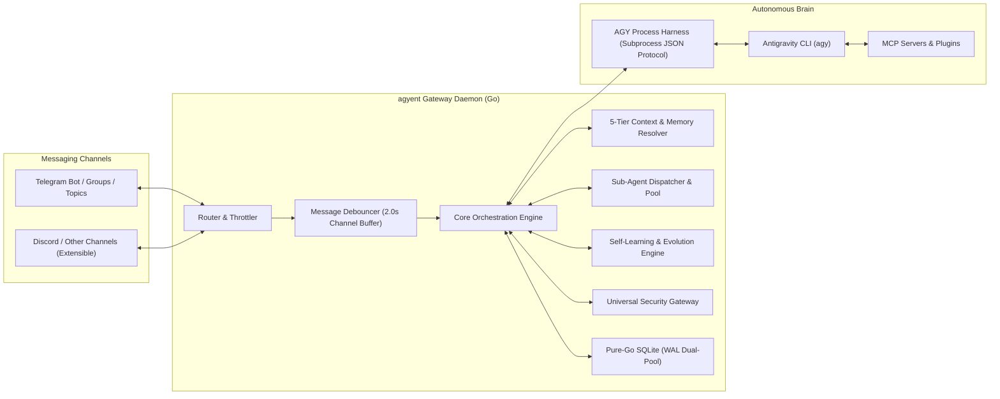

# agyent (agy-agent) 🚀

<div align="center">

[](https://golang.org)
[](LICENSE)
[-success)](https://modernc.org/sqlite)
[](docs/architecture.md)

**High-Performance Personal AI Assistant Gateway & Multi-Agent Harness in Go, powered by Antigravity CLI (`agy`) as the Autonomous Brain.**

[Features](#-key-features) • [Architecture](#-architecture) • [Quickstart](#-quickstart) • [Configuration](#-configuration-reference) • [Slash Commands](#-slash-commands) • [Documentation](#-documentation) • [Contributing](#-contributing) • [License](#-license)

</div>

---

## 🌟 Overview

**`agyent`** is a central Gateway and multi-agent orchestrator written in **Go (Golang)** following **Hexagonal Architecture (Ports & Adapters)**. Compiled into a single, dependency-free static binary, `agyent` connects messaging channels (Telegram Bot, Topics, Groups, Discord) directly to the **Antigravity CLI (`agy`)** running locally on your workstation or VPS.

It bridges conversational chat interfaces with autonomous tool-calling AI agents capable of executing bash commands, reading/editing files, searching the web, dispatching subagents, and orchestrating Model Context Protocol (MCP) servers.



---

## ⚡ Key Features

- **⚡ Lightweight Go Static Binary:** Ultra-fast startup (<10ms), minimal CPU/RAM footprint on low-spec VPS environments (<10MB RAM idle), zero CGO dependencies (utilizing Pure-Go SQLite via `modernc.org/sqlite`).
- **🤖 Multi-Bot Lifecycle Pools & Dedicated Persona Binding:** Run multiple independent Telegram bots simultaneously within a single daemon process with fault isolation. Bind dedicated bot tokens directly to specialized agent personas (e.g. `@dev_architect`, `@security_auditor`).
- **👥 Granular Agent Ownership & RBAC:** Verified agent creator ownership (`OwnerID`) and permission control (`agent_permissions`), isolating workspaces (`IDENTITY.md`, `SOUL.md`, `USER.md`, `MEMORY.md`) with secure collaboration sharing (`admin`, `operator`, `viewer`).
- **🧠 Full Autonomous Power of `agy`:** Native shell execution, recursive code search, intelligent file patch editing, multi-agent dispatching, and MCP tools via structured subprocess JSON streaming.
- **⚡ Dynamic AI Model & Reasoning Effort Selection:** Seamlessly inspect or switch AI models (`pro`, `flash`, `flash-lite`) and reasoning effort levels (`low`, `medium`, `high`, `none`) on the fly via `/model` and `/effort` with 5-tier resolution hierarchy.
- **🐝 Sub-Agent Background Dispatching & Task Pool:** Spawn async background subagent tasks with real-time step tracking, timeout guarantees, interactive Q&A replies (`/task reply`), and task management (`/tasks`, `/task cancel`).
- **⚡ Prefix KV-Cache Preservation:** Fixed Level 0–3 system foundation prompt hierarchy ensuring ~85–95% cache hit rates on large context windows, reducing Turn-to-First-Token (TTFT) latency by up to 80% and slashing token costs (~75% savings on Gemini 0.25x Cache Read pricing).
- **🎭 Workspace-First Multi-Agent Architecture:** Each agent profile maintains an independent workspace containing its Identity (`IDENTITY.md`), Soul (`SOUL.md`), Owner Profile (`USER.md`), and Long-Term Memory (`MEMORY.md`).
- **📁 Multi-Project & Dual-Scope Context:** Seamlessly switch between Global Chat mode and In-Project codebase mode; supports Telegram Groups and Forum Topics with secure `@mention` access filtering.
- **🧬 Self-Learning & Continuous Evolution:** Background reflection engine that autonomously identifies mistakes, user preferences, and Architectural Decision Records (ADRs), merging them in-place into 4D memory with conflict resolution and rolling cold-start lookbacks.
- **🔄 Bidirectional Media & File Sync:**
  - Inbound: User sends photos, documents, or archives $\rightarrow$ automatically downloaded and passed to `agy`.
  - Outbound: `agy` generates new artifacts (charts, images, PDFs, reports) $\rightarrow$ automatically detected and delivered back to the chat channel.
- **📨 Robust Message Pipeline:**
  - Canonical message formatting (`CanonicalMessage`).
  - 2.0s sliding-window debouncing via Go channels to merge rapid bursts of user messages.
  - Namespaced session keys (`channel:bot_id:chat_id[:thread_id]`) and FIFO session locking per user/topic to eliminate race conditions.
  - Heartbeat typing indicators (4.0s) and smart Markdown chunking.
- **🛡️ Universal AI Security Gateway & Dual-Plane Guardrails:**
  - Synchronous native Antigravity lifecycle hook interception (`PreToolUse` & `PostToolUse`) via `agyent hook-bridge` over sub-5ms local IPC socket with fail-safe **Default-Deny** fallback.
  - 4 zero-config security postures (`developer`, `balanced`, `strict`, `read_only`) switchable dynamically or via 1-click Telegram buttons.
  - Interactive **Human-in-the-Loop (HITL)** approval cards with Diff preview, session permission grants, and strict Admin RBAC.
  - Workspace filesystem jailing with symlink ancestor canonicalization, Windows ADS/UNC block, SSRF & Cloud Metadata protection, and DLP secret redaction (OpenAI, Anthropic, GitHub PAT, Gemini, AWS).
- **🧙 Interactive Setup Wizard (`agyent init`):** Fast, guided terminal wizard powered by `charmbracelet/huh` to configure bot tokens, admin permissions, and default workspace.

---

## 🏗️ Architecture

`agyent` is designed around clean, testable Ports and Adapters (Hexagonal Architecture):

```
agyent/
├── cmd/agyent/               # CLI Entrypoints (init, run, register-commands, hook-bridge, version)
├── internal/
│   ├── core/
│   │   ├── domain/           # Core Domain Models (Agent, Session, Conversation, Audit, Security)
│   │   ├── ports/            # Port Interfaces (Storage, Channel, Runner, EventBus, Security)
│   │   ├── engine/           # Central Orchestrator, Commands Dispatcher, Lifecycle GC
│   │   ├── debouncer/        # Go Channel Message Debouncer & Coalescer
│   │   ├── subagent/         # Sub-Agent Dispatcher, Background Worker Pool & Task Manager
│   │   └── concurrency/      # Cross-platform FIFO Session Locks & OS FileLocks
│   ├── adapters/
│   │   ├── channels/telegram # Telegram Adapter (Polling, Router, Throttler, HITL Coordinator)
│   │   ├── harness/agy/      # AGY Subprocess JSON Harness, Snapshot Watcher, Job Objects
│   │   ├── storage/sqlite/   # Pure-Go SQLite WAL Dual-Pool Engine & Migrations
│   │   ├── context/          # 5-Tier Context Hierarchy & Temporal Grounding
│   │   ├── evolution/        # Reflection Engine, 4D Conflict Resolver, Compactor
│   │   ├── security/         # Universal AI Security Gateway, Guardrails & IPC Host
│   │   ├── mcp/              # Global MCP Config Syncer & Process Cleanup
│   │   └── plugin/           # Plugin Manifest & Builtin Plugin Management
│   └── wizard/               # Interactive Terminal Configuration Wizard
└── docs/                     # Comprehensive Architecture & Engineering Documentation
```

---

## 🚀 Quickstart

### 1. Prerequisites
- **Go 1.22+** (only if building from source)
- **Antigravity CLI (`agy`)** installed and available in your `$PATH`
- **Telegram Bot Token** (obtain from [@BotFather](https://t.me/BotFather))
- Your **Telegram User ID** (obtain from [@userinfobot](https://t.me/userinfobot))

### 2. Installation

#### Option A: One-Line Installer (Recommended)

**Linux & macOS:**
```bash
curl -fsSL https://raw.githubusercontent.com/khanhbkqt/agyent/main/install.sh | bash
```

**Windows (PowerShell):**
```powershell
irm https://raw.githubusercontent.com/khanhbkqt/agyent/main/install.ps1 | iex
```

#### Option B: Download Pre-compiled Binary
Download the latest static binary for your OS and architecture directly from [GitHub Releases](https://github.com/khanhbkqt/agyent/releases/latest).

#### Option C: Install via Go or Build from Source
```bash
# Install directly via Go
go install github.com/khanhbkqt/agyent/cmd/agyent@latest

# Or clone and build manually
git clone https://github.com/khanhbkqt/agyent.git
cd agyent
go build -o bin/agyent ./cmd/agyent
```

---

### 3. CLI Usage & Commands

The `agyent` binary provides several dedicated subcommands:

#### 🧙 `agyent init` — Initialize Configuration & Workspace

Run the interactive setup wizard:
```bash
agyent init
```

The wizard will guide you through:
1. Entering your Telegram Bot Token.
2. Specifying your Telegram numeric Admin User ID(s).
3. Setting the agent workspaces directory (default: `~/.agyent/agents/`).
4. Selecting the default **Security Preset** (`unrestricted`, `developer`, `balanced`, `strict`, `read_only`) & HITL timeout.
5. Choosing which builtin **Capability Plugins** (`browser-camoufox`, `database-sqlite`, `system-diagnostics`, `subagent-dispatcher`) to install and enable.
6. Verifying the `agy` CLI binary in `$PATH`.
7. Generating the starter agent (`agyent`) with default identity files and assigned security preset.

**Non-Interactive Setup (for CI/CD & automated deployment):**
```bash
agyent init \
  --non-interactive \
  --token "123456789:ABCdefGHIjklMNOpqrSTUvwxYZ" \
  --admin "123456789" \
  --agents-dir "~/.agyent/agents" \
  --agy-path "agy" \
  --debounce 2.0 \
  --security-preset "developer" \
  --approval-timeout 60 \
  --enable-all-plugins
```

#### 🛡️ `agyent security` — Manage Security Presets & Guardrails

Manage gateway security postures directly from the terminal without monotonic chat downgrade restrictions:
```bash
# View current security dashboard & agent presets
agyent security status

# List all 5 security presets with autonomy levels & permissions
agyent security list-presets

# Switch global security preset (unrestricted | developer | balanced | strict | read_only)
agyent security preset unrestricted

# Switch preset for a specific agent profile
agyent security preset strict --agent auditor
```

#### 📡 `agyent register-commands` — Sync Slash Commands with Telegram

Registers all slash commands and autocomplete descriptions with Telegram Bot API across Default, Private, and Group scopes:
```bash
# Register/Update commands
agyent register-commands

# Delete all registered bot commands
agyent register-commands --delete
```

#### 🚀 `agyent run` — Launch Gateway Daemon

Starts the daemon listening for inbound messages and dispatching tasks to AGY CLI:
```bash
# Run with default configuration (~/.agyent/config.yaml)
agyent run

# Run with custom config and verbose/debug logging
agyent run -c /path/to/config.yaml -v
```

#### 🛡️ `agyent hook-bridge` — Native Antigravity Hook Bridge

Interception bridge for Antigravity CLI lifecycle hooks (`PreToolUse`, `PostToolUse`), routing tool call evaluations to the Security Gateway IPC server with fail-safe Default-Deny fallback:
```bash
agyent hook-bridge pre
agyent hook-bridge post
```

#### ℹ️ `agyent version` — Version & Build Metadata
```bash
agyent version
```

---

### 4. Background Service Deployment (Linux systemd)

To keep `agyent` running continuously in the background on your VPS or workstation:

```bash
# 1. Copy the systemd service file
sudo cp scripts/deploy/agyent.service /etc/systemd/system/

# 2. Reload systemd daemon
sudo systemctl daemon-reload

# 3. Enable and start agyent service
sudo systemctl enable --now agyent

# 4. Check service status and logs
sudo systemctl status agyent
journalctl -u agyent -f
```

---

## ⚙️ Configuration Reference

Configuration is stored in `~/.agyent/config.yaml`. Below is a complete annotated example:

```yaml
# HTTP Server (Optional webhook/health checks)
server:
  host: "127.0.0.1"
  port: 8080

# Telegram Bot & Multi-Bot Configuration
telegram:
  bot_token: "123456789:ABCdefGHIjklMNOpqrSTUvwxYZ"  # Single-bot token fallback
  mode: "polling"                                     # "polling" or "webhook"
  webhook_url: ""
  admin_user_ids:
    - 123456789                                       # Telegram numeric User IDs with Admin RBAC
  allowed_group_ids: []                               # Allowed Telegram Group/Supergroup IDs

  # Multi-Bot Lifecycle Pools (Optional: Run multiple dedicated bot personas)
  bots:
    - name: "architect"
      bot_token: "123456789:AAA..."
      bind_agent: "dev_architect"
    - name: "security"
      bot_token: "987654321:BBB..."
      bind_agent: "security_auditor"

# Antigravity CLI (AGY) Brain Configuration
agy:
  binary_path: "agy"                                  # Command or absolute path to agy CLI
  default_timeout_seconds: 300
  default_model: "pro"                                # "pro", "flash", "flash-lite", or model alias
  default_effort: "high"                              # "low", "medium", "high", "none"
  default_mode: "accept-edits"
  streaming_enabled: true                             # Enable real-time streaming output
  streaming_throttle_interval_seconds: 1.5

# Storage & SQLite Engine
storage:
  db_path: "~/.agyent/agyent.db"                      # Pure-Go SQLite WAL Database
  agents_dir: "~/.agyent/agents"                      # Base directory for agent workspaces
  debounce_seconds: 2.0                               # Message burst debouncing window
  heartbeat_interval_seconds: 4.0                     # Telegram typing indicator interval

# Sub-Agent Background Dispatcher & Worker Pool
subagent:
  max_concurrent_workers: 3                           # Parallel background sub-agent workers
  default_timeout_seconds: 300
  default_model: "flash"
  default_effort: "low"

# Self-Learning & Continuous Evolution Engine
evolution:
  enabled: true
  idle_timeout_minutes: 15                            # Idle time before triggering background reflection
  scan_interval_minutes: 5
  confidence_threshold: 0.85
  reflection_timeout_seconds: 30
  compaction_line_limit: 200

# Universal AI Security Gateway & Guardrails
security:
  enabled: true
  preset: "balanced"                                  # "unrestricted", "developer", "balanced", "strict", "read_only"
  mode: "interactive"                                 # "interactive" (HITL) or "strict"
  approval_timeout_seconds: 60                        # HITL card expiration timeout
  dlp:
    enabled: true
    redaction_mode: "strict"                          # "strict", "permissive", "audit_only"
    sliding_window_bytes: 64
    sanitize_tool_outputs: true

# Logging Configuration
logging:
  level: "info"                                       # "debug", "info", "warn", "error"
  format: "text"                                      # "text" or "json"
```

---

## 🤖 Slash Commands

`agyent` provides an extensive set of in-chat slash commands accessible via direct message, groups, or forum topics:

### 🌐 General & System
| Command | Aliases | Description |
| :--- | :--- | :--- |
| `/help` | — | Display interactive command guide and shortcuts. |
| `/status` | — | View system uptime, active agent, active model/effort, scope, and resource stats. |
| `/tokens` | `/metrics`, `/token` | Inspect turn-level & cumulative token metrics, KV-cache reads, and cost savings. |
| `/context` | — | Inspect active context directives, token budget, and mounted MCP servers. |
| `/skills` | `/skill` | List discovered Progressive Disclosure skills across workspace overlays. |
| `/plugins` | `/plugin` | Manage capability plugins (`/plugins`, `/plugin enable <name>`, `/plugin disable <name>`). |
| `/stream [on\|off]` | — | Query or toggle between Real-Time Streaming (`stream-json`) and Batch mode (`json`). |
| `/reset` | — | Clear short-term conversation context for the active scope. |
| `/force_unlock` | — | Emergency unlock session mutex locks and terminate hanging background processes. |

### ⚡ AI Model & Reasoning Effort
| Command | Aliases | Description |
| :--- | :--- | :--- |
| `/model [name]` | `/m`, `/models` | Inspect or dynamically switch active AI model (`pro`, `flash`, `flash-lite`, `reset`). |
| `/effort [level]` | `/eff` | Inspect or switch reasoning effort level (`low`, `medium`, `high`, `none`, `reset`). |

### 🧵 Multi-Conversation & Context
| Command | Aliases | Description |
| :--- | :--- | :--- |
| `/ask <prompt>` | — | Ask an isolated ephemeral question without polluting active conversation context. |
| `/c` | `/conversations` | Open interactive conversation manager with 1-touch inline buttons. |
| `/c <#>` | — | Quickly switch to a conversation by index number (e.g. `/c 2`). |
| `/new` | — | Start a fresh, clean conversation context. |
| `/pin` / `/unpin` | — | Pin or unpin the active conversation to protect it from automated GC cleanup. |
| `/c rename <title>`| — | Rename the current active conversation title. |
| `/c archive` | — | Archive the current conversation. |
| `/c clean` | — | Trigger garbage collection to purge expired/archived sessions. |

### 🤖 Agent Personas & Granular RBAC
| Command | Aliases | Description |
| :--- | :--- | :--- |
| `/agents` | `/a`, `/a list` | List all agent profiles accessible to your user. |
| `/use <name>` | `/a <name>` | Switch active agent profile (validates granular RBAC permissions). |
| `/a new <name> [desc]` | `/a create` | Register and initialize a new private agent persona with verified ownership. |
| `/a share <agent> <user_id> [role]` | — | Grant collaborator access (`admin`, `operator`, `viewer`) to another user. |
| `/a revoke <agent> <user_id>` | — | Revoke collaborator access from a user. |
| `/a info [agent]` | — | Inspect agent metadata, visibility, owner ID, and active collaborators. |
| `/bootstrap [name]`| `/a bootstrap`| Force re-trigger Genesis Bootstrap interview protocol to synthesize persona identity. |

### 📁 Multi-Project Management
| Command | Aliases | Description |
| :--- | :--- | :--- |
| `/projects` | `/p`, `/p list` | List attached project codebases or view project status. |
| `/p <name>` | `/project use` | Switch into an attached project workspace. |
| `/p new <name> [path]`| `/p create` | Register and attach a new project codebase path. |
| `/p exit` | `/p ~` | Exit project mode and return to Global Chat mode. |
| `/p info` | — | View detailed metadata and directory path of the active project. |
| `/p reset` | — | Reset short-term conversation context for the active project. |

### 🐝 Sub-Agent Background Tasks
| Command | Aliases | Description |
| :--- | :--- | :--- |
| `/tasks` | `/subagents` | List active, completed, and recent background sub-agent tasks. |
| `/task <id>` | — | Inspect task status, elapsed duration, output logs, and step progress. |
| `/task reply <id> <text>`| — | Send input/clarification to a sub-agent waiting for Human-in-the-Loop input. |
| `/task cancel <id>`| — | Force terminate a running background sub-agent task. |
| `/task clean` | — | Purge finished, errored, and cancelled sub-agent task records. |

### 🛡️ Security Gateway & Whitelist
| Command | Aliases | Description |
| :--- | :--- | :--- |
| `/security` | `/sec` | View Security Gateway dashboard and switch security postures. |
| `/security preset <mode>`| — | Switch active preset (`unrestricted`, `developer`, `balanced`, `strict`, `read_only`). |
| `/security grant <pattern>`| — | Grant temporary session permission (15m) for a tool or command pattern. |
| `/security redact <mode>` | — | Switch DLP secret redaction mode (`strict`, `permissive`, `audit_only`). |
| `/whitelist add "<rule>"` | — | Add permanent custom whitelist command rule. |

---

## 🔌 Built-in Plugins & MCP Extensibility

`agyent` features a modular plugin architecture located in `builtin/plugins/`:

- 🌐 **`browser-camoufox`:** Stealth web browsing and automated extraction using Camoufox anti-detect browser.
- 🗄️ **`database-sqlite`:** Direct SQLite database inspection, query execution, and schema analysis.
- 🩺 **`system-diagnostics`:** Host metrics, process tracking, disk I/O, and self-health observability.

Install built-in plugins into any workspace using:
```
/plugin install browser-camoufox
/plugin install database-sqlite
/plugin install system-diagnostics
```

---

## 📚 Documentation

Detailed architecture specifications and engineering decisions are available in the [`docs/`](docs) directory:

- 🏛️ [**System Architecture**](docs/architecture.md): 4-tier system design and component interactions.
- 🧩 [**Extensible Architecture**](docs/extensible-architecture.md): Microkernel, Ports & Adapters, and Lifecycle Event Hooks.
- 🤖 [**Agent Ownership & Multi-Bot Architecture**](docs/agent-ownership-and-multi-bot-architecture.md): Multi-Bot Gateway, dedicated persona bindings, and granular RBAC.
- 🧬 [**Agent Lifecycle & Bootstrap**](docs/lifecycle-and-bootstrap.md): Genesis Onboarding Protocol and dynamic identity synthesis.
- 📨 [**Message Pipeline**](docs/message-pipeline.md): Go channel debouncing, mention filtering, and bidirectional media sync.
- 📂 [**Multi-Project Management**](docs/multi-project.md): Dual-scope context isolation and codebase switching.
- 🧵 [**Multi-Conversation Architecture**](docs/multi-conversation-architecture.md): Flat conversation lifecycle, inline keyboards, and automated GC.
- 💾 [**Storage & Configuration**](docs/storage-and-config.md): Pure-Go SQLite schema (`agyent.db`), WAL dual-pool, and `config.yaml`.
- ⚙️ [**AGY CLI Process Harness**](docs/agy-cli-harness.md): Subprocess execution, snapshot diff detection, and job objects.
- 📡 [**AGY Streaming Protocol**](docs/agy-streaming-protocol.md): Real-time delta streaming and progressive token editing.
- 🧠 [**Context Management Architecture**](docs/context-management-architecture.md): 5-tier context resolution and progressive skills index.
- ⚡ [**Model & Reasoning Effort Selection**](docs/model-and-effort-selection-architecture.md): 5-tier resolution hierarchy, dynamic discovery from `agy models`, and subset effort clamping.
- 🐝 [**Sub-Agent Dispatch & Orchestration**](docs/subagent-architecture.md): Sub-agent worker pool, cascade depth guardrails, and HITL interactive replies.
- 🧩 [**Plugin System Architecture**](docs/plugin-system-architecture.md): Modular plugin manifests, dynamic tool loading, and MCP synchronization.
- 📜 [**System Meta-Instructions Architecture**](docs/system-meta-instruction-architecture.md): Prefix KV-cache prompt assembly and Foundation meta-instructions.
- 🧬 [**Agent Self-Learning & Evolution**](docs/agent-self-learning-and-evolution-architecture.md): Autonomous reflection, 4D memory synthesis, and conflict resolution.
- 🛡️ [**Security & Guardrails Architecture**](docs/security-and-guardrails-architecture.md): Universal Gateway security, non-blocking HITL state machine, and sub-agent jailing.
- 👥 [**Multi-Account Virtualization**](docs/multi-account-architecture.md): Multi-account failover and rate-limit cooldown management.
- 🗺️ [**Master Roadmap & Milestone Plans**](docs/plans/master_roadmap.md): Milestone 1 through Milestone 14 architecture execution records.

---

## 🤝 Contributing

Contributions are welcome! Please check out [CONTRIBUTING.md](CONTRIBUTING.md) for development setup, coding guidelines, and pull request procedures.

---

## 📄 License

`agyent` is licensed under the [MIT License](LICENSE).
