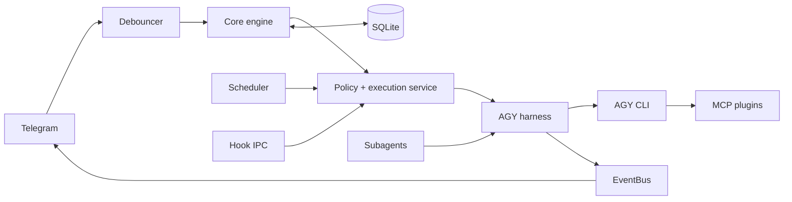

# agyent

`agyent` is a Go gateway that connects Telegram conversations to local
Antigravity CLI (`agy`) agents. It provides agent/workspace routing, project and
conversation isolation, streaming delivery, schedules and heartbeats, background
subagents, plugins, persistent audit data, and a fail-closed security control
plane.

[Documentation](docs/README.md) · [Architecture](docs/architecture.md) ·
[Contributing](CONTRIBUTING.md) · [Changelog](CHANGELOG.md)

## Current capabilities

- Telegram direct messages, groups, topics, polling, webhook mode, and multi-bot
  agent bindings.
- Canonical message normalization, burst debouncing, FIFO session serialization,
  append-mode steering, streaming edits, and artifact delivery.
- Multiple agent workspaces, project scopes, independent conversations, model and
  reasoning-effort selection, and context compaction.
- Pure-Go SQLite (`modernc.org/sqlite`) with WAL, one writer pool, concurrent read
  pool, embedded migrations, audit events, schedules, and task state.
- Central authorization plus an execution chokepoint, active-turn identity,
  filesystem/network/subagent guardrails, local hook IPC, HITL approvals, and DLP
  sanitization.
- Embedded MCP capability plugins and progressively disclosed skills.
- Background scheduler, workspace heartbeats, subagent worker pool, and optional
  memory evolution.

Telegram is the only production channel adapter in the current repository.
`ChannelPort` and `CompositeChannelMux` are extension points for future adapters.

## Architecture at a glance



The current package map, request flow, and architectural invariants are documented
in [docs/architecture.md](docs/architecture.md). Coding agents must start with
[AGENTS.md](AGENTS.md).

## Prerequisites

- A supported Go 1.25 toolchain when building from source.
- Antigravity CLI (`agy`) installed and available on `PATH`.
- A Telegram bot token and the numeric Telegram user ID for at least one admin.
- Python 3 for embedded Python MCP plugins. Individual plugins can require extra
  dependencies such as Camoufox or FFmpeg.

## Install

Download a release from [GitHub Releases](https://github.com/khanhbkqt/agyent/releases/latest),
or use the repository installers:

```bash
curl -fsSL https://raw.githubusercontent.com/khanhbkqt/agyent/main/install.sh | bash
```

```powershell
irm https://raw.githubusercontent.com/khanhbkqt/agyent/main/install.ps1 | iex
```

To build from a clone:

```bash
git clone https://github.com/khanhbkqt/agyent.git
cd agyent
make build
./bin/agyent version
```

## First run

Run the setup wizard, register Telegram commands, then start the daemon:

```bash
agyent init
agyent register-commands
agyent run
```

For automated setup:

```bash
agyent init \
  --non-interactive \
  --token "$TELEGRAM_BOT_TOKEN" \
  --admin "$TELEGRAM_ADMIN_ID" \
  --agy-path agy \
  --security-preset balanced \
  --enable-all-plugins
```

Avoid putting real tokens in shell history. Prefer a protected environment or
secret injection mechanism when automating installation.

## CLI surface

| Command | Purpose |
| --- | --- |
| `agyent init` | Create configuration, database, starter workspace, hooks, and selected plugins |
| `agyent run` | Start the gateway daemon |
| `agyent doctor` | Diagnose configuration, AGY, SQLite, locks, security, plugins, and Telegram |
| `agyent stats` | Report token and cache metrics |
| `agyent agent` | List, inspect, create, and set per-agent security presets |
| `agyent security` | Inspect or change gateway/agent security presets |
| `agyent plugin` | List, install, update, enable, or disable plugins |
| `agyent register-commands` | Synchronize Telegram slash commands |
| `agyent update` | Check or install a release update |
| `agyent hook-bridge` | Internal AGY lifecycle-hook IPC bridge |
| `agyent version` | Show build version, commit, and date |

Run `agyent <command> --help` for the current flags. Cobra command definitions in
`cmd/agyent` are the CLI source of truth.

## Minimal configuration

The default path is `~/.agyent/config.yaml`:

```yaml
telegram:
  bot_token: "${TELEGRAM_BOT_TOKEN}"
  mode: polling
  admin_user_ids: [123456789]

agy:
  binary_path: agy
  default_timeout_seconds: 1800
  default_effort: high
  default_mode: accept-edits
  streaming_enabled: true
  auto_compact: true
  compact_threshold_ratio: 0.70
  queue_mode: fifo

storage:
  db_path: ~/.agyent/agyent.db
  agents_dir: ~/.agyent
  debounce_seconds: 2.0

security:
  preset: balanced

logging:
  level: info
  format: text
```

The wizard writes actual token values; `${...}` above is illustrative. See
[storage and configuration](docs/storage-and-config.md) and
`internal/config/config.go` for the complete current schema/defaults.

## Built-in plugins

| Plugin | Default | Capability |
| --- | --- | --- |
| `database-sqlite` | enabled | Read-only SQLite inspection inside the authorized workspace |
| `scheduler` | enabled | One-off schedules, cron tasks, and heartbeats |
| `subagent-dispatcher` | enabled | Background delegated tasks and task lifecycle tools |
| `system-diagnostics` | enabled | Read-only host telemetry |
| `browser-camoufox` | disabled | Stateful browser/search/extraction/media workflows; extra dependencies required |

Plugin manifests are embedded in the binary. Installed copies can live under
`~/.agyent/plugins` or a workspace's `.agents/plugins`. See
[plugin architecture](docs/plugin-system-architecture.md).

## Development

```bash
make verify
go test ./...
go test -race ./...
go vet ./...
make build
```

`make verify` checks architecture dependency direction, documentation metadata and
links, engineering workflow graph integrity, skill/manifest consistency, Python
plugin syntax, and the short Go suite. Repository work follows the
[engineering workflow graphs](docs/engineering-workflow-graphs.md); see
[CONTRIBUTING.md](CONTRIBUTING.md) for contributor guidance.

## Runtime diagnostics

```bash
agyent doctor --skip-network
agyent doctor --session 'telegram:<bot-id>:<chat-id>' --skip-network
go run ./scripts/debug_session.go --session 'telegram:<bot-id>:<chat-id>'
```

Configuration and the database default to `~/.agyent`. Structured daemon logs and
the AGY transcript identified by the active conversation provide the remaining
evidence for incident triage. Use the project
[session debugger skill](.agents/skills/agyent-session-debugger/SKILL.md) for the
read-only-first runbook.

## License

MIT — see [LICENSE](LICENSE).
