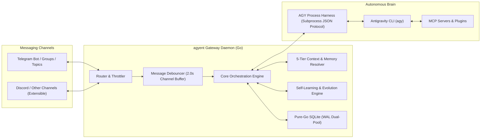

# agyent (agy-agent) 🚀

<div align="center">

[](https://golang.org)
[](LICENSE)
[-success)](https://modernc.org/sqlite)
[](docs/architecture.md)

**High-Performance Personal AI Assistant Gateway & Multi-Agent Harness in Go, powered by Antigravity CLI (`agy`) as the Autonomous Brain.**

[Features](#-key-features) • [Architecture](#-architecture) • [Quickstart](#-quickstart) • [Slash Commands](#-slash-commands) • [Documentation](#-documentation) • [Contributing](#-contributing) • [License](#-license)

</div>

---

## 🌟 Overview

**`agyent`** is a central Gateway and multi-agent orchestrator written in **Go (Golang)** following **Hexagonal Architecture (Ports & Adapters)**. Compiled into a single, dependency-free static binary, `agyent` connects messaging channels (Telegram Bot, Topics, Groups, Discord) directly to the **Antigravity CLI (`agy`)** running locally on your workstation or VPS.

It bridges conversational chat interfaces with autonomous tool-calling AI agents capable of executing bash commands, reading/editing files, searching the web, dispatching subagents, and orchestrating Model Context Protocol (MCP) servers.



---

## ⚡ Key Features

- **⚡ Lightweight Go Static Binary:** Ultra-fast startup (<10ms), minimal CPU/RAM footprint on low-spec VPS environments, zero CGO dependencies (utilizing Pure-Go SQLite via `modernc.org/sqlite`).
- **🧠 Full Autonomous Power of `agy`:** Native shell execution, recursive code search, intelligent file patch editing, multi-agent dispatching, and MCP tools via structured subprocess JSON streaming.
- **⚡ Prefix KV-Cache Preservation:** Fixed Level 0–3 system foundation prompt hierarchy ensuring ~85–95% cache hit rates on large context windows, reducing Turn-to-First-Token (TTFT) latency by up to 80% and slashing token costs (~75% savings on Gemini 0.25x Cache Read pricing).
- **🎭 Workspace-First Multi-Agent Architecture:** Each agent profile maintains an independent workspace containing its Identity (`IDENTITY.md`), Soul (`SOUL.md`), Owner Profile (`USER.md`), and Long-Term Memory (`MEMORY.md`).
- **📁 Multi-Project & Dual-Scope Context:** Seamlessly switch between Global Chat mode and In-Project codebase mode; supports Telegram Groups and Forum Topics with secure `@mention` access filtering.
- **🧬 Self-Learning & Continuous Evolution:** Background reflection engine that autonomously identifies mistakes, user preferences, and Architectural Decision Records (ADRs), merging them in-place into 4D memory with conflict resolution and rolling cold-start lookbacks.
- **🔄 Bidirectional Media & File Sync:**
  - Inbound: User sends photos, documents, or archives $\rightarrow$ automatically downloaded and passed to `agy`.
  - Outbound: `agy` generates new artifacts (charts, images, PDFs, reports) $\rightarrow$ automatically detected and delivered back to the chat channel.
- **📨 Robust OpenClaw Message Handling:**
  - Canonical message formatting (`CanonicalMessage`).
  - 2.0s sliding-window debouncing via Go channels to merge rapid bursts of user messages.
  - FIFO session locking per user/topic to eliminate race conditions.
  - Heartbeat typing indicators (4.0s) and smart Markdown chunking.
- **🛡️ Universal AI Security Gateway & Dual-Plane Guardrails:**
  - Synchronous native Antigravity lifecycle hook interception (`PreToolUse` & `PostToolUse`) with sub-5ms local IPC socket and fail-safe **Default-Deny** fallback.
  - 4 zero-config security postures (`developer`, `balanced`, `strict`, `read_only`) switchable dynamically or via 1-click Telegram buttons.
  - Interactive **Human-in-the-Loop (HITL)** approval cards with Diff preview, session permission grants, and strict Admin RBAC.
  - Workspace filesystem jailing with symlink ancestor canonicalization, Windows ADS/UNC block, SSRF & Cloud Metadata protection, and DLP secret redaction (OpenAI, Anthropic, GitHub PAT, Gemini, AWS).
- **🧙 Interactive Setup Wizard (`agyent init`):** Fast, guided terminal wizard powered by `charmbracelet/huh` to configure bot tokens, admin permissions, and default workspace.

---

## 🏗️ Architecture

`agyent` is designed around clean, testable Ports and Adapters:

```
agyent/
├── cmd/agyent/               # CLI Entrypoints (init, run, version, register-commands)
├── internal/
│   ├── core/
│   │   ├── domain/           # Core Domain Models (Agent, Session, Conversation, Audit)
│   │   ├── ports/            # Port Interfaces (Storage, Channel, Runner, EventBus)
│   │   ├── engine/           # Central Orchestrator, Commands Dispatcher, Lifecycle GC
│   │   ├── debouncer/        # Go Channel Message Debouncer & Coalescer
│   │   └── concurrency/      # Cross-platform FIFO Session Locks & OS FileLocks
│   ├── adapters/
│   │   ├── channels/telegram # Telegram Adapter (Polling, Router, Throttler, Formatter)
│   │   ├── harness/agy/      # AGY Subprocess JSON Harness, Snapshot Watcher, Job Objects
│   │   ├── storage/sqlite/   # Pure-Go SQLite WAL Dual-Pool Engine & Migrations
│   │   ├── context/          # 5-Tier Context Hierarchy & Temporal Grounding
│   │   ├── evolution/        # Reflection Engine, 4D Conflict Resolver, Compactor
│   │   ├── mcp/              # Global MCP Config Syncer & Process Cleanup
│   │   └── plugin/           # Plugin Manifest & Builtin Plugin Management
│   └── wizard/               # Interactive CLI Configuration Wizard
└── docs/                     # Comprehensive Architecture & Engineering Docs
```

---

## 🚀 Quickstart

### 1. Prerequisites
- **Go 1.22+**
- **Antigravity CLI (`agy`)** installed and available in `$PATH`
- **Telegram Bot Token** (from [@BotFather](https://t.me/BotFather))

### 2. Installation

```bash
# Clone the repository
git clone https://github.com/khanhbkqt/agyent.git
cd agyent

# Build the executable
go build -o bin/agyent ./cmd/agyent
```

### 3. Initialize Configuration & Agent Profile

Run the interactive setup wizard:

```bash
./bin/agyent init
```

The wizard will guide you through:
1. Entering your Telegram Bot Token.
2. Specifying your Telegram numeric Admin User ID.
3. Setting the agent workspaces path (default: `~/.agyent/agents/`).
4. Verifying the `agy` CLI binary in `$PATH`.
5. Generating the starter agent (`agyent`) with default identity files.

### 4. Register Bot Slash Commands with Telegram

```bash
./bin/agyent register-commands
```

### 5. Launch the Daemon

```bash
./bin/agyent run
```

---

## 🤖 Slash Commands

`agyent` includes a full suite of in-chat slash commands:

| Command | Description |
| :--- | :--- |
| `/help` | Display interactive command guide and shortcuts. |
| `/status` | View system uptime, active agent, scope, streaming mode, and resource stats. |
| `/tokens` | Inspect turn-level and cumulative token metrics, KV-cache reads, and cost savings. |
| `/context` | Inspect active directives, token budget, and mounted MCP servers. |
| `/skills` | List discovered Progressive Disclosure skills across workspace overlays. |
| `/plugins` | Manage capability plugins (`/plugins`, `/plugin enable <name>`, `/plugin disable <name>`). |
| `/stream [on\|off]` | Query or toggle between Real-Time Streaming (`stream-json`) and Batch mode (`json`). |
| `/reset` | Clear short-term conversation context for the active scope. |
| `/force_unlock` | Force release session mutex locks and terminate hanging background processes. |
| `/c` or `/conversations` | Open interactive conversation manager with 1-touch inline buttons. |
| `/c <#>` | Quickly switch to a conversation by index number (e.g. `/c 2`). |
| `/new` | Start a fresh, clean conversation context. |
| `/pin` / `/unpin` | Pin or unpin the active conversation to protect from automated GC. |
| `/agents` / `/use <name>` | List registered agent profiles or switch active agent. |
| `/projects` / `/p <name>` | List attached project codebases or switch into project context. |
| `/p exit` | Exit project mode and return to Global Chat mode. |
| `/security` or `/sec` | View Security Gateway dashboard and switch active preset (`developer`, `balanced`, `strict`, `read_only`). |
| `/security preset <mode>` | Dynamically switch active security preset. |
| `/security grant <pattern>` | Grant temporary session permission for a command or tool pattern. |
| `/whitelist add <rule>` | Add custom allowed command pattern to active whitelist. |

---

## 🔌 Built-in Plugins & MCP Extensibility

`agyent` features a modular plugin architecture located in `builtin/plugins/`:

- 🌐 **`browser-camoufox`:** Stealth web browsing and automated extraction using Camoufox anti-detect browser.
- 🗄️ **`database-sqlite`:** Direct SQLite database inspection, query execution, and schema analysis.
- 🩺 **`system-diagnostics`:** Host metrics, process tracking, disk I/O, and self-health observability.

Install built-in plugins into any workspace using:
```
/plugin install browser-camoufox
/plugin install database-sqlite
/plugin install system-diagnostics
```

---

## 📚 Documentation

Detailed architecture specifications and engineering decisions are available in the [`docs/`](docs) directory:

- 🏛️ [**System Architecture**](docs/architecture.md): 4-tier system design and component interactions.
- 🧩 [**Extensible Architecture**](docs/extensible-architecture.md): Microkernel, Ports & Adapters, and Lifecycle Event Hooks.
- 🧬 [**Agent Lifecycle & Bootstrap**](docs/lifecycle-and-bootstrap.md): Genesis Onboarding Protocol and dynamic identity synthesis.
- 📨 [**Message Pipeline**](docs/message-pipeline.md): Go channel debouncing, mention filtering, and bidirectional media sync.
- 📂 [**Multi-Project Management**](docs/multi-project.md): Dual-scope context isolation and codebase switching.
- 🧵 [**Multi-Conversation Architecture**](docs/multi-conversation-architecture.md): Flat conversation lifecycle, inline keyboards, and automated GC.
- 💾 [**Storage & Configuration**](docs/storage-and-config.md): Pure-Go SQLite schema (`agyent.db`), WAL dual-pool, and `config.yaml`.
- ⚙️ [**AGY CLI Process Harness**](docs/agy-cli-harness.md): Subprocess execution, snapshot diff detection, and job objects.
- 📡 [**AGY Streaming Protocol**](docs/agy-streaming-protocol.md): Real-time delta streaming and progressive token editing.
- 🧠 [**Context Management Architecture**](docs/context-management-architecture.md): 5-tier context resolution and progressive skills index.
- ⚡ [**Model & Reasoning Effort Selection**](docs/model-and-effort-selection-architecture.md): 5-tier resolution hierarchy, dynamic discovery from `agy models`, and subset effort clamping.
- 🧬 [**Agent Self-Learning & Evolution**](docs/agent-self-learning-and-evolution-architecture.md): Autonomous reflection, 4D memory synthesis, and conflict resolution.
- 🛡️ [**Security & Guardrails Architecture**](docs/security-and-guardrails-architecture.md): Universal Gateway security, non-blocking HITL state machine, and sub-agent jailing.
- 🗺️ [**Master Roadmap & Milestone Plans**](docs/plans/master_roadmap.md): Milestone 1 through Milestone 10 architecture execution records.

---

## 🤝 Contributing

Contributions are welcome! Please check out [CONTRIBUTING.md](CONTRIBUTING.md) for development setup, coding guidelines, and pull request procedures.

---

## 📄 License

`agyent` is licensed under the [MIT License](LICENSE).
