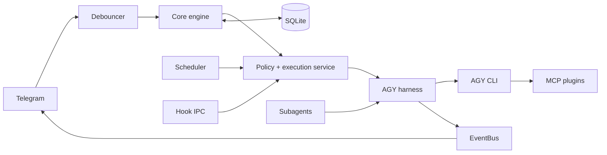
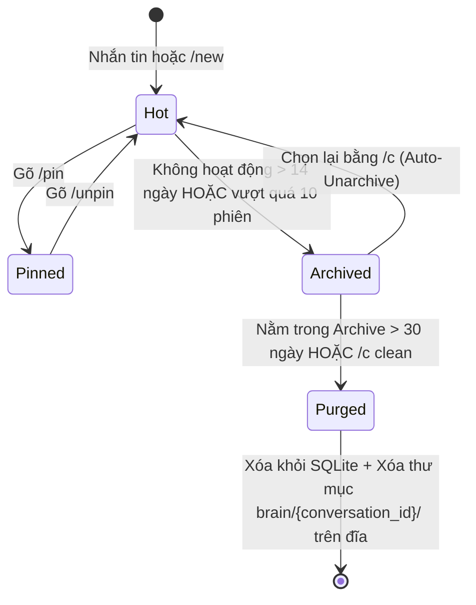

# agyent

`agyent` is a Go gateway that connects Telegram conversations to local
Antigravity CLI (`agy`) agents. It provides agent/workspace routing, project and
conversation isolation, streaming delivery, schedules and heartbeats, background
subagents, plugins, persistent audit data, and a fail-closed security control
plane.

[Documentation](docs/README.md) · [Architecture](docs/architecture.md) ·
[Contributing](CONTRIBUTING.md) · [Changelog](CHANGELOG.md)

## Current capabilities

- Telegram direct messages, groups, topics, polling, webhook mode, and multi-bot
  agent bindings.
- Canonical message normalization, burst debouncing, FIFO session serialization,
  append-mode steering, streaming edits, and artifact delivery.
- Multiple agent workspaces, project scopes, independent conversations, model and
  reasoning-effort selection, and context compaction.
- Pure-Go SQLite (`modernc.org/sqlite`) with WAL, one writer pool, concurrent read
  pool, embedded migrations, audit events, schedules, and task state.
- Central authorization plus an execution chokepoint, active-turn identity,
  filesystem/network/subagent guardrails, local hook IPC, HITL approvals, and DLP
  sanitization.
- Embedded MCP capability plugins and progressively disclosed skills.
- Background scheduler, workspace heartbeats, subagent worker pool, and optional
  memory evolution.

Telegram is the only production channel adapter in the current repository.
`ChannelPort` and `CompositeChannelMux` are extension points for future adapters.

## Architecture at a glance



The current package map, request flow, and architectural invariants are documented
in [docs/architecture.md](docs/architecture.md). Coding agents must start with
[AGENTS.md](AGENTS.md).

## Prerequisites

- A supported Go 1.25 toolchain when building from source.
- Antigravity CLI (`agy`) installed and available on `PATH`.
- A Telegram bot token and the numeric Telegram user ID for at least one admin.
- Python 3 for embedded Python MCP plugins. Individual plugins can require extra
  dependencies such as Camoufox or FFmpeg.

## Install

Download a release from [GitHub Releases](https://github.com/khanhbkqt/agyent/releases/latest),
or use the repository installers:

```bash
curl -fsSL https://raw.githubusercontent.com/khanhbkqt/agyent/main/install.sh | bash
```

```powershell
irm https://raw.githubusercontent.com/khanhbkqt/agyent/main/install.ps1 | iex
```

To build from a clone:

```bash
git clone https://github.com/khanhbkqt/agyent.git
cd agyent
make build
./bin/agyent version
```

## First run

Run the setup wizard, register Telegram commands, then start the daemon:

```bash
agyent init
agyent register-commands
agyent run
```

For automated setup:

```bash
agyent init \
  --non-interactive \
  --token "$TELEGRAM_BOT_TOKEN" \
  --admin "$TELEGRAM_ADMIN_ID" \
  --agy-path agy \
  --security-preset balanced \
  --enable-all-plugins
```

Avoid putting real tokens in shell history. Prefer a protected environment or
secret injection mechanism when automating installation.
## Usage

Trong kiến trúc của agyent, việc quản lý phiên chat được thiết kế theo mô hình phân tầng chặt chẽ. Hệ thống tách bạch rạch ròi giữa Session (Điểm neo kênh chat) và Conversation (Ngữ cảnh hội thoại AI):

---

### 1. Phân biệt: Session vs Conversation

| Khái niệm | Định danh (Key/ID) | Bản chất |
| --- | --- | --- |
| **Session** | `telegram:<chat_id>`<br>*(hoặc `telegram:<bot_id>:<chat_id>:<thread_id>`)* | Đại diện cho kênh kết nối cố định giữa một người dùng/nhóm Telegram với Bot. |
| **Conversation** | Chuỗi UUID *(ví dụ: `f8b6c9bf-55ad-...`)* | Là ngữ cảnh hội thoại cụ thể của Google Antigravity CLI (`agy`), chứa toàn bộ lịch sử hỏi-đáp, biến số, code và file đệm trong `~/.gemini/antigravity/brain/<conversation-id>/`. |

---

### 2. Nguyên tắc: Giữ xuyên suốt hay tạo mới mỗi lần chat?

> [!NOTE]
> **Mặc định: Giữ xuyên suốt (Stateful & Continuous Context)**
>
> - **Không tạo mới sau mỗi tin nhắn:** Mỗi khi bạn nhắn tin, agyent tìm `ConversationID` đang active của phiên đó và truyền cờ `--conversation <uuid>` vào Antigravity CLI. Nhờ vậy, AI nhớ toàn bộ ngữ cảnh trước đó, bạn có thể nói "tiếp tục phần vừa nãy", "sửa lại hàm trên" mà không sợ bị mất trí nhớ.
> - **Dữ liệu được lưu bền vững:** Bản ghi session và cuộc hội thoại được lưu trong SQLite (`agyent.db` ở chế độ WAL). Kể cả khi khởi động lại daemon hoặc reboot máy chủ, phiên chat vẫn được bảo lưu trọn vẹn.

#### Khi nào thì hệ thống mới tạo Conversation mới?

1. **Lần đầu tiên chat:** Khi chưa từng có cuộc trò chuyện nào → sinh UUID đầu tiên.
2. **Khi bạn gõ lệnh `/new` (hoặc `/reset`):** Ngữ cảnh cũ được lưu trữ lại, và tin nhắn tiếp theo của bạn sẽ mở ra một ngữ cảnh hoàn toàn mới sạch sẽ.
3. **Khi dùng lệnh hỏi nhanh `/ask <câu hỏi>` (Ephemeral Query):** Hệ thống chạy một lượt tính toán độc lập mà không lưu vào lịch sử hội thoại, không làm phình dung lượng token và không sửa đổi bộ nhớ dài hạn.
4. **Khi bạn chủ động đổi qua lại giữa các chủ đề bằng `/c` (`/conversations`):** Cho phép bạn tạo nhiều nhánh thảo luận song song (ví dụ: một luồng code backend, một luồng hỏi tin tức) trong cùng một bot.
5. **Tự động nén ngữ cảnh (Auto-Compaction):** Khi số lượng token trong phiên tích lũy vượt quá 90% cửa sổ ngữ cảnh (ví dụ vượt ~1.88M tokens đối với Gemini 2M context), hệ thống sẽ tự động tóm tắt thành bản tóm tắt điều hành (Executive Continuity Digest), đóng conversation cũ và khởi động conversation mới mang theo bản tóm tắt này.

---

### 3. Thời gian lưu giữ phiên là bao lâu? (Vòng đời Lifecycle & GC)

Hệ thống quản lý vòng đời theo máy trạng thái 4 cấp độ:



#### Chi tiết thời gian lưu giữ

| Cấp độ | Tên trạng thái | Thời gian tồn tại | Hành vi của hệ thống |
| --- | --- | --- | --- |
| **Cố định** | Session Key | Vĩnh viễn | Bản ghi người dùng trong SQLite không bao giờ hết hạn. Bot luôn nhớ bạn là ai, đang dùng agent nào. |
| **Cấp 1** | Hot *(Đang hoạt động)* | Vô thời hạn | Miễn là bạn vẫn tiếp tục tương tác và chưa bị đẩy sang Archive. |
| **Cấp 2** | Pinned *(Đã Ghim bằng `/pin`)* | Vĩnh viễn *(Bảo vệ tuyệt đối)* | Không bao giờ bị tự động đưa vào Archive hay bị xóa bởi tiến trình dọn rác định kỳ. |
| **Cấp 3** | Archived *(Lưu trữ ẩn)* | Tối thiểu 30 ngày | • Tự động Archive nếu không có tin nhắn mới sau 14 ngày.<br>• Hoặc tự động Archive phiên cũ nhất nếu số phiên chưa ghim vượt quá 10 phiên.<br>*(Bạn vẫn có thể gõ `/c` để mở lại bất kỳ lúc nào).* |
| **Cấp 4** | Purged *(Xóa sạch)* | Sau 30 ngày nằm trong Archive | Tiến trình nền chạy mỗi 24 giờ một lần sẽ quét các phiên đã archive quá 30 ngày (và không ghim) để:<br>1. Xóa bản ghi trong SQLite database.<br>2. Xóa sạch thư mục trên ổ cứng (`~/.gemini/antigravity/brain/<conversation-id>/`) nhằm tiết kiệm dung lượng đĩa. |

---

### 4. Bảng lệnh hữu ích để kiểm soát phiên chat

- `/new`: Bắt đầu một chủ đề mới ngay lập tức (giữ nguyên chủ đề cũ trong kho).
- `/pin`: Ghim cuộc trò chuyện hiện tại (bảo vệ vĩnh viễn, không bao giờ bị dọn rác).
- `/unpin`: Bỏ ghim.
- `/c` hoặc `/conversations`: Mở menu tương tác dạng nút bấm trên Telegram để chọn, đổi tên hoặc chuyển đổi giữa các cuộc hội thoại.
- `/c clean`: Xóa dọn dẹp ngay lập tức toàn bộ các phiên cũ đã archive để giải phóng ổ cứng.
- `/compact`: Chủ động nén phiên chat hiện tại nếu thấy tốc độ phản hồi chậm lại do tích lũy quá nhiều token.

---


## CLI surface

| Command | Purpose |
| --- | --- |
| `agyent init` | Create configuration, database, starter workspace, hooks, and selected plugins |
| `agyent run` | Start the gateway daemon |
| `agyent doctor` | Diagnose configuration, AGY, SQLite, locks, security, plugins, and Telegram |
| `agyent stats` | Report token and cache metrics |
| `agyent agent` | List, inspect, create, and set per-agent security presets |
| `agyent security` | Inspect or change gateway/agent security presets |
| `agyent plugin` | List, install, update, enable, or disable plugins |
| `agyent register-commands` | Synchronize Telegram slash commands |
| `agyent update` | Check or install a release update |
| `agyent hook-bridge` | Internal AGY lifecycle-hook IPC bridge |
| `agyent version` | Show build version, commit, and date |

Run `agyent <command> --help` for the current flags. Cobra command definitions in
`cmd/agyent` are the CLI source of truth.

## Minimal configuration

The default path is `~/.agyent/config.yaml`:

```yaml
telegram:
  bot_token: "${TELEGRAM_BOT_TOKEN}"
  mode: polling
  admin_user_ids: [123456789]

agy:
  binary_path: agy
  default_timeout_seconds: 1800
  default_effort: high
  default_mode: accept-edits
  streaming_enabled: true
  auto_compact: true
  compact_threshold_ratio: 0.70
  queue_mode: fifo

storage:
  db_path: ~/.agyent/agyent.db
  agents_dir: ~/.agyent
  debounce_seconds: 2.0

security:
  preset: balanced

logging:
  level: info
  format: text
```

The wizard writes actual token values; `${...}` above is illustrative. See
[storage and configuration](docs/storage-and-config.md) and
`internal/config/config.go` for the complete current schema/defaults.

## Built-in plugins

| Plugin | Default | Capability |
| --- | --- | --- |
| `database-sqlite` | enabled | Read-only SQLite inspection inside the authorized workspace |
| `scheduler` | enabled | One-off schedules, cron tasks, and heartbeats |
| `subagent-dispatcher` | enabled | Background delegated tasks and task lifecycle tools |
| `system-diagnostics` | enabled | Read-only host telemetry |
| `browser-camoufox` | disabled | Stateful browser/search/extraction/media workflows; extra dependencies required |

Plugin manifests are embedded in the binary. Installed copies can live under
`~/.agyent/plugins` or a workspace's `.agents/plugins`. See
[plugin architecture](docs/plugin-system-architecture.md).

## Development

```bash
make verify
go test ./...
go test -race ./...
go vet ./...
make build
```

`make verify` checks architecture dependency direction, documentation metadata and
links, engineering workflow graph integrity, skill/manifest consistency, Python
plugin syntax, and the short Go suite. Repository work follows the
[engineering workflow graphs](docs/engineering-workflow-graphs.md); see
[CONTRIBUTING.md](CONTRIBUTING.md) for contributor guidance.

## Runtime diagnostics

```bash
agyent doctor --skip-network
agyent doctor --session 'telegram:<bot-id>:<chat-id>' --skip-network
go run ./scripts/debug_session.go --session 'telegram:<bot-id>:<chat-id>'
```

Configuration and the database default to `~/.agyent`. Structured daemon logs and
the AGY transcript identified by the active conversation provide the remaining
evidence for incident triage. Use the project
[session debugger skill](.agents/skills/agyent-session-debugger/SKILL.md) for the
read-only-first runbook.

## License

MIT — see [LICENSE](LICENSE).
