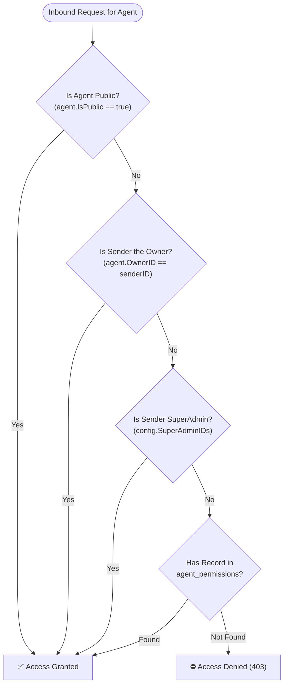

# Multi-Bot Gateway & Agent Ownership (RBAC) Architecture

> **Document status:** Reference
> **Code authority:** `internal/core/auth`, `internal/core/engine/authorization.go`, agent repository, Telegram adapter
> **Last verified:** 2026-09-05

This document provides a comprehensive technical architecture and engineering specification for **Multi-Bot Gateway Management**, **Per-Agent Ownership**, **Granular Role-Based Access Control (RBAC)**, **Session Key Namespacing**, and **Fault-Tolerant Bot Lifecycle Pools** in **`agyent`**.

---

## 1. Executive Summary & Problem Statement

### 1.1. Pain Points in Single-Bot / Single-Tenant Gateways
1. **Context & Persona Conflation (Data Leakage):** In a single-bot setup without ownership, every authenticated user can switch to (`/use`), re-bootstrap (`/bootstrap`), or inspect any agent persona. Private memories in `MEMORY.md`, personalized user traits in `USER.md`, and distinct souls in `SOUL.md` are vulnerable to tampering and accidental cross-contamination.
2. **Session Key Collision Across Multiple Bots:** If multiple Telegram bots connect to a single gateway daemon without namespacing, a user chatting with Bot A (e.g., `@dev_coder_bot`) and Bot B (e.g., `@personal_assistant_bot`) generates identical session keys (`telegram:<user_id>`), causing race conditions, state clobbering, and broken transcripts.
3. **Monolithic Bot Crash Propagation:** In a multi-bot deployment, if one bot token is revoked or hits rate limits (`HTTP 401 / 429`), it must not crash the daemon or disrupt other healthy bots.
4. **Adapter-Coupled Access Control (Hexagonal Violation):** Hardcoding authorization checks inside channel adapters (e.g., `telegram/router.go`) violates Clean Architecture and forces duplicate ACL logic for future channels (Discord, Slack, REST).

### 1.2. Core Architectural Objectives
- **1-to-1 Dedicated Bot-Agent Binding:** Every bot instance is permanently and exclusively bound to a specific agent persona (`bind_agent`), eliminating persona conflicts, context bleed, and confusing persona switching commands (`/use`).
- **Multi-Channel Extension Seam (Composite Mux):** An agent persona and persistent memory can be routed through `CompositeChannelMux` and `domain.TargetContext`. Telegram is implemented; Zalo, Slack, and Discord remain future adapters.
- **Granular Agent Ownership (RBAC):** Every agent has a verified `OwnerID` (the creator's User ID). Access is governed by strict roles: `Owner/Admin`, `Operator`, `Viewer`, or `Public`.
- **Fault-Isolated Multi-Bot Pool:** Each bot instance runs within an isolated Go goroutine with automatic panic recovery and error isolation.
- **Session Key Namespacing (`channel:bot_id:chat_id[:thread_id]`):** Disambiguates concurrent sessions across bots. Compatibility with legacy keys must remain covered by parsing and migration tests.
- **Hexagonal Core Security Gate:** All authorization logic is centralized in the Core Engine (`internal/core/engine/`), leaving channel adapters strictly responsible for message normalization.
- **Zero-CGO & Prefix KV-Cache Preservation:** Pure-Go SQLite WAL persistence with strict Level 0–4 prompt hierarchy preservation. Cache-hit behavior is provider-dependent and must be measured.

---

## 2. End-to-End System Architecture Diagram

```mermaid
flowchart TB
    subgraph MessagingTier ["Tier 1: Multi-Bot & Multi-Channel Surface"]
        Bot1["🤖 Bot 1: @dev_coder_bot\n(Dedicated: dev_architect)"]
        Bot2["🤖 Bot 2: @wife_bot\n(Dedicated: wife_assistant)"]
        ZaloPort["💬 Zalo Official Account"]
        SlackPort["💼 Slack Bot App"]
    end

    subgraph ChannelAdapterTier ["Tier 2: Fault-Isolated Channel Pool (internal/adapters/channels/)"]
        CompositeMux["CompositeChannelMux\n(ports.ChannelPort)"]
        BotPool["Multi-Bot Lifecycle Pool\nmap[int64]*gotgbot.Bot"]
        Worker1["Bot 1 Polling Goroutine\n(Recover on Panic)"]
        Worker2["Bot 2 Polling Goroutine\n(Recover on Panic)"]
        Normalizer["Canonical Normalizer\nFormatSessionKey(channel, bot_id, chat_id, thread_id)"]
        Throttler["Delivery Throttler & Outbound Multiplexer"]
    end

    subgraph CoreEngineTier ["Tier 3: Core Orchestrator & RBAC Gate (internal/core/engine/)"]
        InboundQueue["Inbound Canonical Queue"]
        Debouncer["Sliding Window Debouncer (2.0s)"]
        LockMgr["SessionLockManager (FIFO Mutex)"]
        RBACGate{"[Inbound RBAC Checkpoint]\nCheckAccess(agent, sender_id)"}
        CommandRouter["Slash Command Router\n(/a share, /a revoke, /a info)"]
        TurnExec["Turn Executor & Prompt Assembler"]
    end

    subgraph ExecutionTier ["Tier 4: Subprocess Harness & Workspace Isolation"]
        Harness["AGY Subprocess Controller\n(--output-format stream-json)"]
        WS_A["📂 Workspace A: ~/.agyent/workspace-dev_architect/\n(Owner: User 1001 • SOUL.md, USER.md, MEMORY.md)"]
        WS_B["📂 Workspace B: ~/.agyent/workspace-personal_assistant/\n(Owner: User 2002 • SOUL.md, USER.md, MEMORY.md)"]
        JobGuard["Windows Kernel Job Object / POSIX Process Group"]
    end

    subgraph PersistenceTier ["Tier 5: Pure-Go SQLite Persistence"]
        DB[("Pure-Go SQLite: agyent.db\n(agents, agent_permissions, bot_bindings, sessions, audit_logs)")]
    end

    Bot1 --> Worker1
    Bot2 --> Worker2
    Bot3 --> Worker3
    FutureChannelPort --> Normalizer
    Worker1 --> Normalizer
    Worker2 --> Normalizer
    Worker3 --> Normalizer
    Normalizer --> InboundQueue --> Debouncer --> LockMgr --> RBACGate
    
    RBACGate -->|Authorized| CommandRouter
    RBACGate -->|Authorized| TurnExec
    RBACGate -->|Denied (403)| Throttler
    
    CommandRouter <--> DB
    TurnExec <--> DB
    TurnExec --> Harness
    Harness --- JobGuard
    Harness <--> WS_A
    Harness <--> WS_B
    Harness --> Throttler
    Throttler --> BotPool
    BotPool --> Bot1
    BotPool --> Bot2
    BotPool --> Bot3
```

---

## 3. Core Domain Entities & Interface Contracts

### 3.1. Domain Models (`internal/core/domain/agent.go`)

```go
package domain

import "time"

// AgentStatus defines the operational lifecycle state of an Agent.
type AgentStatus string

const (
	StatusUninitialized AgentStatus = "uninitialized"
	StatusInitialized   AgentStatus = "initialized"
)

// Agent represents an autonomous AGY persona profile, workspace, and ownership boundary.
type Agent struct {
	Name          string      `json:"name"`
	Description   string      `json:"description"`
	Status        AgentStatus `json:"status"`
	WorkspacePath string      `json:"workspace_path"`
	DefaultModel  string      `json:"default_model,omitempty"`
	DefaultEffort string      `json:"default_effort,omitempty"`
	
	// Ownership & Access Control
	OwnerID       string      `json:"owner_id"`  // Telegram User ID of the creator
	IsPublic      bool        `json:"is_public"` // true: Accessible by all; false: Owner + Shared members only
	
	CreatedAt     time.Time   `json:"created_at"`
	UpdatedAt     time.Time   `json:"updated_at"`
}

// AgentPermission represents access grants for collaborator users.
type AgentPermission struct {
	AgentName string    `json:"agent_name"`
	UserID    string    `json:"user_id"`
	Role      string    `json:"role"` // "admin", "operator", "viewer"
	GrantedBy string    `json:"granted_by"`
	GrantedAt time.Time `json:"granted_at"`
}
```

### 3.2. Session Key Namespacing (`internal/core/domain/session.go`)

To avoid session collision across multiple bots, session keys follow the canonical 4-tuple namespace:

$$\text{SessionKey} = \text{channel}:\mathbf{bot\_id}:\text{chat\_id}[:\text{thread\_id}]$$

```go
// FormatSessionKey generates a normalized namespaced session key.
// If botID > 0, format is "channel:botID:chatID[:threadID]".
// Otherwise, format falls back to legacy "channel:chatID[:threadID]".
func FormatSessionKey(channel string, chatID string, threadID int64, botIDOpt ...int64) string {
	channel = strings.TrimSpace(strings.ToLower(channel))
	chatID = strings.TrimSpace(chatID)
	channel = strings.ReplaceAll(channel, ":", "_")
	chatID = strings.ReplaceAll(chatID, ":", "_")

	var botID int64
	if len(botIDOpt) > 0 {
		botID = botIDOpt[0]
	}

	if botID > 0 {
		if threadID > 0 {
			return fmt.Sprintf("%s:%d:%s:%d", channel, botID, chatID, threadID)
		}
		return fmt.Sprintf("%s:%d:%s", channel, botID, chatID)
	}

	if threadID > 0 {
		return fmt.Sprintf("%s:%s:%d", channel, chatID, threadID)
	}
	return fmt.Sprintf("%s:%s", channel, chatID)
}

// ExtractChatIDFromSessionKey accurately extracts chatID across legacy and namespaced formats.
func ExtractChatIDFromSessionKey(sessionKey string) string {
	parts := strings.Split(sessionKey, ":")
	switch len(parts) {
	case 2:
		// Legacy format: telegram:chatID
		return parts[1]
	case 3:
		// Namespaced format: telegram:botID:chatID (if parts[1] is positive botID)
		if _, err := strconv.ParseInt(parts[1], 10, 64); err == nil && !strings.HasPrefix(parts[1], "-") {
			return parts[2]
		}
		// Legacy format with group: telegram:-100123:threadID
		return parts[1]
	case 4:
		// Full namespaced format: telegram:botID:chatID:threadID
		return parts[2]
	default:
		return sessionKey
	}
}
```

---

## 4. Multi-Tier Role-Based Access Control (RBAC)

### 4.1. Access Evaluation Logic (`CheckAccess`)
When a user sends a message or invokes a command on an agent, the Core Engine evaluates permissions through 4 hierarchical checkpoints:



### 4.2. RBAC Privilege Matrix

| Capability / Command | SuperAdmin | Agent Owner | Operator (Shared) | Viewer (Read-only) | Unauthenticated |
| :--- | :---: | :---: | :---: | :---: | :---: |
| **Interactive Chat & Execution** | ✅ Full | ✅ Full | ✅ Full | ✅ Restricted | ❌ Denied |
| **View in Agent List (`/agents`)** | ✅ All | ✅ Owned | ✅ Shared | ✅ Public | ❌ Hidden |
| **Switch Context (`/use <name>`)** | ✅ | ✅ | ✅ | ✅ | ❌ Denied |
| **Manage Projects (`/p new`, `/p list`)** | ✅ | ✅ | ✅ | ❌ | ❌ Denied |
| **Change Model / Effort (`/m`, `/eff`)** | ✅ | ✅ | ✅ | ❌ | ❌ Denied |
| **Share / Revoke Access (`/a share`)** | ✅ | ✅ | ❌ | ❌ | ❌ Denied |
| **Re-Bootstrap / Delete Agent** | ✅ | ✅ | ❌ | ❌ | ❌ Denied |

---

## 5. Multi-Bot Lifecycle & Fault Isolation Pool

In [`internal/adapters/channels/telegram/adapter.go`](../internal/adapters/channels/telegram/adapter.go), the Telegram adapter manages an active pool of `gotgbot.Bot` clients:

```go
type Adapter struct {
	cfg        *config.Config
	bots       map[int64]*gotgbot.Bot      // Active bot instances keyed by Bot ID
	botConfigs map[int64]config.BotConfig  // Associated bot configuration
	eventBus   ports.EventBusPort
	throttler  *DeliveryThrottler
	mediaMgr   *MediaManager
	router     *Router
	// ...
}
```

### 5.1. Fault Isolation & Graceful Startup
1. **Independent Goroutine Polling:** Each bot is launched in its own dedicated goroutine with `recover()` wrappers:
   ```go
   for _, botCfg := range normalizedBots {
       bot, err := gotgbot.NewBot(botCfg.BotToken, a.botOpts)
       if err != nil {
           slog.Error("failed to initialize bot token", "error", err)
           continue // Do not fail other healthy bots
       }
       a.bots[bot.Id] = bot
       go a.startPollingForBot(botCtx, bot, botCfg)
   }
   ```
2. **Dedicated Agent Binding:** If `BotConfig.BindAgent` is specified (e.g. `bind_agent: "dev_architect"`), any incoming message on that bot automatically initializes or locks the session to `ActiveAgent = "dev_architect"`.
3. **Outbound Multiplexing:** Outbound responses carry the originating `msg.BotID`, allowing the delivery engine to invoke `a.bots[msg.BotID].SendMessage(...)` with zero cross-bot crosstalk.

---

## 6. Database Schema & Migration Specification

### Migration: `000007_agent_ownership_and_acl.up.sql`

```sql
-- 1. Extend agents table with ownership and visibility
ALTER TABLE agents ADD COLUMN owner_id TEXT NOT NULL DEFAULT '';
ALTER TABLE agents ADD COLUMN is_public INTEGER NOT NULL DEFAULT 0 CHECK (is_public IN (0, 1));
CREATE INDEX IF NOT EXISTS idx_agents_owner_id ON agents(owner_id);

-- 2. Data Backfill: Preserve backward compatibility for existing agents
UPDATE agents SET is_public = 1 WHERE is_public = 0;
UPDATE agents SET is_public = 1 WHERE name = 'agyent';

-- 3. Granular Agent Collaborator Permissions Table
CREATE TABLE IF NOT EXISTS agent_permissions (
    agent_name TEXT NOT NULL,
    user_id TEXT NOT NULL,
    role TEXT NOT NULL DEFAULT 'operator' CHECK (role IN ('admin', 'operator', 'viewer')),
    granted_by TEXT NOT NULL DEFAULT '',
    granted_at INTEGER NOT NULL,
    PRIMARY KEY (agent_name, user_id),
    FOREIGN KEY(agent_name) REFERENCES agents(name) ON DELETE CASCADE
);
CREATE INDEX IF NOT EXISTS idx_agent_permissions_user_id ON agent_permissions(user_id);
```

---

## 7. Slash Commands Specification

| Command | Syntax | Authorization | Description |
| :--- | :--- | :--- | :--- |
| `/a new` | `/a new <name> [desc]` | SuperAdmin / Any User | Creates a new agent, setting `OwnerID = msg.Sender.ID` and `IsPublic = false`. |
| `/use` | `/use <agent_name>` | Owner / Member / Public | Validates access via `CheckAccess` before switching session active agent. |
| `/agents` | `/agents` (or `/a`) | Authenticated User | Lists only agents owned by, shared with, or public to the caller. |
| `/a share` | `/a share <agent> <user_id> [role]` | Owner / SuperAdmin | Grants collaborator permissions (`admin`, `operator`, `viewer`) to a target user. |
| `/a revoke` | `/a revoke <agent> <user_id>` | Owner / SuperAdmin | Revokes collaborator access for a target user. |
| `/a info` | `/a info <agent>` | Owner / Member | Displays agent metadata, owner ID, public status, and active member list. |
| `/bootstrap` | `/bootstrap [name]` | Owner / SuperAdmin | Resets agent status to `uninitialized` for Genesis onboarding. |

---

## 8. Key Engineering Invariants & Bottleneck Mitigations

| Invariant / Requirement | Risk | Engineering Mitigation |
| :--- | :--- | :--- |
| **Zero-CGO Pure-Go SQLite** | Concurrency deadlock during permission lookups. | Read queries utilize the 20-connection `readDB` pool with `FlexTime` timestamp parsing. |
| **Prefix KV-Cache Preservation** | Dynamic ownership headers injected at Level 1 busting Gemini cache. | Ownership metadata is strictly stored in SQLite; prompt Level 1 (`IDENTITY.md`, `SOUL.md`, `USER.md`, `MEMORY.md`) remains static per agent workspace. |
| **Workspace & Path Jailing** | User A reading User B's workspace files via relative paths. | Workspace paths are canonicalized via `filepath.EvalSymlinks` and bounded to `~/.agyent/workspace-<agent_name>/`. |
| **Windows Job Object Isolation** | Subprocess tree leaks upon agent switching. | All child processes are attached to Windows Kernel Job Objects (`JOB_OBJECT_LIMIT_KILL_ON_JOB_CLOSE`). |
