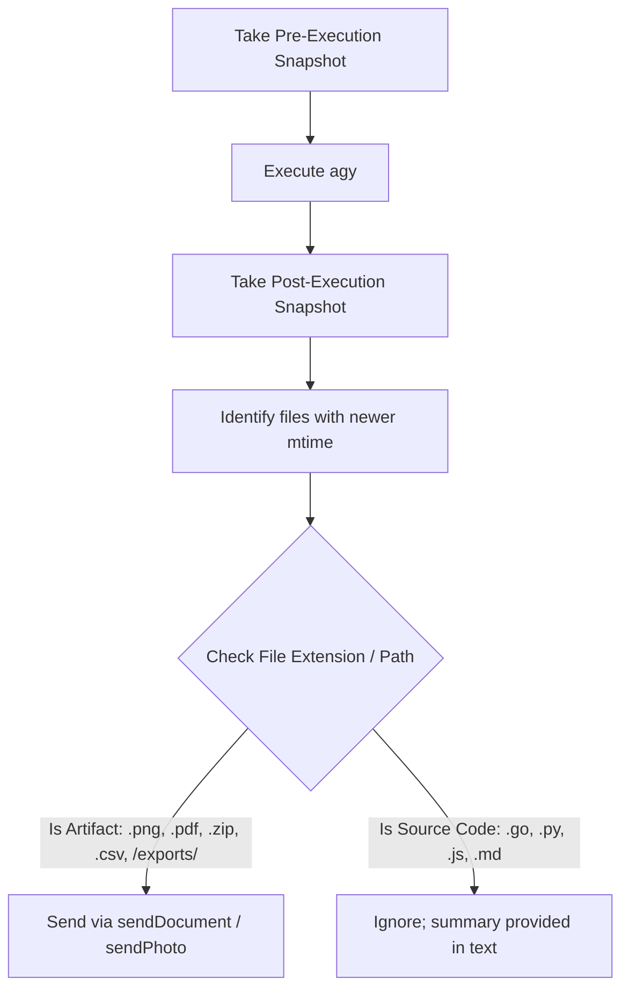
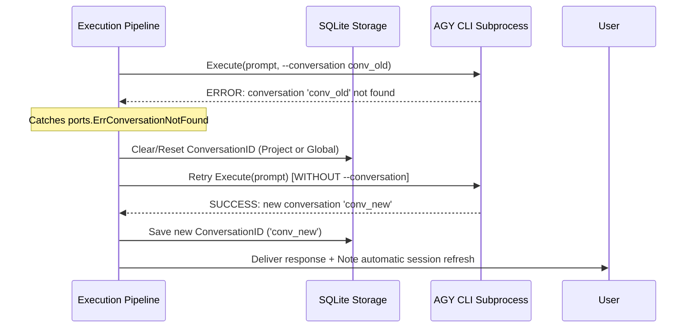

# AGY CLI Harness Technical Specification (Go Subprocess Controller)

> **Document status:** Reference
> **Code authority:** `internal/adapters/harness/agy`, runner port, execution service
> **Last verified:** 2026-09-05

This document provides a detailed technical specification of how the Gateway written in **Go** orchestrates, supervises, and captures results from the `agy` CLI binary, including defense-in-depth architectural mechanisms.

---

## 1. Execution Protocol & Safe STDIN Prompt Delivery

### A. STDIN Prompt Delivery (Bypassing OS CLI Argument Limits)
To eliminate subprocess crashes caused by exceeding OS command-line character length limits (Windows ~32KB, Linux ~128KB when users send large code files or text buffers), the Harness pipes prompt content directly via **standard input (`STDIN`)**:

```go
func (h *Harness) Execute(ctx context.Context, req domain.ExecutionRequest) (*domain.ExecutionResult, error) {
    args := []string{
        "--output-format", "json",
        "--project", "outside-of-project", // Prevents AGY CLI from loading default-cli-project.json
    }

    if req.WorkspaceDir != "" {
        args = append(args, "--add-dir", req.WorkspaceDir) // Mount exclusively the agent/project workspace
    }
    if req.DangerouslySkipPermissions || h.dangerouslySkipPermissions {
        args = append(args, "--dangerously-skip-permissions")
    }
    if req.ConversationID != "" {
        args = append(args, "--conversation", req.ConversationID)
    }
    if req.Mode != "" {
        args = append(args, "--mode", req.Mode)
    }
    if req.Effort != "" {
        args = append(args, "--effort", req.Effort)
    }

    cmd := exec.CommandContext(ctx, h.binaryPath, args...)
    if req.WorkspaceDir != "" {
        cmd.Dir = req.WorkspaceDir // CWD points accurately to the Agent or Project workspace
    }

    // Always pipe prompt via STDIN to support unlimited length & special characters
    cmd.Stdin = strings.NewReader(req.Prompt)

    var stdoutBuf, stderrBuf bytes.Buffer
    cmd.Stdout = &stdoutBuf
    cmd.Stderr = &stderrBuf

    // Configure process tree termination on Windows / Linux when context is cancelled
    configureCmd(cmd)

    if err := cmd.Run(); err != nil {
        return nil, fmt.Errorf("agy process failed: %w, stderr: %s", err, stderrBuf.String())
    }

    return h.parseOutput(stdoutBuf.Bytes())
}
```

---

## 2. Safe JSON Boundary Extraction (JSON Boundary Parser)

In scenarios where `agy` emits auxiliary startup or logging messages to `stdout`, the Harness scans backwards to extract the final valid JSON object from the buffer:

```go
func (h *Harness) parseOutput(raw []byte) (*ExecutionResult, error) {
    // Find boundaries of the JSON object {"conversation_id": ...}
    start := bytes.Index(raw, []byte("{"))
    end := bytes.LastIndex(raw, []byte("}"))
    if start == -1 || end == -1 || end <= start {
        return nil, fmt.Errorf("no valid JSON payload found in agy output: %s", string(raw))
    }

    var output AGYJSONOutput
    if err := json.Unmarshal(raw[start:end+1], &output); err != nil {
        return nil, fmt.Errorf("failed to unmarshal agy output: %w", err)
    }

    return &ExecutionResult{
        Success:        output.Status == "SUCCESS",
        ConversationID: output.ConversationID,
        ResponseText:   output.Response,
        DurationSec:    output.DurationSeconds,
        Usage:          output.Usage,
        Error:          output.Error,
    }, nil
}
```

---

## 3. Snapshot Diff Algorithm & Artifacts Filtering

To prevent message spam on Telegram when `agy` modifies dozens of source code files during software development, the auto-upload algorithm enforces an **Artifact Format Whitelist**:



### Whitelisted Artifact Formats for Automatic Upload:
- **Documents & Reports:** `.pdf`, `.csv`, `.xlsx`, `.docx`, `.json`
- **Charts & Images:** `.png`, `.jpg`, `.jpeg`, `.svg`, `.webp`
- **Compressed Archives:** `.zip`, `.tar.gz`, `.7z`
- **Designated Export Folders:** Any file generated under `exports/` or `output/`

---

## 4. Timeout Handling & Process Tree Zombie Cleanup

1. **Context Watchdog & Process Group Killing:**
   - When execution exceeds timeout (default 1800s) or receives Context cancellation:
     - **On Linux/macOS:** Group processes via `SysProcAttr: &syscall.SysProcAttr{Setpgid: true}` and dispatch `syscall.SIGKILL` to the negative PID (`-cmd.Process.Pid`). OS-specific tests must verify that descendants terminate.
     - **On Windows:** Attach to **Windows Job Objects** (`JOB_OBJECT_LIMIT_KILL_ON_JOB_CLOSE`) or fallback to tree termination via `exec.Command("taskkill", "/F", "/T", "/PID", pid).Run()` to eliminate all spawned child processes (node, python, git, etc.).
2. **Emergency Unlock Command (`/force_unlock`):**
   - If a background process hangs or locks unexpectedly, Admins can issue `/force_unlock` on Telegram to immediately release the `SessionLockManager`.

---

## 5. Lost / Expired AGY Session Auto-Healing

### Failure Scenarios:
1. The AGY transcript folder (`~/.gemini/antigravity/brain/<id>`) is deleted manually or purged via TTL policy.
2. The transcript file is corrupted or desynchronized during VPS/database migrations.
3. The AGY CLI returns `status == "ERROR"` or stderr contains: `"conversation not found"`, `"invalid conversation id"`, `"failed to load conversation"`, or `"no such conversation"`.

### Auto-Healing Flow:


### Source Code Implementation:
1. **Domain Helper:** `session.ResetActiveConversationID()` resets the conversation ID for the current scope (Project or Global).
2. **Storage Synchronization:** `store.SaveSession(ctx, session)` clears the record in `session_project_conversations` or resets `global_conversation_id`.
3. **Harness Auto-Retry:** Upon catching conversation-not-found errors, the engine retries once with a fresh session, preventing user disruption.

---

## 6. Real-Time Streaming Mode (`stream-json`)

In addition to batch execution, the `agy` Harness supports **Real-Time Streaming** (`--output-format stream-json`, `--input-format stream-json`) to deliver enhanced responsiveness:

- **NDJSON Stream Parsing:** Reads stdout line-by-line via `bufio.Scanner`.
- **Live Tool Status Dispatching:** Emits `ToolExecutingEvent` when tools transition to `ACTIVE` state (e.g. `generate_image`, `list_dir`, `run_command`).
- **Interactive Multi-turn STDIN Session:** Keeps a persistent `agy` process alive and pipes subsequent messages via STDIN JSON format `{"event":"user","message":{"content":"..."}}`.
- **Detailed Specification:** See [AGY Streaming Protocol](agy-streaming-protocol.md).

---

## 7. Smart Abort & Real-time Steering Protocol

When running in streaming mode with `queue_mode: "append"`, `Harness` implements a 2-stage graceful interrupt mechanism:

1. **Soft Interrupt via STDIN Pipe:**
   - Active streams are registered in `h.activeStreams sync.Map`.
   - `InterruptStream(sessionKey)` writes `{"event": "interrupt"}\n` directly to the stdin pipe.
   - `agy.exe` detects the interrupt event at its active sub-turn/tool boundary, flushes `transcript.jsonl`, emits `status: "INTERRUPTED"`, and exits cleanly.
2. **GraceTimeout Watchdog & Fallback Hard-Kill:**
   - If `agy.exe` is blocked on a long-running external process (e.g. `npm install`), `Harness` arms a fallback timer `time.AfterFunc(graceTimeout, ...)`.
   - If the process fails to exit within `graceTimeout` (default 3.0s), the context cancellation handler invokes `killProcessTree` via Windows Kernel Job Objects or Unix PGID.
3. **Lossless Conversation Handover:**
   - Because `agy.exe` checkpoints its state before exit, subsequent turns continue seamlessly with `--conversation <id>`, preserving Level 0–3 Gemini KV-cache hit rates.
