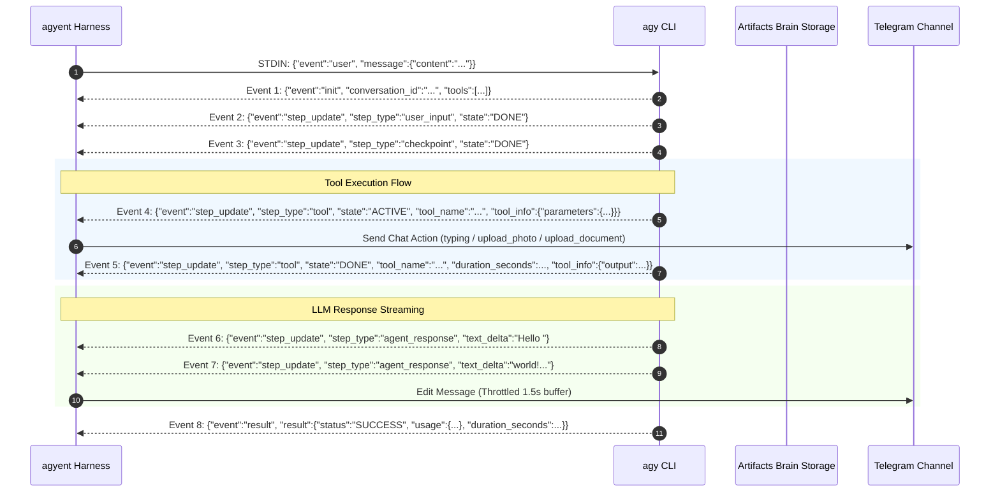
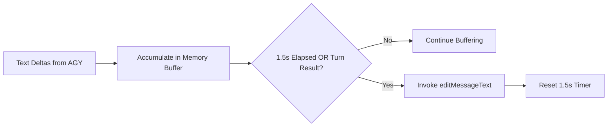

# AGY Streaming Protocol Specification & Real-Time Interaction Architecture

> **Document status:** Reference
> **Code authority:** AGY stream parser and runner, core engine, EventBus, channel delivery adapters
> **Last verified:** 2026-09-06

This document provides a comprehensive technical specification of the **Bidirectional NDJSON Stream-JSON Protocol** in the Antigravity CLI (`agy`), event-driven stream parsing, and real-time delivery architecture for **`agyent`**.

---

## 1. Overview & Operational Modes of AGY CLI

The `agy` CLI provides two primary I/O modes for subprocess interaction:

| Mode | CLI Flags | Characteristics | Use Cases |
| :--- | :--- | :--- | :--- |
| **Batch / Non-stream** | `--output-format json` | Waits for complete turn execution before writing a single JSON payload to STDOUT. | Simple background scripts and non-interactive automation tasks. |
| **Real-Time Streaming** | `--output-format stream-json`<br>`--input-format stream-json` | Emits continuous **NDJSON (Newline Delimited JSON)** lines in real-time. Supports multi-turn interaction over STDIN **without process restarts**. | Interactive Telegram/Webhook channels, live typing rendering, real-time tool state updates, and instant media artifact synchronization. |

---

## 2. STDIN Inbound Protocol (Inbound Payload Protocol)

When `agy` runs with `--input-format stream-json`, the process maintains an open connection and reads NDJSON lines from STDIN.

### Inbound STDIN Message Structure:
Each conversation turn is submitted as a single JSON line terminated with a newline `\n`:

```json
{"event":"user","message":{"content":"User prompt content here"}}
```

Or using the Block Content structure (supporting multi-block text and media):
```json
{
  "event": "user",
  "message": {
    "content": [
      {
        "type": "text",
        "text": "User prompt content here"
      }
    ]
  }
}
```

> [!NOTE]
> Unlike Batch mode (which spawns a fresh `agy` process for every turn), Streaming STDIN mode allows submitting Turn 1 $\rightarrow$ receiving Stream Turn 1 $\rightarrow$ submitting Turn 2 within **the same running process**, preserving in-memory context and eliminating cold-start overhead.

---

## 3. STDOUT Outbound Event Stream

STDOUT continuously emits NDJSON events throughout the turn lifecycle:



---

## 4. Event Types & Schemas

### A. Initialization Event (`event: "init"`)
Emitted immediately after `agy` initializes the execution environment:
```json
{
  "event": "init",
  "conversation_id": "98c6cfd1-73ed-41c0-b8fd-45b7030a35e6",
  "init": {
    "cwd": "C:\\Users\\...\\workspace",
    "tools": [
      "ask_question", "browser_click_element", "call_mcp_tool", "define_subagent",
      "find_by_name", "generate_image", "grep_search", "invoke_subagent",
      "list_dir", "manage_task", "read_url_content", "replace_file_content",
      "run_command", "schedule", "search_web", "view_file", "write_to_file"
    ],
    "permission_mode": "always-proceed"
  }
}
```

### B. Step Update Event (`event: "step_update"`)
Reflects internal actions during turn execution:

#### 1. Tool Execution Step (`step_type: "tool"`):
* **Active State (`state: "ACTIVE"`):**
    ```json
    {
      "event": "step_update",
      "step_update": {
        "conversation_id": "98c6cfd1-73ed-41c0-b8fd-45b7030a35e6",
        "step_index": 3,
        "state": "ACTIVE",
        "step_type": "tool",
        "tool_name": "list_dir",
        "tool_info": {
          "name": "list_dir",
          "parameters": {
            "DirectoryPath": "C:/Users/.../workspace"
          }
        }
      }
    }
    ```
* **Done State (`state: "DONE"`):**
    ```json
    {
      "event": "step_update",
      "step_update": {
        "conversation_id": "98c6cfd1-73ed-41c0-b8fd-45b7030a35e6",
        "step_index": 3,
        "state": "DONE",
        "step_type": "tool",
        "tool_name": "list_dir",
        "duration_seconds": 0.035,
        "tool_info": {
          "name": "list_dir",
          "parameters": { "DirectoryPath": "..." },
          "output": "AGENTS.md\nREADME.md\ncmd/\ndocs/\ngo.mod\n"
        }
      }
    }
    ```

#### 2. LLM Text Generation Step (`step_type: "agent_response"`):
* Token stream delta (`text_delta`):
    ```json
    {
      "event": "step_update",
      "step_update": {
        "conversation_id": "98c6cfd1-73ed-41c0-b8fd-45b7030a35e6",
        "step_index": 4,
        "state": "ACTIVE",
        "step_type": "agent_response",
        "text_delta": "Here is the list of files in the project:\n"
      }
    }
    ```

#### 3. Auxiliary Step Types:
* `step_type: "user_input"`: Records inbound user prompt.
* `step_type: "checkpoint"`: Records context snapshot checkpoints.
* `step_type: "system_message"`: System runtime notifications.

### C. Turn Completion Event (`event: "result"`)
Contains aggregated turn metrics, execution duration, and token usage:
```json
{
  "event": "result",
  "result": {
    "conversation_id": "98c6cfd1-73ed-41c0-b8fd-45b7030a35e6",
    "status": "SUCCESS",
    "response": "Here is the list of files in the project:\n1. [AGENTS.md]...",
    "duration_seconds": 5.65,
    "num_turns": 1,
    "usage": {
      "input_tokens": 28085,
      "output_tokens": 635,
      "thinking_tokens": 481,
      "cache_read_tokens": 0,
      "total_tokens": 28720
    }
  }
}
```

---

## 5. Tool Chaining Lifecycle

During complex multi-step tasks, the agent may invoke multiple tools in succession before synthesizing the final response:

```text
[User Request] -> list_dir (ACTIVE -> DONE) -> view_file (ACTIVE -> DONE) -> generate_image (ACTIVE -> DONE) -> agent_response -> result
```

### Tool Chaining Handling Rules in agyent:
1. **`step_index` Tracking:** Each tool invocation carries a monotonically increasing `step_index`.
2. **Live Status Indicators:**
   - On tool transition to `ACTIVE`: Updates the Telegram message footer or dispatches corresponding ChatAction:
     - `list_dir` / `find_by_name` / `grep_search` $\rightarrow$ `🔍 Searching codebase files...` (Chat Action: `typing`)
     - `view_file` / `read_url_content` $\rightarrow$ `📖 Reading documentation...` (Chat Action: `typing`)
     - `run_command` $\rightarrow$ `⚡ Executing system command...` (Chat Action: `typing`)
     - `generate_image` $\rightarrow$ `🎨 Generating illustration...` (Chat Action: `upload_photo`)
3. **Artifact Collection:** When any tool produces or modifies files in the workspace/brain, the Watcher immediately registers them in the turn's `Artifacts` list.

---

## 6. Media Generation & Handling (`generate_image`)

When the agent uses the image generation tool (`generate_image`), the event lifecycle proceeds as follows:

1. **Tool Trigger (`state: "ACTIVE"`)**:
   ```json
   {
     "event": "step_update",
     "step_update": {
       "step_index": 3,
       "state": "ACTIVE",
       "step_type": "tool",
       "tool_name": "generate_image",
       "tool_info": {
         "name": "generate_image",
         "parameters": {
           "ImageName": "robot_coffee",
           "Prompt": "A cute tiny robot drinking coffee in a cyberpunk cafe..."
         }
       }
     }
   }
   ```
2. **Generation Process**: Imagen API generates the image and persists it to disk.
3. **Brain Artifact Persistence**:
   The image file is automatically stored in the session's native brain directory:
   ```
   ~/.gemini/antigravity/brain/<conversation_id>/<ImageName>_<timestamp>.jpg
   ```
4. **Tool Completion (`state: "DONE"`)**:
   ```json
   {
     "event": "step_update",
     "step_update": {
       "step_index": 3,
       "state": "DONE",
       "step_type": "tool",
       "tool_name": "generate_image",
       "duration_seconds": 27.68
     }
   }
   ```

### Implementation in `agyent`:
* Upon detecting `tool_name == "generate_image"` and `state == "ACTIVE"`, `agyent` immediately dispatches `ToolExecutingEvent{Action: "upload_photo"}` to display *"Bot is sending photo..."* on Telegram.
* When `state == "DONE"`, `agyent` locates the file at `~/.gemini/antigravity/brain/<conv_id>/<ImageName>_*.jpg` and delivers it to Telegram via `sendPhoto` without waiting for the full turn `result`.

---

## 7. Go Structs for Streaming Adapter

In `internal/adapters/harness/agy/`:

```go
package agy

import "agyent/internal/core/domain"

// StreamEvent represents a single NDJSON line from the AGY CLI
type StreamEvent struct {
    Event          string           `json:"event"`
    ConversationID string           `json:"conversation_id,omitempty"`
    Init           *InitPayload     `json:"init,omitempty"`
    StepUpdate     *StepUpdateEvent `json:"step_update,omitempty"`
    Result         *ResultPayload   `json:"result,omitempty"`
    Error          string           `json:"error,omitempty"`
}

type InitPayload struct {
    CWD            string   `json:"cwd"`
    Tools          []string `json:"tools"`
    PermissionMode string   `json:"permission_mode"`
}

type StepUpdateEvent struct {
    ConversationID  string                 `json:"conversation_id"`
    StepIndex       int                    `json:"step_index"`
    State           string                 `json:"state"` // "ACTIVE", "DONE"
    StepType        string                 `json:"step_type"` // "tool", "agent_response", "checkpoint", "user_input"
    ToolName        string                 `json:"tool_name,omitempty"`
    TextDelta       string                 `json:"text_delta,omitempty"`
    DurationSeconds float64                `json:"duration_seconds,omitempty"`
    ToolInfo        *ToolInfoPayload       `json:"tool_info,omitempty"`
    Usage           map[string]interface{} `json:"usage,omitempty"`
}

type ToolInfoPayload struct {
    Name       string                 `json:"name"`
    Parameters map[string]interface{} `json:"parameters"`
    Output     interface{}            `json:"output,omitempty"`
    Error      interface{}            `json:"error,omitempty"`
}

type ResultPayload struct {
    ConversationID  string                 `json:"conversation_id"`
    Status          string                 `json:"status"` // "SUCCESS", "ERROR"
    Response        string                 `json:"response"`
    Error           string                 `json:"error,omitempty"`
    DurationSeconds float64                `json:"duration_seconds"`
    NumTurns        int                    `json:"num_turns"`
    Usage           domain.TokenUsage      `json:"usage"`
}
```

---

## 8. Delivery Throttling Strategy (Delivery Throttler)

Because the Telegram Bot API enforces rate limits (~1–2 edits per second per message), streaming deltas are throttled:



1. **Buffer & Flush Interval:** Maintains a 1.5s ticker coalescing `text_delta` chunks.
2. **Tool Indicator Message:** For long-running tools (bash commands, image generation, repo searches), displays status in the message footer:
   - `🔍 Searching file index...`
   - `🎨 Generating image illustration...`
   - `⚡ Running go test ./...`
3. **Instant Finalization:** On `result` event, flushes all remaining text and finalizes the message with action buttons and attachments.

### Terminal event ownership

The stream parser and runner emit progress only (`init`, text delta, and tool
state). They return the final result or a typed error to the core engine. The
engine is the only component that emits `EventStreamResult`,
`EventStreamInterrupted`, or `EventStreamError`, so one turn has one terminal
event. Delivery adapters retain a `(session_key, turn_id)` deduplication guard
for delayed or repeated delivery. Native and policy denials are delivered as a
conversational result; when AGY produced no response text, the engine supplies a
short explanation instead of exposing an adapter error stack.

---

## 9. Resilience & Edge Cases in Streaming

### A. Telegram HTML Formatting & LIFO Tag Stack Auto-Closing
While text is streaming, an intermediate token delta may split open tags (e.g. `**in progress`, `*italic`, `<blockquote>quote`, or ` ```go\nfunc main() `).

**Solution:**
1. **Telegram HTML Mode (`ParseMode: "HTML"`):** Converts GFM to clean HTML (`<b>`, `<i>`, `<pre><code class="...">`, `<code>`, `<blockquote>`, `<tg-spoiler>`), which is immune to punctuation entity errors (`.`, `-`, `!`, `(`, `)`).
2. **LIFO Tag Stack Auto-Closing:** `AutoCloseTelegramHTML(html string) string` uses a LIFO stack to temporarily append closing tags (`</code></pre>`, `</b>`, `</i>`, `</blockquote>`) exclusively to outbound wire payloads sent to Telegram every 1.5s, **without modifying the internal buffer**.
3. **Sanitized PlainText Fallback:** If Telegram returns HTTP 400 Bad Request, the adapter runs `StripHTMLTags` to sanitize the payload before sending plain text, ensuring the stream never breaks.

### B. Active Stream Overflow (>4096 Characters)
If accumulated streaming text exceeds 4000 characters mid-turn:
1. Adapter calls `SplitMarkdownPreservingCodeBlocks` to finalize **Message 1** (`editMessageText` for Chunk 1).
2. Automatically sends a new **Message 2** (`sendMessage`) to the chat and redirects subsequent streaming deltas to Message 2.

### C. Mid-Stream Process Crash Handling
If the `agy` process terminates unexpectedly (OOM, panic, context timeout):
1. STDOUT Scanner receives `io.EOF` or `err != nil` before receiving the `result` event.
2. Delivery Throttler flushes all buffered text received so far with an execution alert:
   `⚠️ [Warning]: Execution was interrupted before completion.`
3. Harness returns `ports.ErrProcessExecution` so the Engine can record audit logs and release session locks safely.

### D. Milestone-Based Sliding Inactivity Watchdog
Rather than applying a fixed static deadline from turn initiation (which would prematurely kill complex, productive multi-step turns), `agyent` enforces an **Inactivity Watchdog Timer**:
1. **Sliding Timeout Window:** Measures idle duration since the most recent milestone event (`timeout = req.Timeout || defaultTimeout`).
2. **Milestone Events:** The watchdog timer resets exclusively on:
   - Environment initialization (`event: "init"`)
   - Tool execution start/completion (`step_type: "tool"` or `state: "DONE"`)
   - Final turn result (`event: "result"`)
3. **Loop & Stall Protection:** Minor `agent_response` text deltas do not reset the watchdog. If an agent process stalls or hangs on a single step without reaching a milestone for `timeout` duration, the watchdog fires, terminates the OS process tree, and returns `context.DeadlineExceeded`.
4. **Silent Tool Execution Heartbeat Ping:** During long-running tool executions (e.g. `generate_image`, which consumes 35s–65s of silent I/O without stdout token emission), `StreamParser` automatically initiates an active-tool progress heartbeat ping ticker (every 10s). This periodic ping resets the sliding inactivity watchdog while the tool is computing, preventing premature timeout cancellation.
5. **Dynamic Image Task Timeout:** For scheduled cron and background tasks requesting image generation or multimedia workflows, `TaskExecutor` dynamically boosts the execution timeout to at least 300s.
