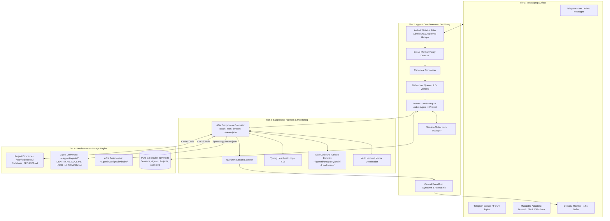

# System Architecture Overview (agyent Architecture)

This document provides a comprehensive technical description of the **`agyent`** system, written in **Go (Golang)** and driven by the **Antigravity CLI (`agy`)**, supporting both **Batch Execution** and **Real-Time Streaming (`stream-json`)**.

---

## 1. Comprehensive System Architecture Diagram

---

## 2. Core Architectural Components

### A. Inbound Ingestion & Filtering Tier
- **Whitelist Enforcement:** Instantly blocks messages from unauthorized users not present in the Admin IDs list or unapproved group chats.
- **Group-Aware Mention Filter:** In group chats and forum topics, only processes messages when:
  1. The message explicitly mentions `@agyent_bot`.
  2. The message is a direct reply to a bot message.
  3. The message is a supported Slash Command (`/p`, `/use`, `/status`, `/reset`).

### B. Normalization & Queueing Tier (Debounce, EventBus & Session Routing)
- **Canonical Message Model:** All messages (text, photos, code attachments) are normalized into a unified `CanonicalMessage` structure.
- **2.0s Debounce Channel:** Automatically aggregates consecutive fragmented messages from a user into a complete, unified prompt turn before invoking `agy`.
- **Central EventBus:** Dispatches lifecycle events (`message.received`, `stream.init`, `stream.delta`, `stream.tool`, `stream.result`, `artifact.detected`) via thread-safe publish/subscribe channels.
- **Session Locking:** Every active session is protected by a dedicated mutex. If a user submits new messages while `agy` is actively processing, the new messages queue sequentially in FIFO order.

### C. Execution & Monitoring Tier (Harness & Streaming Protocol)
- **Subprocess Controller:** Manages the lifecycle of the `agy` CLI binary, enforcing safe timeouts and supporting dual modes:
  - *Streaming Mode (`stream-json`):* Real-time NDJSON stream parsing, streaming text deltas and tool events live.
  - *Batch Mode (`json`):* Parses a single JSON envelope upon process completion.
- **Live Tool & Chat Action Dispatcher:** When tool calls like `generate_image` enter `ACTIVE` state, automatically triggers `sendChatAction(upload_photo)` on Telegram.
- **Auto Outbound Artifacts Watcher:** Monitors the AGY brain directory (`~/.gemini/antigravity/brain/<conv_id>/`) and workspace to detect newly created images and files, delivering them to Telegram immediately.

### D. Storage & State Persistence Tier (Storage & Metadata)
- **Pure-Go SQLite (`modernc.org/sqlite`):** Persists configuration tables, session routing (`user_id` $\rightarrow$ `agent` $\rightarrow$ `project`), audit logs, and token usage metrics.
- **Workspace Markdown Files:** Persists agent persona (`SOUL.md`), identity definition (`IDENTITY.md`), and long-term memory (`MEMORY.md`).
