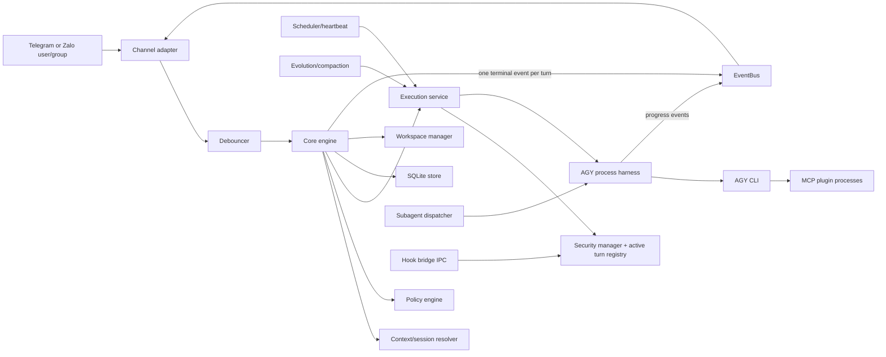
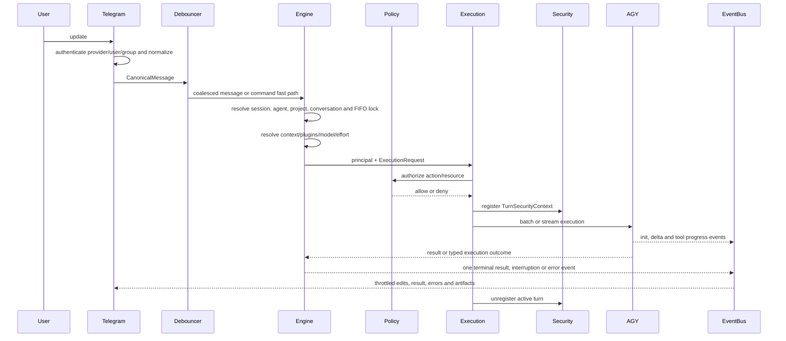

# Current system architecture

> **Document status:** Canonical
> **Code authority:** `cmd/agyent/run.go`, `internal/core`, `internal/adapters`
> **Last verified:** 2026-09-06

`agyent` is a Go gateway that maps authenticated Telegram conversations to local
AGY CLI executions. It supports multiple agent workspaces, project/conversation
isolation, streaming delivery, background schedules and subagents, plugins, and a
security control plane.

Telegram and Zalo are production channel adapters. `ChannelPort` and
`CompositeChannelMux` provide the shared extension seam; an additional channel
is not a supported capability until it is implemented, wired, and covered by
provider-aware authorization and routing tests.

## 1. Container view



The executable object graph is assembled in `cmd/agyent/run.go`. Constructors in
other packages should not behave as hidden service locators.

## 2. Layer ownership

| Layer | Packages | Owns | Must not own |
| --- | --- | --- | --- |
| Domain | `internal/core/domain` | Stable vocabulary, values, state transitions | Telegram, SQLite, JSON-RPC, process details |
| Ports | `internal/core/ports` | Interfaces required by core policy | Adapter construction or concrete dependencies |
| Application core | `internal/core/auth`, `engine`, `execution`, `scheduler`, concurrency/debounce/eventbus/retry | Use-case policy, orchestration, authorization, lifecycle | Imports from `internal/adapters` |
| Adapters | `internal/adapters/...` | Telegram, AGY, SQLite, security IPC/evaluators, context, plugins, MCP, workspace, subagent, evolution | Cross-adapter policy or CLI wiring |
| Composition | `cmd/agyent` | Cobra commands, configuration loading, concrete wiring, shutdown order | Reusable business policy |
| Embedded capabilities | `builtin/plugins` | MCP servers, manifests, scoped rules and skills | Bypassing execution identity/security boundaries |

The application core is intentionally pragmatic: `engine` and `scheduler` consume
configuration values, but no core package imports adapter implementations. The
automated architecture gate enforces this dependency direction.

## 3. Primary message and turn flow



Important boundaries:

- Telegram admission filters reduce invalid work early. The core policy and
  execution service remain the final authorization authority.
- A `Principal` identifies the caller; a `Resource` identifies the target agent
  or session. Do not infer ownership from a path or client-supplied name.
- `execution.Service` is the common chokepoint for normal, scheduled, compacting,
  reflecting, and other AGY turns once the related service is wired.
- Streaming progress is routed by session-scoped events. The engine owns the
  single terminal event for each turn; channel throttlers deduplicate it by
  session and turn before delivery.

## 4. Security control and execution planes

The gateway uses two connected planes:

1. The control plane in Go resolves principals/roles, registers active turn
   identity, evaluates presets, coordinates HITL decisions, sanitizes output, and
   records audit events.
2. The hook bridge receives AGY lifecycle hook requests over local IPC and binds
   them to the registered `AGYENT_TURN_ID`. Unknown or stale turns are denied.

APIS-4D propagates workspace, agent, session, and user identity to child
processes. The turn ID prevents a plugin/hook request from borrowing an unrelated
active context. See `security-and-guardrails-architecture.md` and
`plugin-developer-and-isolation-standard.md` for detailed constraints.

## 5. State and persistence

SQLite is opened through `internal/adapters/storage/sqlite.Open`:

- `writeDB`: one connection for mutations and migrations.
- `readDB`: up to twenty connections for concurrent reads on file databases.
- WAL, busy timeout, synchronous normal, foreign keys, and other pragmas are set in
  `BuildDSN`.
- Embedded migrations are applied in filename order and recorded in
  `schema_migrations`.
- Migration `000011` is an intentionally irreversible hardening migration and is
  preceded by a verified snapshot for legacy databases.

The main persisted aggregates are users/groups, agents and ACLs, projects,
sessions/conversations, audit/security events, subagent tasks, schedules, and
heartbeats. The migration files are the schema source of truth.

Agent knowledge lives in workspace Markdown files. Conversation transcripts and
AGY-native state live under the AGY brain directory; the gateway stores routing
IDs rather than duplicating that transcript.

## 6. Prompt/context model

For a new/ephemeral conversation, prompt assembly is deterministic:

```text
Level 0  runtime foundation
Level 1  global identity/soul/user/long-term memory/core rules
Level 2  project directives and active plugin rules
Level 3  sorted skill headers
Level 4  attachments, time, continuity digest, daily memory, user message
```

Daily memory is dynamic and remains at Level 4. A warm conversation uses
`ComposeContinuationPrompt`, relying on the AGY conversation transcript rather
than resending Levels 0–3. Sorting is a compatibility requirement because prefix
order affects cache reuse.

## 7. Background flows

### Scheduler and heartbeat

The core scheduler persists tasks, claims due work, resolves workspace and
identity, executes through the execution service, emits completion/failure events,
and updates the next run. Heartbeats read workspace `HEARTBEAT.md` instructions.
Overlap and misfire policies are domain values and must remain explicit.

### Subagents

The dispatcher persists a task before queueing it, applies a bounded worker pool,
starts an isolated AGY subprocess, and transitions tasks through compare-and-swap
state changes. Shared workspaces retain the parent's project scope; scratch mode
uses an isolated task workspace. Cancellation must terminate the process tree.

### Evolution and compaction

Evolution collects bounded transcript deltas, filters candidate memories, runs
reflection through the authorized execution path when wired, resolves conflicts,
and updates workspace memory. Conversation compaction creates a continuity digest
that is injected at Level 4 of the next turn.

## 8. Extension rules

### New channel adapter

Implement `ChannelPort`, normalize inbound identity, use `TargetContext` for
outbound routing, and add provider-aware authorization tests. Wire the adapter in
the composition root and update this document before claiming support.

### New storage adapter

Implement core-owned repository ports. Preserve scoped query semantics and
timestamp behavior; do not expose database-specific rows to domain packages.

### New plugin

Provide a strict `plugin.json`; optional `mcp_config.json`, `rules/AGENTS.md`, and
`skills/<name>/SKILL.md`; propagate APIS-4D identity; validate filesystem and
tenant ownership inside the plugin; and keep tool schemas synchronized with
skills.

## 9. Verification boundaries

- `make architecture-check` enforces package dependency direction and the
  pure-Go SQLite rule.
- `make docs-check` verifies document status, local links, code references in
  authoritative docs, manifests, and skill metadata.
- `make verify` runs both gates, plugin syntax validation, and the short Go suite.
- Concurrency/process/security changes also require `go test -race ./...`.
