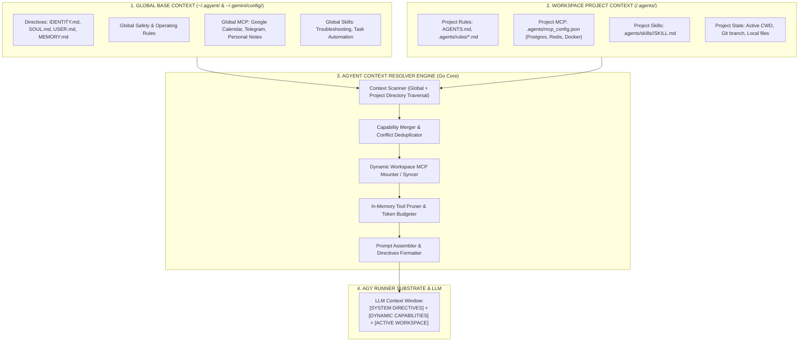
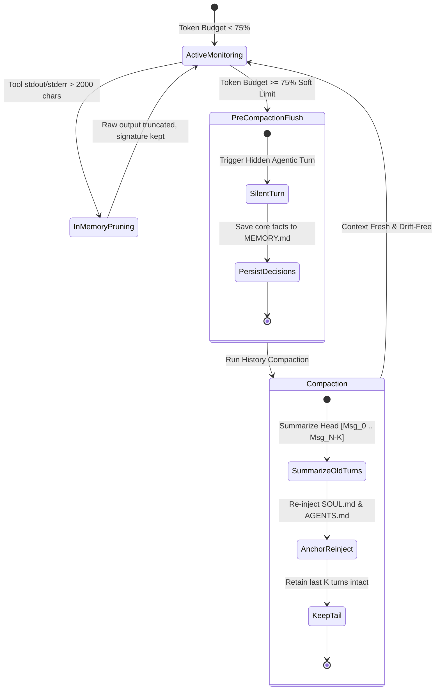
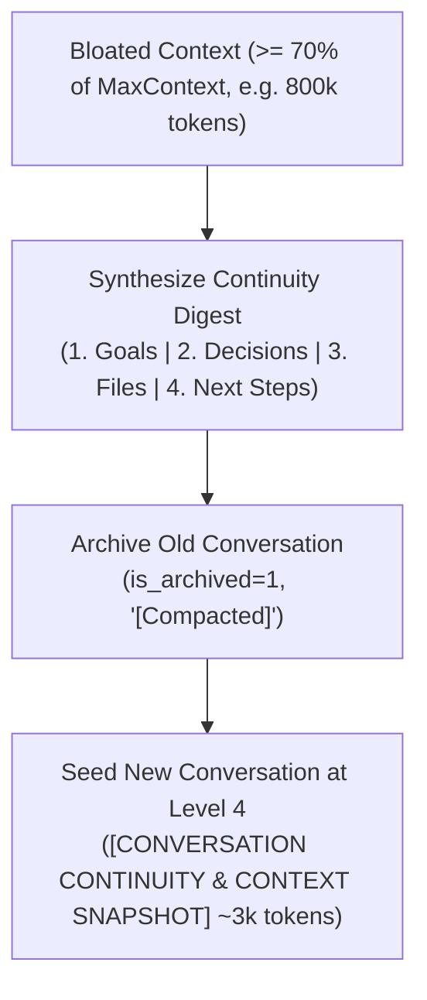

# Context Management Architecture

> **Document status:** Reference
> **Code authority:** `internal/adapters/context`, plugin/MCP adapters, prompt bootstrap and compactor
> **Last verified:** 2026-09-05

This document provides a comprehensive technical specification of the **Context Management System** for **`agyent`**. This design clearly distinguishes between **Global Agent Context** and **Workspace Project Context**, integrating architectural insights from OpenClaw and empirical findings with the Antigravity CLI (`agy 1.1.20`).

---

## 1. Overview & Architectural Principles

In autonomous personal AI assistant systems, the Context Window is the most critical and scarce runtime resource. `agyent` enforces 4 foundational design principles:

1. **Hierarchical Layered Context:**
   - **Level 0 - System Meta-Instruction ([Architecture Details](system-meta-instruction-architecture.md)):** Static runtime foundation frame (`[SYSTEM RUNTIME FOUNDATION]`) anchored at the top of the prompt to maximize KV-cache prefix hits and anchor the gateway runtime persona.
   - **Level 1 - Global Base Layer (`~/.agyent/agents/<name>/`):** Contains core identity (`IDENTITY.md`), personality/soul (`SOUL.md`), user profile (`USER.md`), long-term memory (`MEMORY.md`), personal tools (Global MCP), and shared system skills. Always accompanies the agent across all tasks.
   - **Level 2 - Workspace Overlay Layer (`<project>/.agents/`):** Contains codebase architectural rules (`AGENTS.md`), local infrastructure tools (`.agents/mcp_config.json`), and specialized domain workflows (`.agents/skills/`) specific to the active codebase.
2. **Deterministic Precedence & Override Hierarchy:** Explicit merge precedence rules when conflicts arise:
   $$\text{System Foundation} \rightarrow \text{Workspace Project} > \text{Global Config} > \text{Built-in Engine Defaults}$$
3. **Zero Context Leakage:** When switching projects, all Workspace MCP tools and skills from the previous project are unmounted/released immediately, eliminating cross-project hallucinations and data contamination.
4. **Progressive Disclosure & Lifecycle Pruning:** Injects only lightweight skill headers (~60 tokens/skill) into the prompt index; automatically prunes excessive tool execution outputs to preserve token budget.

---

## 2. System Architecture Diagram



---

## 3. Matrix of the 4 Context Pillars

| Pillar | 🌐 Global Level (`~/.agyent/agents/<name>/`) | 📁 Workspace Level (`<project>/.agents/`) | Resolution & Empirical Findings |
| :--- | :--- | :--- | :--- |
| **1. Rules** | Identity, address conventions, data safety, baseline interaction etiquette. | Code architecture (Clean Arch), linters, banned dependencies, commit conventions. | **Hierarchical Stacking:** Global rules load as base $\rightarrow$ Workspace `AGENTS.md` stacks on top as domain constraints. |
| **2. Skills** | General system skills: Diagnostics, session management, reminder tools. | Project-specific domain runbooks: Staging deployment, database migration scripts. | **Native Progressive Disclosure:** AGY CLI automatically discovers `.agents/skills/<name>/SKILL.md` in workspace and loads full bodies only upon prompt triggers. |
| **3. Tools / MCP** | **Global Integrations:** enabled global plugins. | **Project Infrastructure:** enabled workspace plugins. | **Dynamic MCP Syncing:** AGY CLI reads `~/.gemini/config/mcp_config.json` (mirrored across all runtime targets). `agyent` mounts session-keyed MCP servers for an exclusive turn and unmounts them afterward. |
| **4. Memory / State** | Durable facts: User preferences, working habits, Architectural Decision Records (ADRs). | Project context: Active CWD, git branch, in-progress bugs, task checklist in repo. | **Scoped Isolation:** Workspace reads global memory as needed; project notes never leak across codebases. |

---

## 4. Token Lifecycle Management & Anti-Drift Architecture

Drawing inspiration from OpenClaw's Cognitive OS design, `agyent` implements 3 advanced mechanisms:



1. **In-Memory Tool Result Pruning:** Automatically truncates large terminal and log outputs (> 2000 characters) in memory after the turn completes, preserving signatures and status while protecting user conversation history.
2. **Two-Tier Memory Structure:** Clearly separates Durable Memory (`MEMORY.md`) from Daily Episodic Logs (`memory/YYYY-MM-DD.md`).
3. **Agent Self-Learning & Evolution ([Architecture Details](agent-self-learning-and-evolution-architecture.md)):** Autonomous reflection, feedback sentiment sensing, and persistent memory updates are managed by the self-learning subsystem.
4. **Pre-Compaction Silent Memory Flush:** When context approaches 75% of window capacity, the engine triggers a background turn asking the agent to extract critical facts/decisions into `MEMORY.md` prior to compaction.
5. **Post-Compaction Anchor Re-injection:** Automatically re-injects `SOUL.md` and `AGENTS.md` summaries immediately following conversation summaries to eliminate persona drift.

---

## 5. Core Go Structs & Port Interfaces

### 5.1. Domain Entities (`internal/core/domain/context.go`)

```go
package domain

import "time"

type ContextScope string

const (
    ScopeGlobal    ContextScope = "global"
    ScopeWorkspace ContextScope = "workspace"
)

type SkillHeader struct {
    Name        string       `json:"name"`
    Description string       `json:"description"`
    FilePath    string       `json:"file_path"`
    Scope       ContextScope `json:"scope"`
}

type MCPServerConfig struct {
    ServerName string            `json:"server_name"`
    Command    string            `json:"command"`
    Args       []string          `json:"args,omitempty"`
    ServerURL  string            `json:"server_url,omitempty"`
    Env        map[string]string `json:"env,omitempty"`
    Scope      ContextScope      `json:"scope"`
    Disabled   bool              `json:"disabled"`
}

type ResolvedContext struct {
    WorkingDir          string
    GlobalDirectives    string
    WorkspaceDirectives string
    CombinedDirectives  string
    SkillHeaders        []SkillHeader
    ActiveMCPServers    []MCPServerConfig
    ResolvedAt          time.Time
}
```

### 5.2. Port Interface (`internal/core/ports/context.go`)

```go
package ports

import (
    "context"
    "agyent/internal/core/domain"
)

type ContextResolverPort interface {
    // Resolve combines Directives, Skills, Rules, and MCP definitions across Global and Workspace scopes
    Resolve(ctx context.Context, globalHome string, workspaceDir string) (*domain.ResolvedContext, error)
    
    // DiscoverSkills scans and deduplicates skills from global and workspace skill directories
    DiscoverSkills(ctx context.Context, globalHome string, workspaceDir string) ([]domain.SkillHeader, error)
    
    // SyncWorkspaceMCP mounts or unmounts project MCP servers for an exclusive turn.
    SyncWorkspaceMCP(ctx context.Context, workspaceDir string, isMount bool) error
}
```

---

## 6. Conversation Context Compaction & Continuity Seeding (Level 4)

Over long-running multi-turn developer sessions, tool outputs, diffs, and conversational turns accumulate rapidly, threatening model context limits (1M on Gemini, 200k on Claude, 128k on GPT).

`agyent` employs a **Context Compactor Engine** that can substantially reduce
long session history. Semantic continuity is an output to evaluate against the
retained goals, decisions, files, and next steps; it is not guaranteed by a
compression percentage:



### 6.1. Hybrid Synthesis Architecture
1. **Primary Path (Semantic LLM Synthesis):** Runs a fast, low-effort single-turn synthesis prompt (`--mode plan --effort low`) to extract an executive 4-block Markdown Continuity Digest.
2. **Fallback Path (Heuristic Extraction):** If the LLM execution times out or fails, the engine falls back deterministically to extracting recent audit log snippets, project scope, and touched files without blocking the session.

### 6.2. Trigger Mechanisms
* **Manual Command (`/compact` or `/compress`):** Users can explicitly compact their current session context on-demand.
* **Auto-Compact Watchdog:** Automatically triggers post-turn when `audit.Usage.InputTokens >= capability.EffectiveCompactThreshold()` (default: **70% of Max Context Window**), proactively avoiding high-latency and watchdog timeout limits.

---

## 7. Implementation Roadmap

Detailed execution phases are tracked in [Milestone 7: Context Management & Skills Subsystem](plans/milestone-7-context-management-and-skills.md) and [Milestone 15: Context Compaction & Capabilities](plans/milestone-15-context-compaction-and-capabilities.md).
