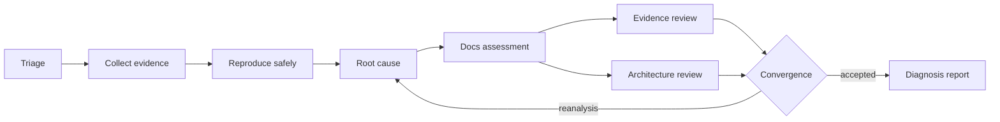
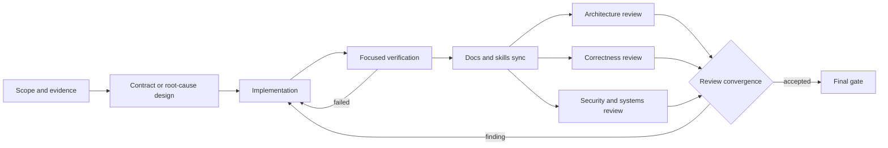

# Engineering workflow graphs

> **Document status:** Normative
> **Code authority:** `.agents/workflows/*.json`, `scripts/check_workflows.py`, and `AGENTS.md`
> **Last verified:** 2026-09-05

All concrete repository diagnosis and change work is routed through one validated
workflow graph. The graph makes evidence, mutation boundaries, review,
documentation synchronization, and completion gates explicit without giving an
agent any authority beyond the user's request.

The machine-readable contract is [workflow.schema.json](../.agents/workflows/workflow.schema.json),
and execution semantics are defined in the [workflow guide](../.agents/workflows/README.md).
The cross-cutting decision is recorded in
[ADR 0001](adr/0001-mandatory-engineering-workflow-graphs.md).

## Routing

| Intent | Graph | Result |
| --- | --- | --- |
| Investigate or explain only | [Debug](../.agents/workflows/debug.json) | Reviewed diagnosis; no mutation |
| Find and fix a defect | [Bugfix](../.agents/workflows/bugfix.json) | Regression-protected fix |
| Modify existing behavior or structure | [Change](../.agents/workflows/change.json) | Bounded, compatible change |
| Add a capability or contract | [New feature](../.agents/workflows/new-feature.json) | Acceptance-traceable feature |

Mixed “diagnose and fix” requests use the bugfix graph. Documentation-only
changes use the change graph. A diagnosis-only task cannot cross into mutation
without a new explicit request.

## Common node contract

Every node supplies:

- a node-scoped `system_prompt` subordinate to user and higher-level
  instructions;
- `guide`, `skills`, and `tools` needed at that stage;
- named `inputs` and evidence-bearing `outputs`;
- an explicit `may_edit` capability boundary;
- blocking acceptance criteria and outcome transitions.

Agents track node state in the active task plan. They do not add transient state
files to the repository. `scripts/check_workflows.py` verifies graph structure,
reachability, artifact producers, mutation boundaries, mandatory docs nodes,
review convergence, and terminal gates.

## Debug graph

Every node is read-only. The graph may recommend remediation but cannot apply it.

## Bugfix, change, and feature graphs

The feature graph additionally requires feature discovery, architecture design,
an ADR decision, and acceptance traceability. The bugfix graph requires a failing
reproduction and proven causal chain. The change graph requires an impact and
compatibility map.

## Review convergence

Review branches are independent and read-only. When delegation is available and
authorized, use separate read-only reviewers. Otherwise run fresh-context review
passes from raw evidence and the diff. Each report must name examined files and
commands and emit structured findings.

Severities `P0`, `P1`, and `P2` block completion. A `P3` is fixed or explicitly
accepted. Any remediation returns through focused verification, documentation
sync, and all review branches; a partial re-review does not converge.

## Documentation synchronization

The docs node is never skipped. It updates or explicitly dispositions:

- canonical architecture and component references;
- root and scoped `AGENTS.md` files;
- user README, CLI help, schemas, and migration notes;
- affected `SKILL.md` and tool contracts;
- ADRs for cross-cutting or hard-to-reverse decisions.

`make verify` validates workflow graphs together with documentation, skill,
plugin, architecture, and Go checks.
