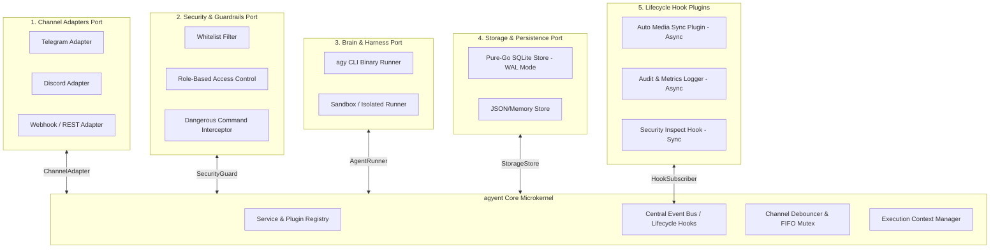

# Modular Extensible Architecture (Microkernel & Ports/Adapters)

This document describes the software design of **agyent** following the **Microkernel pattern combined with Ports & Adapters in Go**, detailing synchronous hook execution (`SyncEmit`) and asynchronous event dispatching (`AsyncEmit`).

---

## 1. Microkernel Architectural Diagram



---

## 2. Core Port Interfaces & Contracts

### A. Communication Channel (`ChannelAdapter`)
```go
type ChannelAdapter interface {
    Name() string
    Start(ctx context.Context, inbound chan<- CanonicalMessage) error
    Send(ctx context.Context, msg OutboundMessage) error
    SendStream(ctx context.Context, chatID string, initialMsg string) (StreamMessageHandle, error)
    SendChatAction(ctx context.Context, chatID string, action string) error // "typing", "upload_photo", "upload_document"
    SendFile(ctx context.Context, chatID string, filePath string, caption string) error
    Stop() error
}
```

### B. Brain Subprocess Harness (`AgentRunner`)
```go
type StreamHandler func(event domain.Event) error

type AgentRunner interface {
    Name() string
    Execute(ctx context.Context, req ExecutionRequest) (*ExecutionResult, error)
    ExecuteStream(ctx context.Context, req ExecutionRequest, handler StreamHandler) (*ExecutionResult, error)
    HealthCheck(ctx context.Context) error
}
```

### C. Storage & Persistence (`StorageStore`)
```go
type StorageStore interface {
    GetSession(ctx context.Context, sessionKey string) (*Session, error)
    SaveSession(ctx context.Context, session *Session) error
    ListAgents(ctx context.Context) ([]Agent, error)
    GetAgent(ctx context.Context, name string) (*Agent, error)
    SaveAgent(ctx context.Context, agent *Agent) error
    ListProjects(ctx context.Context, agentName string) ([]Project, error)
    LogAudit(ctx context.Context, log AuditLog) error
    Close() error
}
```

---

## 3. Synchronous vs. Asynchronous Event Dispatching (`SyncEmit` vs `AsyncEmit`)

To prevent secondary plugins (such as audit loggers or network alerts) from delaying response times of the core engine, the `EventBus` separates event execution into two execution paths:

```go
type EventBus struct {
    syncSubscribers  map[EventType][]SyncHandler   // Blocking execution; can inspect or abort request
    asyncSubscribers map[EventType][]AsyncHandler  // Non-blocking background goroutine workers
}

// 1. SyncEmit: For Security Checks & Pre-turn Data Intervention
func (eb *EventBus) SyncEmit(ctx context.Context, evt Event) error {
    for _, handler := range eb.syncSubscribers[evt.Type()] {
        if err := handler(ctx, evt); err != nil {
            return err // Abort execution immediately if security check fails
        }
    }
    return nil
}

// 2. AsyncEmit: For Audit Logging, Token Metrics, and Auxiliary Notifications
func (eb *EventBus) AsyncEmit(evt Event) {
    for _, handler := range eb.asyncSubscribers[evt.Type()] {
        go func(h AsyncHandler) {
            h(context.Background(), evt) // Runs concurrently without blocking the main turn thread
        }(handler)
    }
}
```

---

## 4. Standard Go Directory Structure Layout

```
agyent/
├── cmd/
│   └── agyent/
│       ├── main.go            <-- CLI Entrypoint (init, run, status)
│       ├── init_cmd.go        <-- Setup Wizard
│       └── run_cmd.go         <-- Daemon Bootstrapper
├── internal/
│   ├── core/                  <-- Core Microkernel (Zero external dependencies)
│   │   ├── domain/            <-- Entities: Agent, Project, Session, Message
│   │   ├── ports/             <-- Interface contracts: Channel, Runner, Storage, Security
│   │   ├── eventbus/          <-- Pub/Sub Event Bus (SyncEmit & AsyncEmit)
│   │   ├── debouncer/         <-- 2.0s Message Buffer Queue
│   │   └── engine/            <-- Central Turn Orchestration
│   │
│   ├── adapters/              <-- Pluggable Secondary Adapters
│   │   ├── channels/
│   │   │   ├── telegram/      <-- Telegram Adapter (Polling & Webhook)
│   │   │   └── discord/       <-- (Extensible) Discord Adapter
│   │   ├── harness/
│   │   │   └── agy_cli/       <-- AGY Subprocess Runner (STDIN & JSON Parser)
│   │   ├── storage/
│   │   │   └── sqlite/        <-- Pure-Go SQLite Implementation (WAL Mode)
│   │   └── security/
│   │       ├── whitelist/     <-- Admin & Group Whitelist
│   │       └── guardrail/     <-- Dangerous command filters
│   │
│   └── plugins/               <-- Lifecycle Hook Plugins
│       ├── media_sync/        <-- Bidirectional file & photo sync
│       └── audit_logger/      <-- Audit logs & token metrics recorder
```
