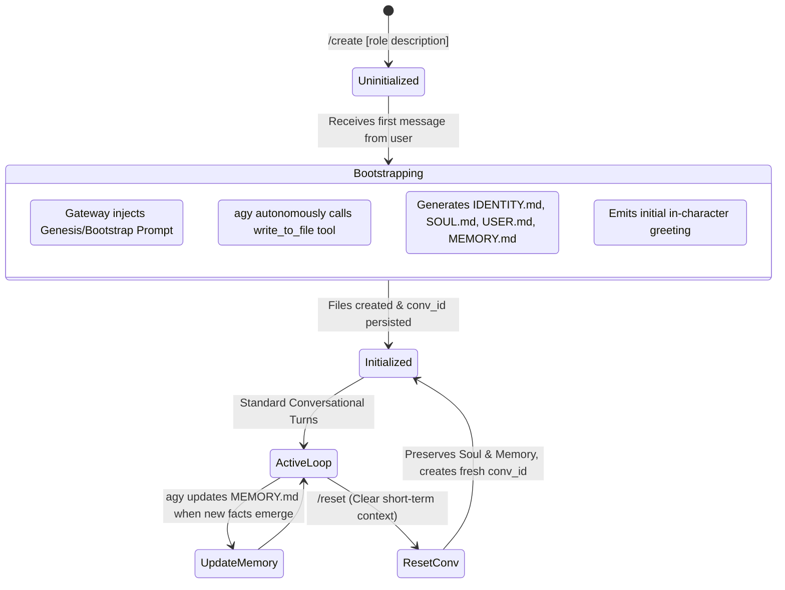

# Agent Lifecycle & Genesis Bootstrap Protocol

This document describes the lifecycle of an agent from birth (`uninitialized`) to operational readiness (`initialized`), along with the creation mechanism for the 4 core knowledge pillars.

---

## 1. Lifecycle State Machine Diagram



---

## 2. The 4 Knowledge Pillars of an Agent

Upon bootstrapping, each agent workspace maintains 4 Markdown files that serve as its foundational persona:

### 1. `IDENTITY.md` (Self-Identity & Capabilities)
- Name, title, and expertise scope (e.g. Go Backend Specialist, Cloud Architect, Daily Life Assistant).
- Scope of responsibility (strengths and boundaries of what is in/out of scope).

### 2. `SOUL.md` (Personality & Behavioral Philosophy)
- Tone of voice (professional, witty, sharp, concise).
- Thinking principles (First-principles reasoning, Test-driven development, Zero-trust security).
- Behavioral rules and ethical guardrails.

### 3. `USER.md` (Owner Profile)
- Owner's name and preferred mode of address.
- Working timezone, coding habits, and preferred tech stack.
- Preferences, strict requirements, and constraints specified by the user.

### 4. `MEMORY.md` (Persistent Long-Term Memory)
- Tracked projects list.
- Key Architectural Decision Records (ADRs).
- Lessons learned and past mistakes resolved.

---

## 3. Genesis Bootstrap Protocol Prompt Template

When an agent's status is `uninitialized`, the gateway passes the following prompt to `agy`:

```text
[SYSTEM BOOTSTRAP PROTOCOL - MANDATORY INITIALIZATION]
You are initializing a brand-new, dedicated Agent Workspace.
Your goal is to establish your core identity, soul, user context, and memory files in this directory.

[AGENT CONFIGURATION]
- Requested Agent Name: {agent_name}
- Role & Purpose Description: {description}
- Owner/User Info: {user_info}
- User's First Message: "{initial_user_message}"

[INSTRUCTIONS]
You MUST create the following files in the current workspace using your file-writing tools:
1. `IDENTITY.md`: Define your identity, name, role, scope of expertise, and tools you excel at.
2. `SOUL.md`: Define your personality, tone of voice, thought process, core values, and behavioral boundaries.
3. `USER.md`: Summarize known details about your owner (preferences, constraints, timezone, expectations).
4. `MEMORY.md`: Initialize your long-term memory structure with sections:
   - ## Core Facts & Preferences
   - ## Active Projects & Context
   - ## Lessons Learned & Decisions

After creating these files, provide a concise, in-character greeting to your owner, addressing their first message and confirming that your initialization is complete.
```
