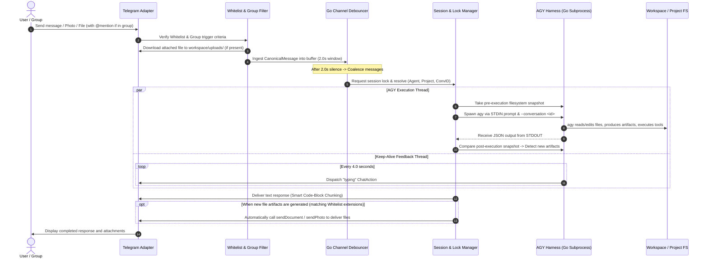

# agyent Message and Media Pipeline

> **Document status:** Reference
> **Code authority:** Telegram adapter, debouncer, core engine, AGY watcher/throttler
> **Last verified:** 2026-09-05

This document details the 6-stage message processing pipeline, sliding-window message debouncing, Telegram Topics handling, smart Markdown/HTML chunking (preserving code blocks), and bidirectional media synchronization.

---

## 1. End-to-End Message & Media Pipeline Sequence Diagram



---

## 2. Detailed Pipeline Stages

### Stage 1: Ingestion & Group Topics Filter
- **1-on-1 Chats:** Verifies that `user_id` exists in the Admin Whitelist.
- **Group Chats & Supergroup Topics:**
  - Session key is constructed as: `telegram:group_id:thread_id` (in Forum Topics, each Topic functions as an independent Project Context without crosstalk).
  - Only triggered when: message mentions `@agyent_bot`, replies to a bot message, or starts with a `/p` command.

---

### Stage 2: Automatic Inbound Media Synchronization & Workspace Relocation
When a user uploads code files, logs, or photos:
1. **Ingestion & Staging:** Gateway downloads the file into the staging cache (`~/.agyent/staging/<safe_name>`) with Windows reserved name and path traversal sanitization.
2. **Turn Workspace Relocation:** When the Core Engine resolves the active session's workspace (`agent.WorkspacePath` or `proj.ProjectPath`), `WorkspacePort` automatically relocates or copies the staged files into `<workspaceDir>/uploads/<timestamp>_<safe_name>`.
3. **Git Isolation:** Automatically provisions `<workspaceDir>/uploads/.gitignore` containing `*\n!.gitignore\n` to prevent personal/temporary uploads from polluting git tracking in repository workspaces.
4. **Frictionless AGY Execution & Guardrails:** Because the attachments reside within `<workspaceDir>`, AGY CLI (`--add-dir <workspaceDir>`) can access them subject to the configured security policy and PathJail checks.
5. **Level 4 Prompt Injection:** Formats attachments strictly within Level 4 so dynamic paths do not invalidate the stable Level 0–3 prefix:
   ```text
   [ATTACHED FILES RECEIVED]
   - File: /absolute/path/to/project/uploads/1724930123_error.log (Type: document, Size: 1024 bytes)
   
   User Prompt: "Please analyze this error log for me"
   ```

---

### Stage 3: Debouncing & Coalescing via Go Channels
Uses `time.Timer` and a buffer queue to coalesce rapid fragmented user messages sent within 2.0s into a single turn prompt.

---

### Stage 3.1: Real-Time Steering & Smart Abort (Append Mode)
When `queue_mode: "append"` is configured (or toggled via `/mode append`), incoming messages do not wait blindly in the FIFO lock queue if a turn is actively executing:
1. **Debouncer Shield:** Inbound messages still pass through the debouncer window (1.5s–2.0s) to prevent process thrashing when a user rapidly sends multiple fragmented messages.
2. **Soft Interrupt Signal:** `Engine` issues `runner.InterruptStream(sessionKey)`, which streams `{"event": "interrupt"}\n` over STDIN to `agy.exe`.
3. **Safe Checkpoint Boundary:** `agy` CLI finishes its active atomic sub-turn/tool (e.g. `write_to_file`, `git commit`), flushes its `transcript.jsonl` cleanly, emits `status: "INTERRUPTED"`, and exits.
4. **GraceTimeout Fallback:** If a long-running tool (e.g. heavy compilation) does not exit within `grace_timeout_seconds` (default 3.0s), the engine automatically falls back to controlled OS process tree termination (`JobGuard` / `killProcessTree`).
5. **UI Stream Finalization:** `DeliveryThrottler` appends a pause indicator (`⏸️ Đã tạm dừng lượt này để nhận chỉ dẫn mới...`), drains background workers, and cleanly finalizes the message.
6. **Continuation Handover:** Turn 2 acquires the `SessionLockManager` lock and continues using the established `--conversation <id>`, preserving Level 0–3 prefix invariance. Provider cache behavior is measured separately.

---

### Stage 4: Per-Session Concurrency Locking
- Each `SessionKey` is protected by a dedicated `sync.Mutex` and reference-counted `lockEntry`.
- In `fifo` mode (default), subsequent turns wait sequentially on `sem`. In `append` mode, the active turn drains at its safe checkpoint before the waiting turn acquires the lock.
- If an execution exceeds 1800s, the timeout watchdog automatically terminates the subprocess and releases the lock. The `/force_unlock` slash command is supported for emergency releases.

---

### Stage 5: AGY Subprocess Execution (Batch or Streaming Mode) & Snapshot Diff
1. **Pre-execution Snapshot:** Captures directory state (`map[filename]mtime`).
2. **Execute `agy` Binary:**
   - *Batch Mode:* Captures single JSON envelope upon process exit.
   - *Streaming Mode (`stream-json`):* Ingests real-time NDJSON stream events.
3. **Live Feedback & Chat Actions:**
   - On tool execution (`step_type: tool`, `state: ACTIVE`): Automatically dispatches corresponding chat action (`upload_photo` for `generate_image`, `upload_document` or `typing` for other tools).
   - On `text_delta`: Accumulates deltas into buffer and pushes updates periodically (1.5s sliding window edits via throttled `editMessageText`) to prevent API rate limits.
   - Detailed specification: See [AGY Streaming Protocol](agy-streaming-protocol.md).

---

### Stage 6: Telegram HTML Formatting & Smart Chunking Engine

When `agy` generates responses in GitHub Flavored Markdown (GFM), directly sending raw text via Telegram `MarkdownV2` often results in HTTP `400 Bad Request` errors due to standard punctuation characters (`.`, `-`, `!`, `(`, `)`).

To ensure rock-solid rendering, the gateway implements **Telegram HTML Mode (`ParseMode: "HTML"`)** with a pure Go single-pass state machine parser:
1. **Converts GFM to compliant Telegram HTML:**
   - Headings (`### Heading`) $\rightarrow$ `<b>Heading</b>`
   - Bold / Italic (`**text**`, `*text*`) $\rightarrow$ `<b>text</b>`, `<i>text</i>`
   - Code Blocks (```` ```go ````) $\rightarrow$ `<pre><code class="language-go">...</code></pre>` (Auto-escaping `<`, `>`, `&`)
   - Inline Code (`` `code` ``) $\rightarrow$ `<code>...</code>`
   - Blockquotes (`> quote`) $\rightarrow$ `<blockquote>...</blockquote>`
   - Links, Spoilers, Strikethrough $\rightarrow$ `<a href="...">`, `<tg-spoiler>`, `<s>`
2. **Streaming Auto-Closing (LIFO Tag Stack):** Detects and temporarily closes unclosed opening tags in outbound streaming payloads without altering internal text buffers.
3. **Smart Chunking for Messages Exceeding 4000 Characters:**
   - Finds safe break points at line/paragraph boundaries.
   - Preserves code blocks (`<pre><code>`) and formatting tags across message chunks (closing tags at end of Chunk 1 and reopening them at start of Chunk 2).
4. **Resilient Plain-Text Fallback:** If Telegram returns an entity parse error 400, the formatter automatically strips all HTML tags using `StripHTMLTags` and delivers clean plain text.

---

### Stage 7: Auto Artifacts Upload
1. Compares post-execution snapshot with the pre-execution baseline and inspects the AGY brain directory (`~/.gemini/antigravity/brain/<conv_id>/`).
2. When newly created files match the artifact whitelist (`.png`, `.jpg`, `.pdf`, `.zip`, `.csv`, `.xlsx`, `exports/*`), the gateway automatically invokes Telegram APIs (`sendPhoto` / `sendDocument`) to deliver them to the chat.
