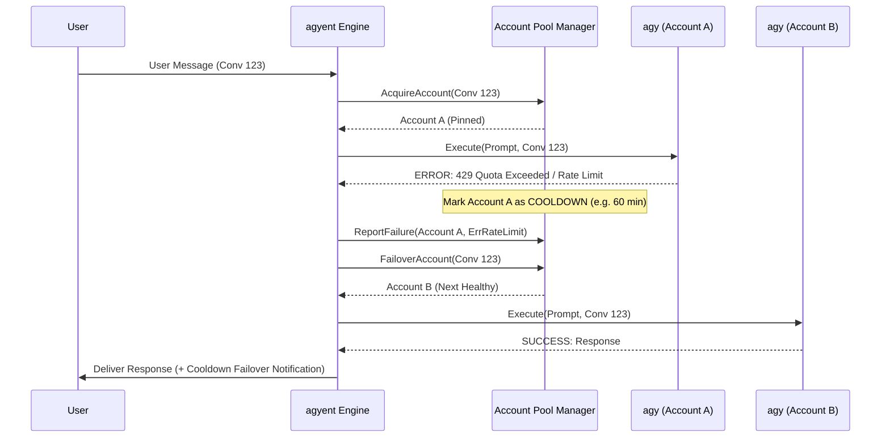
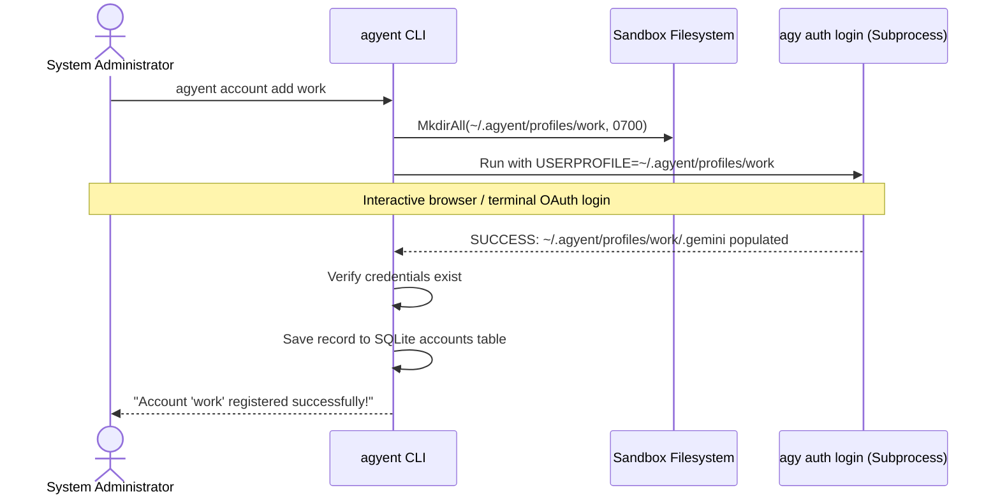

# Multi-Account Profile Virtualization & Pool Architecture

> **Document status:** Proposed
> **Code authority:** none; account-pool packages and migrations described here are not implemented
> **Last verified:** 2026-09-05

This is an unshipped design. Do not create or use the referenced account domain,
port, adapter, migration, or CLI commands unless the user explicitly requests the
feature and accepts a current design review.

This document provides the comprehensive technical specification and architectural blueprint for implementing **Multi-Account Profile Virtualization**, **Account Pool Management**, and **Auto-Cooldown Failover** for the `agy` CLI Harness within `agyent`.

---

## 1. Overview & Problem Statement

### The Challenge
Google's Antigravity CLI (`agy`) is designed primarily as a single-user developer tool. It stores its OAuth refresh tokens, session databases, and configuration statically inside the user's home directory (`~/.gemini/` on Linux/macOS or `%USERPROFILE%\.gemini\` on Windows). It does not natively provide a `--profile` or `--account` command-line switch.

If a developer or team attempts to switch accounts by re-authenticating directly, the existing session token is overwritten, disrupting ongoing daemon tasks and long-running conversations.

### The `agyent` Solution
`agyent` operates as an OS-level **Subprocess Controller (Harness)**. By virtualizing the user home environment variables (`HOME`, `USERPROFILE`, `APPDATA`, `LOCALAPPDATA`) for each spawned `agy` process, `agyent` can run an arbitrary number of isolated Google accounts concurrently on the same host without requiring binary patches, reverse engineering, or credential extraction.

---

## 2. Profile Virtualization Architecture

```mermaid
flowchart TD
    UserReq["User Message (Telegram / Discord)"] --> Engine["Core Engine & Context Resolver"]
    Engine --> AccountMgr["Account Pool Manager"]
    
    subgraph Pool ["Account Pool State & Strategy"]
        AccountMgr --> Strategy{"Rotation Strategy"}
        Strategy -->|Sticky Session| BindLookup["Check Session Binding"]
        Strategy -->|Failover (429)| NextAvail["Select Healthy Profile"]
        Strategy -->|Project Scope| ProjBind["Lookup Project Binding"]
    end

    Pool --> SelectedAccount["Selected Account: 'account_work'"]
    
    subgraph Harness ["AGY CLI Subprocess Harness"]
        SelectedAccount --> EnvInject["Inject Environment Overrides:\nHOME = ~/.agyent/profiles/account_work\nUSERPROFILE = .../account_work"]
        EnvInject --> SpawnProc["exec.CommandContext('agy', args...)"]
    end

    subgraph ProfilesFS ["Virtual Profile Sandboxes (~/.agyent/profiles/)"]
        SpawnProc -.-> P1["profiles/account_personal/.gemini/"]
        SpawnProc -.-> P2["profiles/account_work/.gemini/"]
        SpawnProc -.-> P3["profiles/account_backup/.gemini/"]
    end
```

### Profile Directory Layout
All virtualized account profiles reside under the `agyent` data directory with strict OS-level permissions (`0700`):

```
~/.agyent/
├── config.yaml
├── agyent.db                  # SQLite WAL Database (stores account metadata & bindings)
└── profiles/
    ├── account_primary/
    │   └── .gemini/           # Isolated Google Session 1 (OAuth tokens, brain, cache)
    ├── account_secondary/
    │   └── .gemini/           # Isolated Google Session 2 (OAuth tokens, brain, cache)
    └── account_team/
        └── .gemini/           # Isolated Google Session 3 (OAuth tokens, brain, cache)
```

---

## 3. Account Pool & Rotation Strategies

### 3.1. Strategy A: Sticky Session + Auto-Cooldown Failover (Default & Recommended)
To preserve provider-side prefix-cache eligibility, turns within the same
conversation should remain pinned to the same account. Actual cache behavior
must be measured for the selected provider and model:



#### Key Properties:
* **KV-Cache Optimization:** Continues using the same Google cache partition until exhausted.
* **Auto-Cooldown:** Accounts hitting rate limits are placed in `COOLDOWN` state with an exponential backoff timer (default: 60 minutes).
* **Automatic Healing:** Once the cooldown timer expires, the account is automatically restored to `ACTIVE` status in the pool.

### 3.2. Strategy B: Scope & Project-Based Binding
Enables strict separation between organizational and personal workloads:
* `Project "finance-engine"` ➔ Bound to `account_work`
* `Project "home-automation"` ➔ Bound to `account_personal`
* Global Mode ➔ Bound to `account_primary` with fallback to `account_secondary`

---

## 4. SQLite Schema Additions

The SQLite schema is extended with versioned migrations (`000005_account_pool.sql`):

```sql
-- Accounts Table
CREATE TABLE IF NOT EXISTS accounts (
    id TEXT PRIMARY KEY,                       -- e.g. 'acc_work', 'acc_personal'
    label TEXT NOT NULL,                       -- Human-readable name: 'Work Account (Google Workspace)'
    profile_dir TEXT NOT NULL UNIQUE,          -- Absolute path to virtual profile directory
    status TEXT NOT NULL DEFAULT 'ACTIVE',     -- 'ACTIVE', 'COOLDOWN', 'DISABLED', 'ERROR'
    cooldown_until DATETIME,                   -- Timestamp when cooldown ends
    rate_limit_count INTEGER NOT NULL DEFAULT 0,
    last_used_at DATETIME,
    created_at DATETIME NOT NULL DEFAULT CURRENT_TIMESTAMP,
    updated_at DATETIME NOT NULL DEFAULT CURRENT_TIMESTAMP
);

-- Session to Account Bindings (Sticky Session State)
CREATE TABLE IF NOT EXISTS session_account_bindings (
    session_key TEXT NOT NULL,                 -- e.g. 'tg:123456789:0' or 'group:-100123:topic_5'
    scope_type TEXT NOT NULL,                  -- 'GLOBAL' or 'PROJECT'
    scope_id TEXT NOT NULL DEFAULT '',         -- Project name if scope_type is 'PROJECT'
    account_id TEXT NOT NULL,
    bound_at DATETIME NOT NULL DEFAULT CURRENT_TIMESTAMP,
    last_active_at DATETIME NOT NULL DEFAULT CURRENT_TIMESTAMP,
    PRIMARY KEY (session_key, scope_type, scope_id),
    FOREIGN KEY (account_id) REFERENCES accounts(id) ON DELETE CASCADE
);

CREATE INDEX IF NOT EXISTS idx_accounts_status ON accounts(status);
CREATE INDEX IF NOT EXISTS idx_session_account_bindings_acc ON session_account_bindings(account_id);
```

---

## 5. Go Core Domain & Port Interfaces

### 5.1. Domain Models (`internal/core/domain/account.go`)

```go
package domain

import "time"

type AccountStatus string

const (
    AccountStatusActive   AccountStatus = "ACTIVE"
    AccountStatusCooldown AccountStatus = "COOLDOWN"
    AccountStatusDisabled AccountStatus = "DISABLED"
    AccountStatusError    AccountStatus = "ERROR"
)

type Account struct {
    ID             string        `json:"id"`
    Label          string        `json:"label"`
    ProfileDir     string        `json:"profile_dir"`
    Status         AccountStatus `json:"status"`
    CooldownUntil  *time.Time    `json:"cooldown_until,omitempty"`
    RateLimitCount int           `json:"rate_limit_count"`
    LastUsedAt     *time.Time    `json:"last_used_at,omitempty"`
    CreatedAt      time.Time     `json:"created_at"`
    UpdatedAt      time.Time     `json:"updated_at"`
}

func (a *Account) IsAvailable(now time.Time) bool {
    if a.Status == AccountStatusActive {
        return true
    }
    if a.Status == AccountStatusCooldown && a.CooldownUntil != nil && now.After(*a.CooldownUntil) {
        return true
    }
    return false
}
```

### 5.2. Port Interface (`internal/core/ports/account_pool.go`)

```go
package ports

import (
    "context"
    "time"
    "agyent/internal/core/domain"
)

type AccountPoolManager interface {
    // RegisterAccount initializes a new profile sandbox and records metadata
    RegisterAccount(ctx context.Context, id, label string) (*domain.Account, error)
    
    // AcquireAccount resolves the appropriate account for a session using the configured strategy
    AcquireAccount(ctx context.Context, sessionKey, scopeType, scopeID string) (*domain.Account, error)
    
    // ReportExecutionResult reports turn outcomes to update cooldown or error counters
    ReportExecutionResult(ctx context.Context, accountID string, isRateLimit bool, isAuthError bool) error
    
    // ListAccounts returns all accounts with their real-time health and cooldown status
    ListAccounts(ctx context.Context) ([]domain.Account, error)
    
    // SetCooldown manually or automatically applies a cooldown period
    SetCooldown(ctx context.Context, accountID string, duration time.Duration) error
    
    // DeleteAccount unregisters and safely removes the account sandbox
    DeleteAccount(ctx context.Context, accountID string) error
}
```

### 5.3. Harness Integration (`internal/adapters/harness/agy/harness.go`)

```go
func (h *Harness) Execute(ctx context.Context, req domain.ExecutionRequest) (*domain.ExecutionResult, error) {
    // Resolve profile sandbox path from request
    profileDir := req.AccountProfileDir
    if profileDir == "" {
        profileDir = h.defaultProfileDir
    }

    cmd := exec.CommandContext(ctx, h.binaryPath, args...)
    cmd.Dir = req.WorkspaceDir
    cmd.Stdin = strings.NewReader(req.Prompt)

    // Virtualize OS environment to direct agy to the isolated .gemini configuration
    cmd.Env = append(os.Environ(),
        "HOME="+profileDir,
        "USERPROFILE="+profileDir,
        "APPDATA="+filepath.Join(profileDir, "AppData", "Roaming"),
        "LOCALAPPDATA="+filepath.Join(profileDir, "AppData", "Local"),
    )

    // ... (Job Objects & Stdout/Stderr streaming)
}
```

---

## 6. CLI Management & Telegram Slash Commands

### 6.1. CLI Management Commands (`cmd/agyent/account.go`)

```bash
# Add a new account (launches interactive agy login within the sandbox)
agyent account add work --label "Work Google Account"

# List all configured accounts and their current status
agyent account list

# Test authentication status of a specific profile
agyent account test work

# Manually trigger login refresh for an existing profile
agyent account login work

# Remove an account profile
agyent account remove work
```

### 6.2. Interactive Account Registration Flow



### 6.3. Telegram & Discord Slash Commands

| Command | Arguments | Permission | Description |
| :--- | :--- | :--- | :--- |
| `/accounts` | `None` | Admin | List all registered accounts, active status, rate limit counts, and cooldown timers. |
| `/account use` | `<account_id>` | Admin | Force-bind current conversation/project to the specified account profile. |
| `/account cooldown` | `<account_id> [mins]`| Admin | Manually place an account into cooldown (or reset cooldown with `0`). |
| `/account status` | `None` | User | Show which account profile is currently executing the active session. |

---

## 7. KV-Cache Preservation vs Rotation Trade-offs

| Factor | **Sticky Session + Failover** *(Selected)* | **Per-Turn Round-Robin** *(Rejected)* |
| :--- | :--- | :--- |
| **Prefix KV-Cache Hit Rate** | **85% – 95%** (High cache re-use on Gemini) | **0% – 10%** (Cache misses on every turn) |
| **Turn Latency** | Low (~1.2s avg response start) | High (Full pre-fill recomputation on every turn) |
| **API Token Cost** | **0.25x Cache Read Pricing** | Full 1.0x input token pricing on every turn |
| **Rate Limit Resilience** | High (Instant fallback when 429 occurs) | High (Spreads requests across accounts) |

> [!TIP]
> **Why Sticky Session is Superior:**
> This proposed design assumes cache reuse is account-scoped. Validate that
> assumption against the selected provider before implementation. Sticky
> sessions are intended to reduce avoidable prefix invalidation; auto-failover
> improves availability but cannot guarantee uptime.

---

## 8. Implementation Checklist for Future Milestones

- [ ] **Phase 1 (Storage):** Create SQLite migration `000005_account_pool.sql` and update SQLite store adapter.
- [ ] **Phase 2 (Core Domain & Ports):** Implement `domain.Account`, `domain.AccountStatus`, and `ports.AccountPoolManager`.
- [ ] **Phase 3 (Profile Virtualization):** Update `internal/adapters/harness/agy/` to inject custom `HOME` / `USERPROFILE` per request.
- [ ] **Phase 4 (CLI Entrypoints):** Implement `cmd/agyent/account.go` (`add`, `list`, `login`, `remove`, `test`).
- [ ] **Phase 5 (Engine & Failover):** Wire `AccountPoolManager` into `internal/core/engine/` with 429 error classifier and auto-cooldown logic.
- [ ] **Phase 6 (Slash Commands):** Expose `/accounts` and `/account use` commands in Telegram router.
- [ ] **Phase 7 (Automated Tests):** Add unit tests for pool rotation, cooldown expiration, and multi-profile environment variable isolation.
