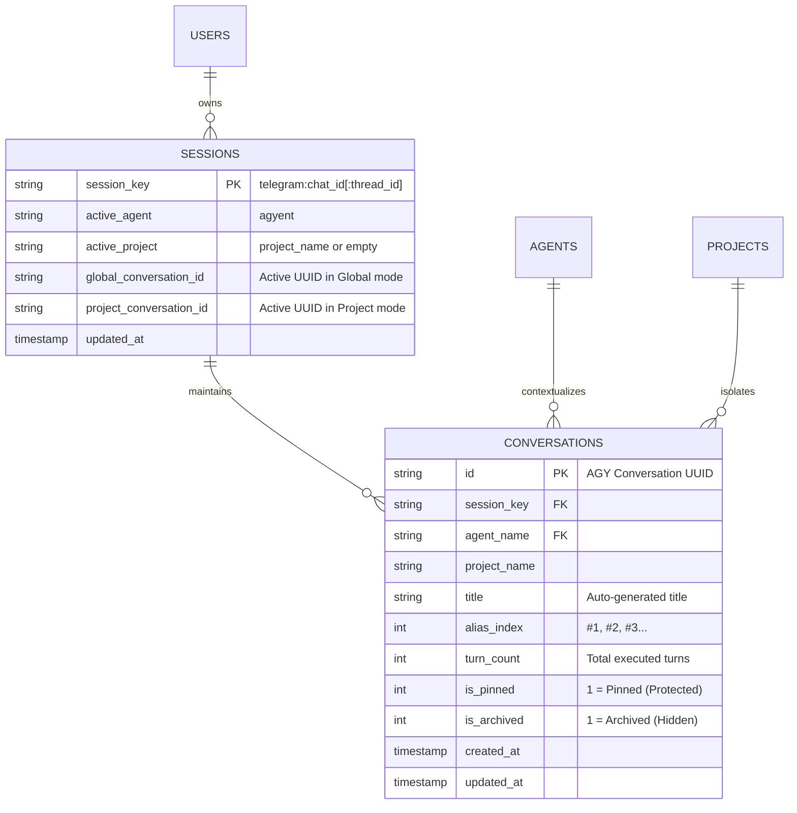
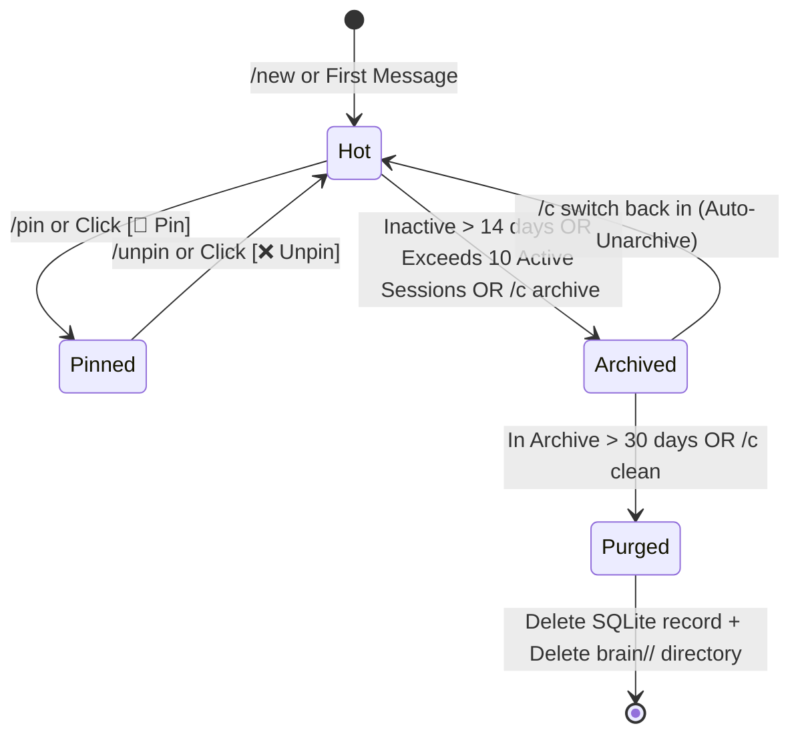

# Multi-Conversation Architecture & Lifecycle GC

> **Document status:** Reference
> **Code authority:** conversation domain/repository, engine conversation commands, lifecycle GC
> **Last verified:** 2026-09-05

This document provides a comprehensive technical architecture design for **Multi-Conversation Management**, **Isolated Ephemeral Queries (`/ask`)**, **1-Touch Conversation Switching (Adaptive Inline Keyboards)**, **Zero-Memory Pinning**, and **Tiered Automated Garbage Collection (Lifecycle GC)** in **`agyent`**.

---

## 1. Problem Statement & Motivation

### 1.1. Pain Points in Contemporary Personal AI Assistants
1. **Context Pollution:** During a deep work or coding session, users frequently need to ask quick, unrelated questions (looking up syntax, translating a word, drafting a short email). Direct interaction in the active session pollutes the system prompt and wastes conversational token budget.
2. **Context Loss on Reset:** When temporarily switching topics, users are forced to `/reset` or create a new session, losing work in progress unless they manually preserve complex 36-character UUID strings (`f8b6c9bf-55ad-...`).
3. **Disk Bloat & Interface Clutter:** Each session generates a workspace directory under `~/.gemini/antigravity/brain/<id>/` (containing transcripts, artifacts, and logs). Over time, hundreds of stale sessions clutter the chat UI and consume disk space.
4. **Tedious Command Ergonomics on Mobile:** Requiring users to memorize and type complex commands (like `/c pin 2`, `/c switch 3`) creates friction on mobile interfaces.

### 1.2. agyent Design Objectives
- **Zero-Pollution Ephemeral Turn (`/ask <prompt>`):** Answer isolated questions in a single turn without persisting to active conversation history or modifying `MEMORY.md`.
- **Flat Conversation Switcher:** An intuitive, flat conversation list model with human-readable titles automatically synthesized from the initial prompt turn.
- **Adaptive Inline Keyboards (1-Touch UI):** Support switching conversations, pinning, and creating new sessions with a single click on Telegram (CallbackQuery), automatically falling back to formatted text on channels without button UI.
- **Zero-Memory Pinning:** Pin the active conversation immediately using `/pin` (no arguments needed) or by clicking `[ 📌 Pin ]` directly in the `/c` menu.
- **Automated Lifecycle GC:** 4-tier lifecycle (Hot/Pinned/Archived/Purged), automatically purging expired archived sessions and safely deleting orphaned brain directories to reclaim disk space.

---

## 2. Architectural Blueprint & Entity Models

### 2.1. Entity Relationship Diagram (ERD)



---

### 2.2. Conversation Lifecycle State Machine



---

## 3. Core Operational Flows

### 🌟 Flow 1: Isolated Ephemeral Queries (`/ask <prompt>`)
* **Behavior:** User submits `/ask <query>`.
* **Underlying Processing:**
  1. `Engine` recognizes the `/ask` command and builds an `ExecutionRequest` with `ConversationID = ""` and `IsEphemeral = true`.
  2. Subprocess `Harness` executes a single isolated turn.
  3. Returns the output to the user.
  4. **Safety Rule:** Never saves `execResult.ConversationID` into `session.active_conversation_id`, and never triggers `MEMORY.md` updates.

---

### 🌟 Flow 2: 1-Touch Adaptive Keyboards (`/c` & Inline Buttons)
* **Behavior:** User sends `/c` or `/conversations`.
* **Telegram UI Presentation:**
  ```text
  🧵 Conversations List [agyent • Global Mode] (Page 1/1):

  1. 📌 #1: [Pinned] Design Core Engine Architecture (yesterday, 24 turns)
  2. 👉 #2: 🟢 [Active] Fix runner timeout issue (10 mins ago, 6 turns)
  3. ⚪ #3: Refactor Telegram adapter (3 hours ago, 12 turns)
  ```
  **Inline Keyboard:**
  ```text
  ┌───────────────────────┬──────────────┐
  │  🔄 Switch #1         │  ❌ Unpin    │
  ├───────────────────────┼──────────────┤
  │  👉 #2 (Active)       │  📌 Pin      │
  ├───────────────────────┼──────────────┤
  │  🔄 Switch #3         │  📌 Pin      │
  ├───────────────────────┴──────────────┤
  │  ➕ New Conversation                 │
  └──────────────────────────────────────┘
  ```
* **Callback Data Format (64-byte Telegram standard):**
  - Switch: `c:sw:<uuid>`
  - Pin: `c:pin:<uuid>`
  - Unpin: `c:unpin:<uuid>`
  - New: `c:new`
  - Archive: `c:arc:<uuid>`

---

### 🌟 Flow 3: Zero-Memory Pinning
* **Method 1 (Contextual Command):** Type **`/pin`** during active chat $\rightarrow$ Automatically pins the active session, protecting it permanently from garbage collection. Type **`/unpin`** to unpin.
* **Method 2 (Inline Button):** Click `[ 📌 Pin ]` directly in the `/c` menu.

---

### 🌟 Flow 4: Automated Archival & Safe Garbage Collection (Lifecycle GC Worker)
1. **Auto-Archive:**
   * Scans sessions where `is_pinned = 0` with no new activity after **14 days** $\rightarrow$ sets `is_archived = 1`.
   * Enforces a ceiling of **10 Active Conversations** per scope. Exceeding 10 sessions auto-archives the oldest unpinned session.
2. **Auto-Purge:**
   * Background task runs every 24 hours to scan sessions archived for more than **30 days**.
   * **Disk Protection (Defense-in-Depth):** The `safePurgeBrainDir` helper verifies 36-character UUID regex and path traversal safety before calling `os.RemoveAll`.
   * **Transaction Separation:** Deletes SQLite records first, then purges directories on disk asynchronously (preventing SQLite lock contention).
3. **On-Demand Cleanup:** Type **`/c clean`** to run immediate garbage collection on stale archived sessions.

---

## 4. Database Schema & Migration

### Migration File: `internal/adapters/storage/sqlite/migrations/000002_multi_conversations.up.sql`

```sql
CREATE TABLE IF NOT EXISTS conversations (
    id TEXT PRIMARY KEY,                           -- AGY Conversation UUID (e.g. "f8b6c9bf-...")
    session_key TEXT NOT NULL,                     -- Attached to User/Chat/Thread
    agent_name TEXT NOT NULL,                      -- Handling Agent Name
    project_name TEXT NOT NULL DEFAULT '',         -- Empty = Global Mode, String = In-Project
    title TEXT NOT NULL,                           -- Human-readable title (auto-generated from first prompt)
    alias_index INTEGER NOT NULL DEFAULT 0,        -- Sequential index (#1, #2...)
    turn_count INTEGER NOT NULL DEFAULT 0,         -- Executed turn count
    is_pinned INTEGER NOT NULL DEFAULT 0 CHECK (is_pinned IN (0, 1)),      -- 1 = Pinned (Protected)
    is_archived INTEGER NOT NULL DEFAULT 0 CHECK (is_archived IN (0, 1)),  -- 1 = Archived (Hidden)
    created_at INTEGER NOT NULL,                   -- Unix Milliseconds
    updated_at INTEGER NOT NULL,                   -- Unix Milliseconds
    FOREIGN KEY(session_key) REFERENCES sessions(session_key) ON DELETE CASCADE,
    FOREIGN KEY(agent_name) REFERENCES agents(name) ON DELETE RESTRICT
);

-- Optimized Lookup Indexes
CREATE INDEX IF NOT EXISTS idx_conversations_active_lookup 
ON conversations(session_key, agent_name, project_name, is_archived, is_pinned DESC, updated_at DESC);

CREATE INDEX IF NOT EXISTS idx_conversations_alias
ON conversations(session_key, agent_name, project_name, alias_index);

CREATE INDEX IF NOT EXISTS idx_conversations_gc_purge
ON conversations(is_archived, is_pinned, updated_at);

-- Idempotent Backfill from Legacy Data
INSERT OR IGNORE INTO conversations (id, session_key, agent_name, project_name, title, alias_index, turn_count, is_pinned, is_archived, created_at, updated_at)
SELECT s.global_conversation_id, s.session_key, s.active_agent, '', 'Main Conversation', 1, 1, 0, 0, s.updated_at, s.updated_at
FROM sessions s
WHERE s.global_conversation_id != '';

INSERT OR IGNORE INTO conversations (id, session_key, agent_name, project_name, title, alias_index, turn_count, is_pinned, is_archived, created_at, updated_at)
SELECT spc.conversation_id, spc.session_key, s.active_agent, s.active_project, 'Project Session ' || s.active_project, 1, 1, 0, 0, spc.updated_at, spc.updated_at
FROM session_project_conversations spc
JOIN sessions s ON s.session_key = spc.session_key
WHERE spc.conversation_id != '';
```

---

## 5. Standardized Slash Commands Reference

| Command | Alias | Description & UX |
| :--- | :--- | :--- |
| **`/ask <prompt>`** | — | Isolated single-turn question (zero-pollution, no history saved, no `MEMORY.md` update). |
| **`/c`** | `/conversations` | Open conversations menu with 1-touch buttons `[ 🔄 Switch ]`, `[ 📌 Pin ]`, `[ ➕ New ]`. |
| **`/new`** | `/c new` | Initialize a fresh, clean conversation context. |
| **`/compact [note]`** | `/compress` | **Compress active conversation** into a structured Level 4 continuity digest, archive old context, and reduce tokens by ~99%. |
| **`/pin`** | `/c pin` | **Pin the active conversation immediately** (no parameters or IDs required). |
| **`/unpin`** | `/c unpin` | **Unpin the active conversation**. |
| **`/c <1\|2\|3>`** | `/c switch <#>` | Fast-switch to conversation by sequential index (e.g. `/c 2`). |
| **`/c rename <title>`**| `/c title` | Rename the title of the active conversation. |
| **`/c archive`** | `/c close` | Archive the active conversation to hide it from the active menu. |
| **`/c clean`** | `/c purge` | Run immediate garbage collection on old archived sessions (> 30 days) and reclaim disk space. |
