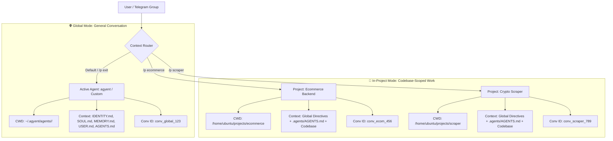

# Multi-Project Management & Context Scope

This document details the separation between **Global Chat Mode** and **In-Project Codebase Mode**, along with group-aware context sharing capabilities.

---

## 1. Dual-Scope Context Architecture

---

## 2. Group Chat Operational Rules

When `agyent` is added to a Telegram Group or Supergroup Topic/Thread:
1. **Context Scope:** The state of `active_agent` and `active_project` is bound to that **Group ID (or Topic ID)**, allowing all group members to collaborate within a unified, shared context.
2. **Safe Triggering:** The bot only executes turns when:
   - A member sends a Slash Command (e.g. `/p ecommerce`).
   - A member asks a question mentioning `@agyent_bot` or replies directly to a bot message.
3. **Response Header Context Tag:**
   Every response delivered to a group includes a contextual scope tag:
   > 📁 `[DevExpert • Project: ecommerce]`
   > I have successfully created the `/checkout` API endpoint in `router.go`.

---

## 3. Project Slash Commands Reference

| Command | Alias | Scope | Detailed Description |
| :--- | :--- | :--- | :--- |
| `/projects` | `/p list` | Both | List all registered projects for the active agent. |
| `/project use <name>` | `/p <name>` | Both | Switch into specified project (loads codebase and project-scoped conversation). |
| `/project new <name> [path]` | `/p new` | Both | Register a new project codebase (bound to a filesystem path on the host). |
| `/project exit` | `/p exit`, `/p ~` | In-Project | Exit active project and return to Global Chat mode. |
| `/project info` | `/p info` | In-Project | View project details (filesystem path, owner agent, conversation ID). |
| `/project reset` | `/p reset` | In-Project | Reset short-term conversation context for this project (codebase remains untouched). |
| `/agents` | `/a list` | Both | List available agents in the gateway. |
| `/use <agent_name>` | `/a <name>` | Both | Switch active agent. |
