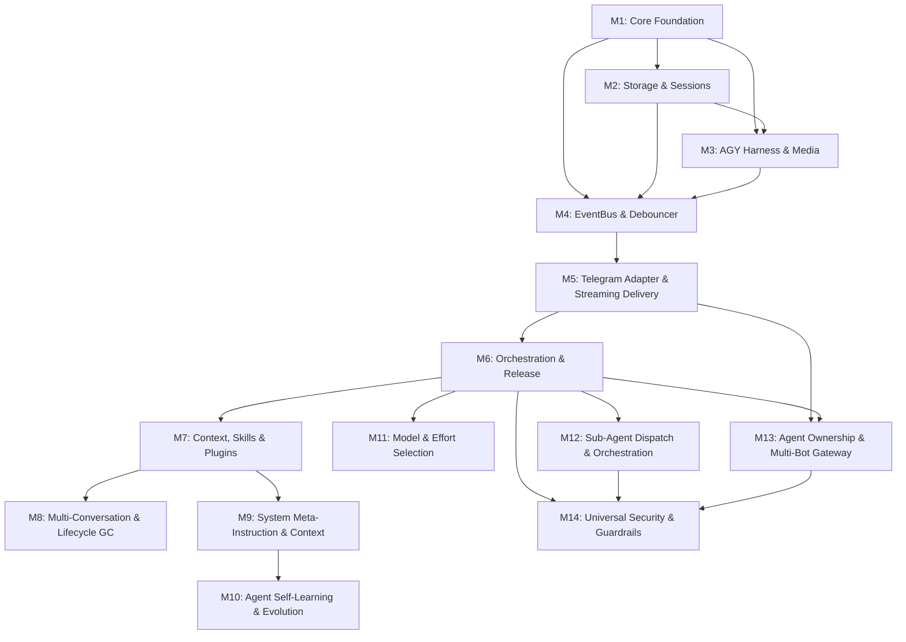

# Master Roadmap - agyent Project

Master roadmap and overall progress tracking dashboard for **agyent**, upgraded and adapted for **Real-Time Streaming Mode (`stream-json`)**.

---

## Progress Tracking Dashboard

| ID | Milestone | Core Scope | Owner | Status | Progress % | Target Date |
|---|---|---|---|---|---|---|
| 1 | [Core Foundation](milestone-1-core-foundation.md) | Clean Architecture, Domain Entities, Port Contracts, SQLite Migrations | TechPM / Backend Agent | Done | 100% | 2026-08-25 |
| 2 | [Storage & Sessions](milestone-2-storage-and-sessions.md) | Pure-Go SQLite Repositories, Session Lock, Multi-Project Scope, Migrations | Backend Agent | Done | 100% | 2026-08-25 |
| 3 | [AGY Harness & Media](milestone-3-agy-harness-and-media.md) | Subprocess Controller, STDIN Prompt, NDJSON Parser, Brain Artifacts Sync | Integration Agent | Done | 100% | 2026-08-25 |
| 4 | [EventBus & Debouncer](milestone-4-eventbus-and-debouncer.md) | Central EventBus (Sync/Async), Stream Event Routing, 2.0s Channel Debouncer | Backend Agent | Done | 100% | 2026-08-25 |
| 5 | [Telegram Adapter](milestone-5-telegram-adapter-and-delivery.md) | Gotgbot Adapter, Streaming Throttler (1.5s), Live Chat Actions, Media Sync | Integration Agent | Done | 100% | 2026-08-27 |
| 6 | [Orchestration & Release](milestone-6-orchestration-and-release.md) | Core Engine Wiring, Stream Toggle Config, Daemon CLI, Cross-compile & Release | DevOps / Release Agent | Done | 100% | 2026-08-25 |
| 7 | [Context, Skills & Plugins](milestone-7-context-management-and-skills.md) | Global vs Workspace Resolver, Progressive Skills, Plugin Ecosystem, Token Pruning | Backend Agent | Done | 100% | 2026-08-25 |
| 8 | [Multi-Conversation & Lifecycle](milestone-8-multi-conversation-and-lifecycle.md) | Multi-Conversation Switching, /ask Ephemeral Turn, Adaptive Inline UI, Lifecycle GC | Principal Architect / Backend Agent | Done | 100% | 2026-08-25 |
| 9 | [System Meta-Instruction & Context](milestone-9-system-meta-instruction-and-context.md) | Static Level 0 Identity Anchor, Prompt Assembly, Two-Tier Memory Pipeline | Backend Agent | Done | 100% | 2026-08-25 |
| 10 | [Agent Self-Learning & Evolution](milestone-10-agent-self-learning-and-evolution.md) | Async Feedback Sensing, Conflict Resolution, Memory Compaction, Security Redaction | Backend Agent | Done | 100% | 2026-08-26 |
| 11 | [Model & Effort Selection](milestone-11-model-and-effort-selection.md) | Dynamic Model Discovery (agy models), 5-Tier Precedence, Subset Effort Clamping, Audit Tracking | Principal Architect / Backend Agent | Done | 100% | 2026-08-26 |
| 12 | [Sub-Agent Dispatch & Orchestration](milestone-12-subagent-dispatch-and-orchestration.md) | Non-Blocking Dispatch, Subprocess Worker Pool, Live Stream Telemetry, 3 Callback Modes | Systems Architect / Backend Agent | Done | 100% | 2026-08-26 |
| 13 | [Agent Ownership & Multi-Bot Gateway](milestone-13-agent-ownership-and-multi-bot-gateway.md) | Multi-Bot Pools, Dedicated Agent Binding, Per-Agent Ownership, Granular RBAC, Namespaced SessionKey | Principal Architect / Backend Agent | Done | 100% | 2026-08-26 |
| 14 | [Universal AI Security & Guardrails](milestone-14-security-and-guardrails.md) | PreToolUse Hook Bridge, Non-Blocking HITL, Sliding-Window DLP, Filesystem Jail, Sub-Agent Governance | Security Architect / Backend Agent | Done | 100% | 2026-08-26 |

---

## Dual-Mode Execution Architecture

Gateway `agyent` supports both execution modes, configurable via `config.yaml` (`streaming_enabled: true/false`), environment variables, or per-session toggles:

1. **Real-Time Streaming Mode (`streaming_enabled: true` - Default):**
   - Spawns `agy` with `--output-format stream-json --dangerously-skip-permissions`.
   - Parses NDJSON stream via `bufio.Scanner`: `init` $\rightarrow$ `step_update` (tool, agent_response, checkpoint) $\rightarrow$ `result`.
   - Emits events across `EventBus` (`stream.init`, `stream.delta`, `stream.tool`, `stream.result`).
   - Telegram Adapter uses **Delivery Throttler (1.5s)** for smooth typing and sends corresponding ChatActions (`upload_photo` when drawing, `typing` when writing code).
   - Automatically detects generated images in `~/.gemini/antigravity/brain/<conv_id>/` and delivers them to Telegram immediately upon `generate_image` completion.

2. **Classic Batch Mode (`streaming_enabled: false` - Fallback):**
   - Spawns `agy` with `--output-format json --dangerously-skip-permissions`.
   - Awaits process completion and parses a single JSON envelope.
   - Ideal for low-resource VPS environments or channels without stream editing support.

---

## Dependency Matrix

---

## Definition of Done

- [x] Implemented Core Domain, SQLite Storage, Migrations, and Dual-Scope Sessions (M1, M2).
- [x] Implemented Subprocess Harness, STDIN Streaming, Snapshot Diff Media Watcher (M3).
- [x] Empirically validated & authored AGY Streaming Protocol specification.
- [x] Implemented Central EventBus (Sync/Async) and 2.0s Debouncer capable of routing Stream Events (M4).
- [x] Implemented Telegram Adapter with Streaming Throttler (1.5s) and Live Chat Actions (M5).
- [x] Wired Core Engine, supported dynamic On/Off Streaming toggle, and packaged Release (M6).
- [x] Passed 100% of Unit, Concurrency, and Integration Test Matrices (`go test ./...`).
- [x] Followed Conventional Commits convention.
- [x] Fully integrated Context Scopes & Memory Evolution per M9 & M10.
- [x] Implemented Dynamic Model & Effort Selection Engine (M11).
- [x] Implemented Non-Blocking Sub-Agent Dispatching & Multi-Agent Orchestration (M12).
- [x] Implemented Universal AI Security Gateway & Dual-Plane Guardrails (M14).
