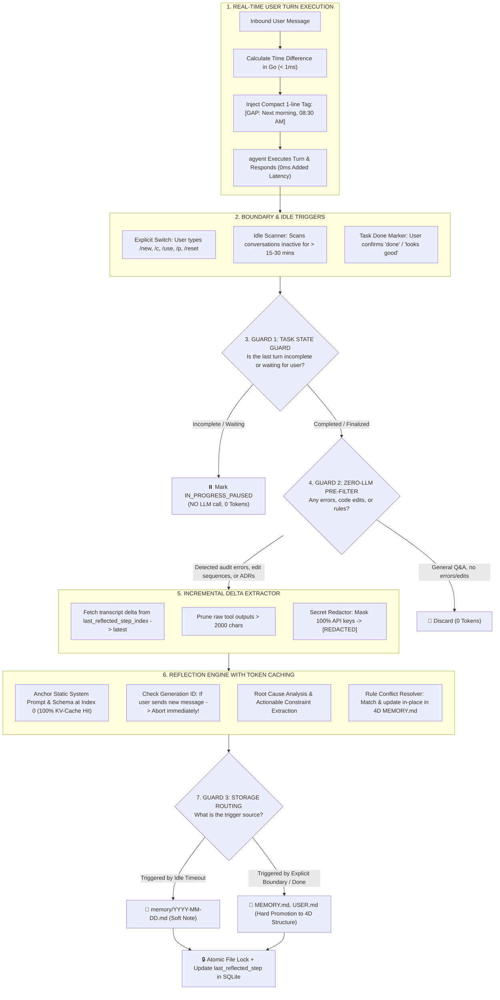

# Milestone 10: Autonomous Agent Self-Learning & Memory Evolution

> **Document status:** Historical
> **Code authority:** evolution adapter, engine integration and current reference document
> **Last verified:** 2026-09-05

Comprehensive technical specification and implementation plan for **Milestone 10: Agent Self-Learning, Reflection Engine, 4D Memory Conflict Resolution & Temporal Context Grounding** of the **`agyent`** system.

---

## 1. Executive Summary & Core Objectives

- **Ultra-Compact Temporal Grounding:** Compute exact time gaps between turns in Go and inject an ultra-compact 1-line temporal tag (`[GAP: Next morning, 08:30 AM]`, ~6 tokens, $\ge 30\text{m}$ gap threshold) to eliminate conversational disorientation with zero runtime token bloat.
- **48-Hour Rolling Lookback Window:** Ingest the previous 48 hours of episodic logs (`memory/YYYY-MM-DD.md`) during new day cold-starts.
- **Defense-in-Depth Safety Architecture (4 Guardrails):**
  1. *Task State Guard:* Detects in-progress or blocked tasks (`TaskStateInProgressPaused`) to prevent premature reflection (0 token cost).
  2. *Zero-LLM Heuristic Pre-Filter:* Evaluates transcripts and SQLite audit logs using pure Go rules (0 token cost).
  3. *Incremental Delta Extractor:* Reflects only on steps from `last_reflected_step_index` to the latest step, pruning excessive tool output logs.
  4. *Active Generation Guard:* Instantly aborts background reflection if the user submits a new turn.
- **4-Dimensional Synthesized Memory Model (`MEMORY.md`):**
  1. *User-Soul Synergy & Collaboration Protocol*
  2. *Active Trajectory & Pending State*
  3. *Hardened Architectural Decisions (ADRs)*
  4. *Evolved Behavioral Guardrails*
- **4D In-Place Conflict Resolution:** Matches candidate rules against existing entries and updates them in-place, eliminating rule contradictions and persona drift.

---

## 2. End-to-End Reflection & Evolution Architecture Diagram

---

## 3. Detailed Phase Breakdown

### Phase 1: Configuration, Domain Entities & Port Contracts
- **Config (`internal/config/config.go`):** Add `EvolutionConfig` (supporting YAML and `AGYENT_EVOLUTION_*`).
- **Domain Entities (`internal/core/domain/evolution.go`):** Declare `TaskProgressState`, `EvolutionTrigger`, `ConversationSnapshot`, `FeedbackSignal`, `MemoryCandidate`, `RuleConstraint`.
- **Port Contracts (`internal/core/ports/evolution.go`):** Declare `TemporalContextPort`, `TaskStateGuardPort`, `HeuristicFilterPort`, `SecurityGuardrailPort`, `ReflectionEnginePort`, `ConflictResolverPort`, `MemoryStorePort`, `EvolutionOrchestratorPort`.

### Phase 2: Ultra-Compact Temporal Tag & Context Lookback Resolver
- **Temporal Tag Formatter (`internal/adapters/context/temporal.go`):** Computes time deltas in Go and returns an ultra-compact tag (~6 tokens, $\ge 30\text{m}$ gap threshold).
- **Context Lookback Resolver (`internal/adapters/context/resolver.go`):** Loads past 48h logs when `memory/TODAY.md` is empty.

### Phase 3: Task State Guard, Zero-LLM Pre-Filter & Incremental Delta Extractor
- **Task State Guard (`internal/adapters/evolution/task_guard.go`):** Recognizes `TaskStateInProgressPaused` to prevent premature reflection on incomplete tasks.
- **Zero-LLM Pre-Filter (`internal/adapters/evolution/filter.go`):** Scans transcripts & audit logs locally via pure Go (0 token cost).
- **Incremental Delta Extractor (`internal/adapters/evolution/delta_extractor.go`):** Extracts steps from `last_reflected_step_index` to latest, pruning large tool logs.

### Phase 4: Security Guardrails, Static Prefix Reflection & 4D Conflict Resolver
- **Security Guardrails (`internal/adapters/evolution/security.go`):** Regex scanner sanitizing API keys and tokens into `[REDACTED]`, blocking prompt injections.
- **Static Prefix Reflection (`internal/adapters/evolution/reflection.go`):** Anchors system prompt & schema at Index 0 (100% KV-cache hit rate); wraps abort signal when `generation_id` changes.
- **4D Rule Conflict Resolver (`internal/adapters/evolution/conflict_resolver.go`):** Maintains 4-dimensional memory structure in `MEMORY.md`, replacing contradictory rules in-place.

### Phase 5: Storage, SQLite Cursor & Compactor
- **Storage & Cursor Tracking (`internal/adapters/evolution/memory_store.go`):**
  - Routes Soft Notes (`memory/YYYY-MM-DD.md`) on Idle vs Hard Promotion to 4D structure (`MEMORY.md`).
  - Updates `last_reflected_step` field in SQLite `conversations`.
  - Atomic write (`.tmp` $\rightarrow$ `fsync` $\rightarrow$ `Rename`) with OS file locking.
- **Memory Compactor (`internal/adapters/evolution/compactor.go`):** Deduplicates recurring lessons, preserves 4D memory sections, and keeps `MEMORY.md` $< 200$ lines.

### Phase 6: Idle Scanner, Engine Wiring & 6 Verification Scenarios
- **Idle Scanner (`internal/adapters/evolution/idle_scanner.go`):** Background scanner checking for idle conversations $> 15\text{m}$.
- **Evolution Orchestrator (`internal/adapters/evolution/orchestrator.go`):** Bounded worker pool (`queue_capacity = 100`) with load shedding and abort signal handling.
- **Wiring (`engine.go` & `run.go`):** Integrates 1-line temporal tags into prompts and orchestrates the evolution cycle.
- **6 Test Scenarios:**
  1. *Test A:* Ultra-Compact Temporal Tag (~6 tokens, $\ge 30\text{m}$ gap threshold).
  2. *Test B:* 48h Cold-Start Handover (Resolving previous day logs).
  3. *Test C:* In-Progress Task Defense (Blocks premature reflection, 0 token cost).
  4. *Test D:* User Resumes Chat & Abort Signal (Aborts reflection when user sends new message).
  5. *Test E:* 4D Memory Promotion & Conflict Resolution (In-place rule updates).
  6. *Test F:* Adversarial Security (API key redaction and injection blocking).

---

## 4. Definition of Done

- [x] Temporal Tag Formatter operates with ultra-compact 1-line format (~6 tokens, $\ge 30\text{m}$ gap threshold).
- [x] 48h Rolling Window resolves the New Day Cold-Start problem cleanly.
- [x] `MEMORY.md` is maintained per the 4-Dimensional Knowledge Structure aligned with `USER.md` and `SOUL.md`.
- [x] 4 Defense Guardrails prevent premature reflection and safely handle user return turns.
- [x] Zero-LLM Pre-Filter and Static Prefix Caching reduce reflection token costs by 85%–95%.
- [x] Secret Redactor masks 100% of tokens and API keys to `[REDACTED]`.
- [x] Atomic File Locks operate safely across Windows and Linux.
- [x] 100% pass rate across test suite (Unit Tests & Tests A, B, C, D, E, F) via `go test ./...`.
