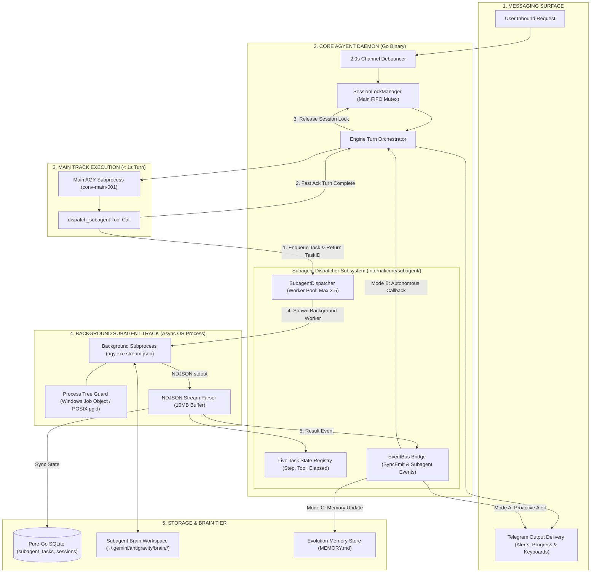

# Milestone 12: Sub-Agent Background Dispatching & Non-Blocking Multi-Agent Orchestration

> **Document status:** Historical
> **Code authority:** subagent adapter/domain/ports/repository and current reference document
> **Last verified:** 2026-09-05

Comprehensive technical specification and implementation plan for **Milestone 12: Sub-Agent Background Dispatching, Isolated Subprocess Concurrency, Live NDJSON Stream Telemetry & Multi-Agent Orchestration** of the **`agyent`** system.

---

## 1. Executive Summary & Core Objectives

- **Sub-Millisecond Non-Blocking Dispatch:** Main Agent delegates resource-intensive or long-running tasks and returns an acknowledgment ticket in `< 1ms` (`534.8 µs` measured in POC), immediately releasing the main session lock so users can chat freely without pauses.
- **Isolated OS Subprocess Execution:** Background sub-agents spawn independent child processes (`agy.exe --output-format stream-json`) with dedicated conversation UUIDs in `~/.gemini/antigravity/brain/<sub_id>/`.
- **Zero Context Pollution:** Intermediate raw tool calls, massive file diffs, and compiler outputs are kept strictly within the sub-agent's brain. The main session context receives only distilled Markdown summaries and artifact references, preserving 100% of Level 0–4 Prefix KV-Cache integrity.
- **Model Tiering & Cost Reduction:** Main track uses high-reasoning models (`gemini-pro`), while background sub-agents default to fast, cost-efficient models (`gemini-flash` / `gemini-flash-lite`), cutting operational token costs by up to 85%.
- **Live Stream Interception & Progress Inspection:** The Go daemon intercepts live NDJSON stream events (`step_update`, `tool` ACTIVE/DONE, `agent_response`), tracking active steps and current tools in memory with zero file-polling overhead.
- **Inter-Agent Return Protocols (3 Modes):**
  1. *Autonomous Agent Callback (`callback_main`):* Enqueues a synthetic system turn to wake up the Main Agent for multi-step reasoning and aggregation.
  2. *Proactive Notification (`notify_user`):* Pushes completed status, distilled summary, and inline buttons directly to Telegram.
  3. *Silent Memory Sync (`silent`):* Records results to `subagent_tasks` SQLite store and updates `MEMORY.md` without conversational interruption.
- **Process Tree Cleanup:** Guaranteed termination of all subprocess trees via Windows Kernel Job Objects (`CreateJobObject` / `SetInformationJobObject`) and POSIX process groups (`Setpgid: true` & negative PID signals).

---

## 2. End-to-End Multi-Agent Dispatch Architecture Diagram

---

## 3. Detailed Phase Breakdown

### Phase 1: Database Migration & Core Domain Entities
- **SQLite Migration (`000005_subagent_tasks.up.sql`):** Create table `subagent_tasks` with indexing on `parent_session_key`, `status`, and `created_at`, including `pending_question` field.
- **Domain Entities (`internal/core/domain/subagent.go`):** Declare `SubagentTask`, `SubagentTaskStatus` (`PENDING`, `RUNNING`, `WAITING_FOR_INPUT`, `COMPLETED`, `FAILED`, `CANCELLED`), and `SubagentCallbackMode`.
- **Port Contracts (`internal/core/ports/subagent.go`):** Define `SubagentDispatcherPort` with `SendTaskInput` and repository extensions in `StoragePort`.

### Phase 2: Subagent Dispatcher Engine & Worker Pool
- **Package (`internal/core/subagent/`):**
  - `dispatcher.go`: Manages task queue, concurrent worker pool (`max_concurrent_workers`), timeout enforcement, and state transitions.
  - `registry.go`: Thread-safe in-memory cache for sub-second task queries and real-time step/tool updates.
  - `executor.go`: Subprocess execution wrapper with STDIN streaming, Windows Job Object attachment, and NDJSON parsing.
- **Unit & Concurrency Tests (`internal/core/subagent/dispatcher_test.go`):** Validate worker pool capacity, task cancellation, and crash isolation.

### Phase 3: Tooling Integration & Prompt Assembly
- **Internal Subagent Tools:**
  - `dispatch_subagent`: Parameters for `title`, `prompt`, `agent_name`, `model`, `workspace_mode`, and `callback_mode`.
  - `check_subagent_progress`: Returns live step, running duration, active tool, and recent logs.
  - `send_subagent_input`: Sends clarification input to resume sub-agents in `WAITING_FOR_INPUT` status via `agy --conversation <sub_id>`.
  - `cancel_subagent_task`: Forcefully terminates a running task and tears down the process tree.
  - `list_subagents`: Lists active and completed tasks for the session.
- **Level 0 System Prompt Directives:** Guide the Main Agent to proactively delegate long-running or repository-wide subtasks.

### Phase 4: Inter-Agent Return Protocols & Telegram Delivery
- **Synthetic System Turn Handler (`internal/core/engine/engine.go`):** Handles `CallbackInvokeMain` and `WAITING_FOR_INPUT` clarification callbacks, acquiring session lock when idle or enqueuing to debouncer.
- **Telegram Live Status Updates (`internal/adapters/channels/telegram/`):**
  - Proactive completion cards with Markdown summaries and inline action buttons.
  - Clarification alerts when sub-agent requires human decision.
  - Slash commands: `/tasks`, `/task <id>`, `/task reply <id> <input>`, `/task cancel <id>`, `/task clean`.

### Phase 5: Verification & End-to-End Benchmark Suite
- **Stress & Concurrency Scenarios:**
  1. *Test A (Sub-millisecond Dispatch):* Verify dispatch latency $< 1\text{ms}$.
  2. *Test B (Main Track Non-Blocking):* Run simultaneous heavy background tasks while interacting continuously on the main session.
  3. *Test C (Tool Call Interception):* Verify real-time capture of `step_update` and active tools from NDJSON stream.
  4. *Test D (Fault & Timeout Isolation):* Simulate hanging or crashing sub-agent subprocesses; verify parent daemon remains stable and OS Job Objects terminate all descendant processes.
  5. *Test E (Zero Context Bloat):* Measure main context token growth and verify 0 bytes of raw tool logs enter the main transcript.

---

## 4. Definition of Done

- [x] Technical Architecture document authored at [`docs/subagent-architecture.md`](file:///c:/Users/stevan.nguyen/Desktop/projects/agyent/docs/subagent-architecture.md).
- [x] POC program created and benchmarked against real `agy.exe` binary at [`cmd/poc_subagent/main.go`](file:///c:/Users/stevan.nguyen/Desktop/projects/agyent/cmd/poc_subagent/main.go).
- [x] SQLite Migration `000006_subagent_tasks.up.sql` integrated and tested.
- [x] `SubagentDispatcher` package implemented in `internal/core/subagent/`.
- [x] Internal Subagent Tools mounted and registered for the Main Agent.
- [x] Autonomous Callback & Proactive Telegram delivery working cleanly.
- [x] Windows Kernel Job Objects & POSIX Process Groups verified for 100% clean process termination.
- [x] 100% test pass rate on unit and integration test matrices (`go test ./...`).
