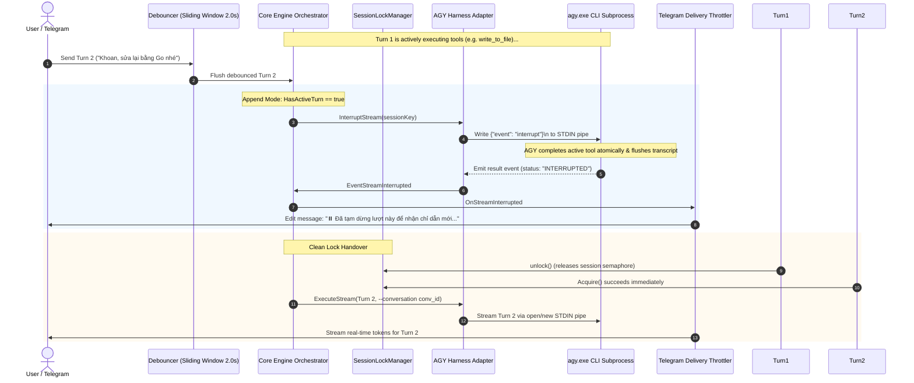

# Milestone 13: Smart Abort & Real-Time Steering (Append Mode)

## 1. Executive Summary

Milestone 13 introduces **Real-Time Steering and Smart Abort (Append Mode)** to `agyent`. In previous releases, incoming messages while a turn was actively executing were placed in a sequential FIFO lock queue. Milestone 13 introduces an intelligent interruption mechanism where incoming steering messages safely interrupt in-flight turns at safe sub-turn/tool boundaries, emit `status: "INTERRUPTED"`, update the chat UI with a pause indicator, and immediately launch the next turn without race conditions or workspace corruption.

---

## 2. Architectural Blueprint



---

## 3. Engineering Invariants & Guarantees

1. **Zero-CGO & Pure-Go Safety:** All changes preserve single-binary static Go compilation without external C bindings.
2. **Safe Closed-Pipe Handling:** `InterruptStream` safely ignores `io.ErrClosedPipe` and `os.ErrClosed` when race conditions occur between natural process exits and interrupt signals.
3. **Zero-Leak Memory Management:** `Harness.activeStreams` and `Engine.activeTurns` guarantee 100% cleanup via `defer` handlers on timeouts, crashes, or panics.
4. **Debouncer Shielding:** Rapid succession messages (e.g. 5 quick messages in 2 seconds) are coalesced into a single turn by the debouncer sliding window before issuing interrupt signals, preventing CPU/process thrashing.
5. **Level 0–4 KV-Cache Invariance:** Continued sessions pass prompt text to established `--conversation <id>` sessions without duplicating system or skill headers, preserving 85–95% cache hit rates on Gemini models.

---

## 4. Configuration Reference

```yaml
agy:
  queue_mode: "append"             # "fifo" (default) | "append"
  append_strategy: "coalesce"      # "coalesce" | "replace"
  grace_timeout_seconds: 3.0       # Fallback timeout before OS process tree kill
```

---

## 5. Verification Log

- `internal/adapters/harness/agy`: 28 tests passing (`TestHarness_InterruptStream`, `TestStreamParser_TC_BRG_06_StreamInterruptedStatusHandling`).
- `internal/core/engine`: Tests passing (`TestEngine_AppendMode_SoftInterrupt`, `TestEngine_ModeSlashCommand`).
- `internal/adapters/channels/telegram`: Tests passing (`TestThrottler_StreamInterrupted`).
- Build verification: `go build ./cmd/agyent` completed successfully.
