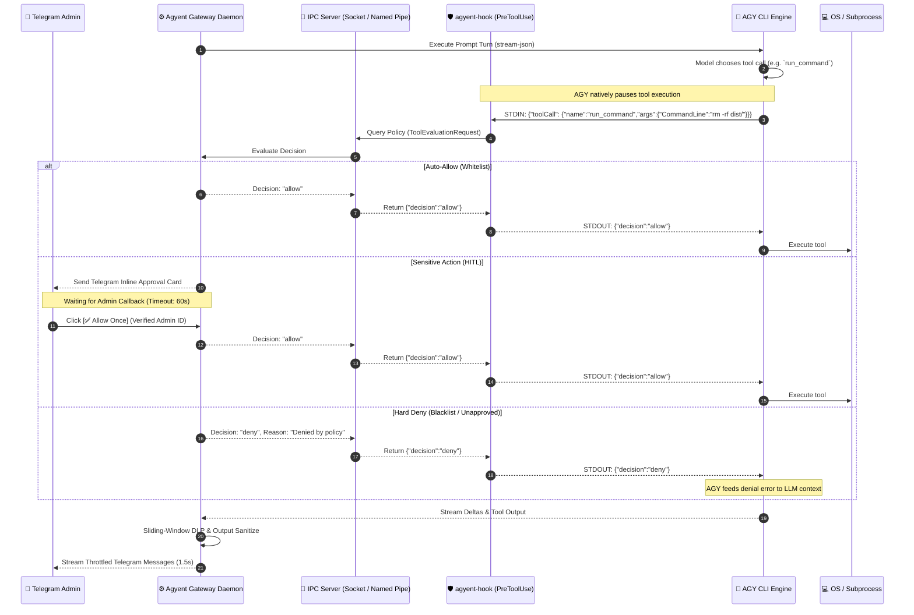

# Milestone 14: Universal AI Security Gateway & Guardrails (Synchronous Lifecycle Interception & Defense-in-Depth)

Comprehensive technical specification and step-by-step implementation plan for **Milestone 14: Universal AI Security Gateway, Antigravity PreToolUse Hook Bridge, Non-Blocking Synchronous HITL, Sliding-Window DLP, Filesystem Jailing, and Sub-Agent Governance** of the **`agyent`** system.

---

## 1. Executive Summary & Core Objectives

- **Synchronous Lifecycle Interception:** Implement `agyent-hook` binary and Gateway IPC Server (Unix Socket / Windows Named Pipe) connecting directly into Antigravity CLI's native `PreToolUse` and `PostToolUse` Lifecycle Hooks (`<workspaceDir>/.agents/hooks.json`).
- **PostToolUse Secret Ingestion Sanitizer:** Automatically scan and mask API keys (`sk-...`, `ghp_...`, `AKIA...`, `Bearer ...`) and sensitive secrets within tool execution outputs (`view_file`, `run_command`, `read_url_content`) to `[REDACTED_SECRET]` before they can contaminate LLM working context, transcripts, or long-term memory (`MEMORY.md`).
- **Synchronous Human-In-The-Loop (HITL):** Seamlessly pause AGY tool execution at the hook level, trigger interactive Telegram inline cards (`[✅ Allow Once]`, `[🛡️ Allow for Session]`, `[❌ Deny]`, `[🛑 Force Kill]`), verify Admin RBAC on callbacks, and resume tool execution within sub-5ms IPC turnround.
- **Canonical Filesystem Jailing:** Enforce strict workspace isolation, POSIX symlink evaluation (`filepath.EvalSymlinks`), Windows NTFS Directory Junction (`mklink /J`) / Hardlink / 8.3 Short Name resolution, and absolute blacklist paths (`~/.ssh`, `~/.aws`, `~/.agyent/config.yaml`, `<workspaceDir>/.agents/hooks.json`).
- **Sub-Agent Governance & Anti-Fork Bomb:** Synchronously intercept `define_subagent` and `invoke_subagent`, enforce Role Capability Matrices (`researcher`, `coder`, `reviewer`), prevent recursive nesting (cascade depth = 1), and cap concurrent background workers.
- **Network Egress & SSRF Protection:** Block private subnets (RFC 1918), loopbacks, and cloud metadata (`169.254.169.254`) with active DNS Rebinding prevention (`net.LookupIP`) and IP encoding normalization.
- **Sliding-Window Outbound DLP:** Redact high-entropy API keys and secrets across 1.5s streaming token boundaries via a 64-character lookback buffer, plus outgoing tool argument inspection.
- **Tool Output Indirect Injection Sanitizer:** Sanitize web and MCP tool outputs before ingestion into LLM context.
- **4 Zero-Config Security Presets:** `developer`, `balanced` (default), `strict`, `read_only` with instant `/security preset <mode>` runtime switching.

---

## 2. Architecture & IPC Sequence Diagram

---

## 3. Implementation Phases & Task Breakdown

### Phase 1: Domain Models, Interfaces & Configuration Schema
- [x] Define canonical domain models in `internal/core/domain/security.go`:
  - `SecurityPreset` (`developer`, `balanced`, `strict`, `read_only`), `SecurityDecision` (`allow`, `deny`, `ask`), `ToolEvaluationRequest`, `ApprovalRequest`, `SecurityDashboard`, `RedactionConfig`.
- [x] Define port interfaces in `internal/core/ports/security.go`:
  - `SecurityManagerPort`, `HookIPCPort`, `HITLApprovalPort`.
- [x] Update `internal/config/config.go` with full `SecurityConfig` struct:
  - Agent-assisted config management (`agent_config_management`), manageable files list, redaction modes (`strict`, `permissive`, `audit_only`), environment key whitelists, and YAML tags.

### Phase 2: High-Speed IPC Server & `agyent-hook` CLI
- [x] Create `internal/adapters/security/ipc/`:
  - TCP localhost server (`127.0.0.1:49215`) with sub-millisecond JSON wire protocol.
  - Non-blocking connection handler with context cancellation.
- [x] Create standalone CLI subcommand `cmd/agyent/hook.go`:
  - `agyent hook-bridge`: Reads `PreToolUse` and `PostToolUse` JSON from stdin, forwards to Gateway IPC, prints decision JSON to stdout.
- [x] Implement Workspace Hook Auto-Provisioning (`internal/adapters/security/provisioner.go`):
  - Ensure `<workspaceDir>/.agents/hooks.json` exists and registers `agyent hook-bridge` for both `PreToolUse` and `PostToolUse`.
  - Clean up any stale global hooks via `RemoveGlobalHooks`.

### Phase 3: Path Jailing, Canonical Resolver & Windows Quirks
- [x] Create `internal/adapters/security/pathjail/`:
  - Canonical path resolution via `filepath.EvalSymlinks` + `filepath.Clean`.
  - Windows-specific normalization: Win32 `GetLongPathNameW` (8.3 short names), case folding, Alternate Data Stream (ADS) blocking, NTFS junction handling.
  - Strict workspace containment check (`strings.HasPrefix(target, workspaceDir)` or `allowed_paths`).
  - Blacklist path enforcement (`~/.ssh`, `~/.aws`, `~/.gnupg`, `~/.kube`, `<workspaceDir>/.agents/hooks.json`).
  - Delegated config editing support: allow modification to `manageable_files` (e.g. `~/.agyent/config.yaml`, `.env`) when approved via HITL.

### Phase 4: Network Egress & SSRF Protection
- [x] Create `internal/adapters/security/network/`:
  - IP normalization (Decimal, Hex, Octal, IPv6-mapped IPv4).
  - Private subnet blocking (`127.0.0.0/8`, `10.0.0.0/8`, `172.16.0.0/12`, `192.168.0.0/16`, `169.254.169.254`, `::1`).
  - Active DNS Rebinding protection via synchronous `net.LookupIP` before allowing URL fetch.
  - Tool Output Sanitizer scanning for indirect prompt injection signatures in fetched HTML/text.

### Phase 5: Sub-Agent Governance & Anti-Fork Quotas
- [x] Intercept `invoke_subagent` and `define_subagent` in Policy Evaluator:
  - Enforce Role Capability Matrix (`researcher`, `coder`, `reviewer`).
  - Block nested spawning when `cascade_depth >= 1`.
  - Concurrency quota enforcement (max 3 concurrent subagents).

### Phase 6: Sliding-Window Outbound DLP, PostToolUse Sanitizer & Telegram HITL Integration
- [ ] Implement PostToolUse Output Sanitizer:
  - Mask sensitive tokens (`sk-...`, `ghp_...`, `AKIA...`, `Bearer ...`) in tool outputs according to `redaction_mode` (`strict`, `permissive`, `audit_only`).
  - Preserve `whitelisted_env_keys` (`PORT`, `DATABASE_URL`, `HOST`) for seamless local DevOps workflows.
- [ ] Upgrade Delivery Throttler in `internal/adapters/channels/telegram/`:
  - 64-character sliding lookback buffer across 1.5s flush boundaries.
- [ ] Implement Interactive HITL Approval in Telegram Adapter:
  - Formatted inline approval card with callback data `hitl:<req_id>:<action>`.
  - Diff preview when agent modifies manageable config files (`.env`, `config.yaml`).
  - Strict Admin ID verification (`callback.From.ID == admin_user_id`).
  - 60s auto-deny timeout timer.

### Phase 7: Slash Commands & Verification
- [ ] Implement Slash Commands: `/security`, `/security preset <mode>`, `/security grant <scope> [ttl]`, `/security redact <mode>`, `/whitelist add <cmd|path>`, `/audit [limit]`.
- [ ] End-to-end unit, integration, and chaos test suites (`go test -race ./...`).

---

## 4. Definition of Done (DoD)

- [ ] All 6 Security Checkpoints implemented and fully passing unit and integration tests.
- [ ] `PreToolUse` Lifecycle Hook bridge operational with <5ms IPC roundtrip latency.
- [ ] Windows path quirks (8.3 names, junctions, ADS) tested on Windows environments.
- [ ] Sliding-window DLP verified to catch secrets split across streaming chunks.
- [ ] Sub-agent privilege escalation and fork bombs blocked at hook level.
- [ ] Telegram HITL callback protected against non-admin spoofing.
- [ ] Zero regressions across existing test suite (`go test ./...`).
