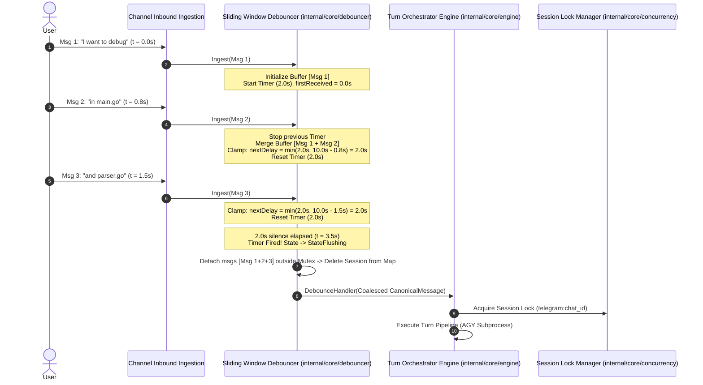

# Milestone 4: Central EventBus, Sliding Window Debouncer & Stream Routing

> **Production-Grade Technical Specification (Principal / TechLead Architect Specification & Audit Sign-Off Dashboard)**  
> **Milestone ID:** 4  
> **Milestone Name:** Central EventBus, Sliding Window Debouncer & Stream Routing  
> **Status:** Completed & Verified (100%)  
> **Target Date:** 2026-08-26  

---

## 1. Technical Audit & Sign-Off Dashboard

| Review Role | Status | Key Technical Requirements |
| :--- | :---: | :--- |
| 🛡️ **Go Concurrency & Systems Auditor** | **APPROVED** ✅ | - Use **Copy-On-Write slice** for subscriber registry; snapshot slice under RLock and release lock immediately before iterating handlers (prevents writer starvation & self-deadlock).<br>- Channel send to `asyncQueue` protected via `mu.RLock()` + `isClosed` check, atomic drop counter.<br>- Drain 100% of pending events during shutdown using `close(queue)` + `for evt := range queue`.<br>- State machine separation (`StateBuffering` $\rightarrow$ `StateFlushing`) prevents race between Timer Fire and new `Ingest()` calls.<br>- Zero-alloc hot-path for `stream.delta` (lazy error slice allocation, pointer payloads). |
| 📐 **Clean Architecture & Domain Auditor** | **APPROVED** ✅ | - **Dependency Inversion:** Decouple `stream_bridge` from Core `eventbus`. The NDJSON parsing bridge belongs to the Harness Adapter (`adapters/harness/agy/stream_parser.go`), while Core only ingests normalized `domain.Event`.<br>- **Separation of Concerns:** Debouncer is a pure Ingestion Filter; it does not directly acquire session locks or call the Runner. Engine (Orchestrator) manages session locking.<br>- Moved `SessionLockManager` from SQLite adapter into `ports.LockManager` and `internal/core/concurrency/lock_manager.go`.<br>- Standardized `ports.EventBusPort` (added `UnsubscribeFunc`, `CloseWithTimeout`, and `context.Context` for `AsyncEmit`). |
| ⚡ **Failure Modes & Chaos Auditor** | **APPROVED** ✅ | - NDJSON Scanner supports expanded **10MB** buffer (prevents `bufio.ErrTooLong` 64KB crashes on large diff/base64 outputs).<br>- Dynamic Timer Clamp: $\text{nextDelay} = \min(\text{WindowDuration}, \text{remainingMax})$ prevents starvation during continuous typing.<br>- Slash Command Fast-Path Pre-emption: Immediately flushes pending buffer upon encountering `/reset` or `/force_unlock` to avoid race conditions.<br>- Poison-pill defense: Sanitizes malformed UTF-8 (`strings.ToValidUTF8`), strips null bytes `\x00`, enforces `MaxTotalCoalescedBytes = 1MB`.<br>- Resource ceiling: `MaxActiveSessions = 5000` prevents memory exhaustion / DoS. |
| 🧪 **QA/QC Lead & Test Strategy Architect** | **APPROVED** ✅ | - **Deterministic Virtual Clock (`clock.Clock` / `clock.Timer`):** Simulates instantaneous time progression, eliminating 100% of real `time.Sleep` calls, reducing test runtime to $<200\text{ms}$ and eliminating flaky CI/CD tests.<br>- **Comprehensive 30-Scenario Test Matrix:** Covers Unit, Concurrency Race (`go test -race`), Chaos Resilience, Stream Latency ($<1\text{ms}$), and Memory Zero-Idle State.<br>- Integrated `go.uber.org/goleak` verifying goroutine leaks across all tests.<br>- Quality Gates: 100% Pass, Coverage $\ge 90.0\%$, 0 Race Conditions, 0 Leaks. |

---

## 2. Architecture & Key Objectives

Milestone 4 serves as the **Event Coordination Nervous System** and **Ingestion Optimization Layer** of the `agyent` Gateway:

1. **Central EventBus Engine (`internal/core/eventbus/`):**
   - Implements `ports.EventBusPort` contract.
   - **`SyncEmit(ctx context.Context, evt domain.Event) error`:** Synchronous direct dispatching (zero-allocation hot path, sub-millisecond latency $<1\text{ms}$, benchmark $<50\mu\text{s}$) designed for Real-Time Streaming (`stream.delta`, `stream.tool`, `stream.init`, `stream.result`). Features panic isolation with `debug.Stack()` and error aggregation via `errors.Join`.
   - **`AsyncEmit(ctx context.Context, evt domain.Event)`:** Asynchronous non-blocking dispatching via buffered queue worker pool for Audit Logging, Token Metrics Tracking, and Async Indexing. Features bounded queue overflow policy with atomic drop telemetry and graceful draining on shutdown.
   - Thread-safe using `sync.RWMutex` and Copy-On-Write subscriber slice mutations.

2. **2.0s Sliding Window Channel Debouncer (`internal/core/debouncer/`):**
   - Coalesces rapid fragmented user messages within a 2.0s sliding window into a unified `CanonicalMessage`.
   - Isolates buffers per unique `SessionKey` (`channel:chat_id[:thread_id]`).
   - Merges text (`\n` separation), preserves `Attachments` arrays, and merges interaction flags (`IsMentioned`, `IsReplyToBot`, `ReplyToMessageID`).
   - **Slash Command Fast-Path Pre-emption:** Flushes buffer immediately ($t=0\text{ms}$) upon detecting slash commands (`/p`, `/reset`, `/force_unlock`).
   - **Dynamic Starvation Guard:** Clamps timers to guarantee forced flushes at `MaxWaitDuration = 10.0s` or `MaxMessageCount = 20`.
   - **Safe Go Timer Pattern:** Handles channel race conditions when stopping/resetting Go timers.
   - **Memory Leak Protection:** Cleans up session maps when idle (`ActiveCount == 0`).

3. **Stream Event Routing & Adapter Bridge (`internal/adapters/harness/agy/stream_parser.go`):**
   - Parses NDJSON lines from Harness (`agy.StreamEvent`) with 10MB buffer.
   - Maps stream events to canonical domain events:
     - `EventStreamInit ("stream.init")`: Stream session initialization with tools and working directory.
     - `EventStreamDelta ("stream.delta")`: Dispatches token `text_delta` to Telegram Delivery Throttler.
     - `EventStreamTool ("stream.tool")`: Updates Tool state `ACTIVE` / `DONE` to update Telegram ChatActions (`upload_photo`, `typing`).
     - `EventStreamResult ("stream.result")`: Final execution result with token usage and duration.
     - `EventStreamError ("stream.error")`: Process crash or execution error notification.

---

## 3. Detailed Component Design

### 3.1. Central EventBus Architecture

```mermaid
flowchart TD
    subgraph Publishers [Event Publishers]
        Harness[AGY Subprocess Harness]
        Engine[Turn Execution Engine]
        Channel[Channel Inbound Ingestion]
    end

    subgraph EventBus [internal/core/eventbus]
        Registry[Subscriber Registry<br/>sync.RWMutex + Copy-On-Write Slices]
        
        SyncPath[Sync Dispatch Path<br/>Snapshot Slice -> Direct Invocation -> Panic Isolation]
        AsyncQueue[Async Buffered Queue<br/>chan domain.Event capacity: 1024]
        WorkerPool[Async Worker Goroutines Pool]
    end

    subgraph SyncSubscribers [Synchronous Handlers (Hot Path < 1ms)]
        Throttler[Telegram Delivery Throttler]
        ChatAction[Telegram Live Chat Actions]
        ToolIndicator[Live Status Indicator]
    end

    subgraph AsyncSubscribers [Asynchronous Handlers (Cold Path)]
        Audit[SQLite Audit Logger]
        Metrics[Token & Latency Metrics Collector]
        Indexer[Context Search Indexer]
    end

    Harness -->|SyncEmit stream.delta / stream.tool| SyncPath
    Engine -->|SyncEmit execution.pre / post| SyncPath
    Channel -->|AsyncEmit message.received| AsyncQueue

    SyncPath --> Throttler
    SyncPath --> ChatAction
    SyncPath --> ToolIndicator

    AsyncQueue --> WorkerPool
    WorkerPool --> Audit
    WorkerPool --> Metrics
    WorkerPool --> Indexer
```

---

### 3.2. Sliding Window Message Debouncer Architecture



---

### 3.3. Ports & Domain Contracts

#### A. Interface `ports.EventBusPort` (`internal/core/ports/eventbus.go`):
```go
package ports

import (
	"context"
	"io"
	"github.com/khanhbkqt/agyent/internal/core/domain"
)

// UnsubscribeFunc cancels an event subscription.
type UnsubscribeFunc func()

// SyncEventHandler handles events synchronously. Returning an error can abort the pipeline.
type SyncEventHandler func(ctx context.Context, evt domain.Event) error

// AsyncEventHandler handles events asynchronously in background worker pool.
type AsyncEventHandler func(ctx context.Context, evt domain.Event)

// EventBusPort defines the pub/sub contract for internal system lifecycle and stream events.
type EventBusPort interface {
	io.Closer

	// SyncEmit dispatches an event synchronously to all registered sync handlers with panic isolation.
	SyncEmit(ctx context.Context, evt domain.Event) error

	// AsyncEmit queues an event non-blockingly for asynchronous processing.
	AsyncEmit(ctx context.Context, evt domain.Event)

	// SubscribeSync registers a synchronous handler and returns an unsubscription callback.
	SubscribeSync(eventType domain.EventType, handler SyncEventHandler) UnsubscribeFunc

	// SubscribeAsync registers an asynchronous handler and returns an unsubscription callback.
	SubscribeAsync(eventType domain.EventType, handler AsyncEventHandler) UnsubscribeFunc

	// DroppedEventsCount returns the total number of dropped async events due to queue overflow.
	DroppedEventsCount() uint64

	// CloseWithTimeout gracefully drains the async queue within the given context deadline.
	CloseWithTimeout(ctx context.Context) error
}
```

#### B. Interface `ports.DebouncerPort` (`internal/core/ports/debouncer.go`):
```go
package ports

import (
	"context"
	"github.com/khanhbkqt/agyent/internal/core/domain"
)

// DebounceHandler is invoked when a debounced message window closes and emits a coalesced message.
type DebounceHandler func(ctx context.Context, msg domain.CanonicalMessage) error

// DebouncerPort defines the sliding window buffering and coalescing contract.
type DebouncerPort interface {
	// Ingest accepts an inbound message, resets the sliding window, or triggers fast-path pre-emption.
	Ingest(ctx context.Context, msg domain.CanonicalMessage) error

	// Flush forces immediate coalescing and emission for a specific session.
	Flush(ctx context.Context, sessionKey string) error

	// FlushAll flushes all pending in-flight session buffers.
	FlushAll(ctx context.Context) error

	// ActiveSessions returns the current count of active buffered sessions (zero-idle check).
	ActiveSessions() int

	// Close gracefully flushes pending buffers and stops all timers.
	Close(ctx context.Context) error
}
```

#### C. Interface `ports.LockManager` (`internal/core/ports/lock.go`):
```go
package ports

import (
	"context"
	"time"
)

// UnlockFunc releases the acquired session lock.
type UnlockFunc func()

// LockManager coordinates mutual exclusion per session key.
type LockManager interface {
	// Acquire blocks until lock is granted, timeout expires, or context is canceled.
	Acquire(ctx context.Context, sessionKey string, timeout time.Duration) (UnlockFunc, error)

	// ActiveLockCount returns the number of active tracked locks (for metrics & diagnostics).
	ActiveLockCount() int
}
```

---

## 4. Package Blueprint for Milestone 4

```
internal/
├── core/
│   ├── domain/
│   │   ├── events.go                 <-- Stream Events, LifeCycle Events, Payloads
│   │   ├── events_test.go            <-- Unit tests for Event structures
│   │   ├── message.go                <-- CanonicalMessage, OutboundMessage, Attachment
│   │   ├── session.go                <-- Session entity, FormatSessionKey
│   │   └── execution.go              <-- ExecutionRequest, ExecutionResult
│   ├── ports/
│   │   ├── eventbus.go               <-- EventBusPort, Handlers, UnsubscribeFunc, Closer
│   │   ├── debouncer.go              <-- DebouncerPort, DebounceHandler
│   │   ├── lock.go                   <-- LockManager, UnlockFunc
│   │   ├── runner.go                 <-- RunnerPort, StreamHandler
│   │   ├── storage.go                <-- StoragePort, Repositories
│   │   ├── channel.go                <-- ChannelPort
│   │   └── security.go               <-- SecurityPort
│   ├── concurrency/
│   │   ├── lock_manager.go           <-- In-memory SessionLockManager
│   │   └── lock_manager_test.go      <-- Concurrency & timeout tests
│   ├── eventbus/
│   │   ├── bus.go                    <-- Central EventBus (Copy-On-Write, Zero-alloc Sync, Worker Pool)
│   │   └── bus_test.go               <-- Concurrency, Panic, Re-entrancy, Goleak Tests
│   └── debouncer/
│       ├── clock.go                  <-- Clock interface & RealClock implementation
│       ├── debouncer.go              <-- 2.0s Sliding Window Debouncer Engine (Dynamic Clamp)
│       ├── debouncer_test.go         <-- Virtual Clock deterministic tests, Starvation tests
│       ├── coalescer.go              <-- Message & attachment merging & null-byte sanitization
│       └── coalescer_test.go         <-- Unicode, Null-byte, 1MB truncation tests
└── adapters/
    └── harness/
        └── agy/
            ├── stream_parser.go      <-- NDJSON Stream parser (10MB buffer) & EventBus emitter
            └── stream_parser_test.go <-- Tests for stream chunking, errors, and tool events
```

---

## 5. Work Breakdown Structure (WBS)

| Task ID | Item | Output File | Technical Focus & Requirements |
| :--- | :--- | :--- | :--- |
| **M4-T1** | Domain Stream Events & Port Contracts | `internal/core/domain/events.go`<br>`internal/core/ports/eventbus.go`<br>`internal/core/ports/debouncer.go`<br>`internal/core/ports/lock.go` | Extended EventType enum, Stream Payloads, `UnsubscribeFunc`, `LockManager`, `DebouncerPort`. |
| **M4-T2** | Concurrency Lock Manager Migration | `internal/core/concurrency/lock_manager.go`<br>`internal/core/concurrency/lock_manager_test.go` | Moved `SessionLockManager` from SQLite adapter into `core/concurrency`, implementing `ports.LockManager`. |
| **M4-T3** | Central EventBus Engine | `internal/core/eventbus/bus.go` | Copy-On-Write slice, Zero-alloc `SyncEmit` hot path, Async Worker Pool, Per-handler Panic Isolation (`debug.Stack`), Atomic Drop Telemetry. |
| **M4-T4** | EventBus Test Suite (TC-EB-01 $\rightarrow$ 10) | `internal/core/eventbus/bus_test.go` | Race testing 100 concurrent workers, Panic recovery, Re-entrancy no-deadlock, `goleak.VerifyNone()`. |
| **M4-T5** | Virtual Clock & Deterministic Testing | `internal/core/debouncer/clock.go` | `Clock` / `Timer` interface, `RealClock` runtime, and `MockClock` deterministic time traveler. |
| **M4-T6** | Message Coalescer & Sanitizer | `internal/core/debouncer/coalescer.go`<br>`internal/core/debouncer/coalescer_test.go` | Text merging with `\n`, attachment deduplication, UTF-8/null-byte sanitization, 1MB ceiling. |
| **M4-T7** | 2.0s Sliding Window Debouncer Engine | `internal/core/debouncer/debouncer.go` | Safe Timer reset/drain, Dynamic Clamp $\min(2.0s, \text{remainingMax})$, Slash command fast-path pre-emption, Zero-leak map. |
| **M4-T8** | Debouncer Test Suite (TC-DEB-01 $\rightarrow$ 12) | `internal/core/debouncer/debouncer_test.go` | Virtual Clock exact assertions, Starvation cap 10s, Multi-session isolation, Zero-idle memory check. |
| **M4-T9** | Harness Stream NDJSON Parser & Emitter | `internal/adapters/harness/agy/stream_parser.go`<br>`internal/adapters/harness/agy/stream_parser_test.go` | NDJSON scanner 10MB buffer, Bridge to EventBus `SyncEmit`, handling abrupt child process crashes. |
| **M4-T10**| Chaos & Stress Suite (TC-CHS-01 $\rightarrow$ 04) | `internal/core/eventbus/chaos_test.go` | Chaos testing: Timer fire vs Pre-emption race, Poisoned async subscriber, Out-of-order timestamps, Goleak audit. |

---

## 6. Production QA Test Matrix (30 Scenarios)

```
========================================================================================================================
                                     PRODUCTION QA TEST MATRIX - MILESTONE 4 (30 SCENARIOS)
========================================================================================================================
ID          | Category    | Target & Scenario                                 | Expected Assertion / Verification
========================================================================================================================
[GROUP 1: CENTRAL EVENTBUS ENGINE (internal/core/eventbus)]
------------------------------------------------------------------------------------------------------------------------
TC-EB-01    | Unit        | Sequential SyncEmit & Handler FIFO Order          | Handlers receive events in registered order.
TC-EB-02    | Resilience  | Panic Isolation (defer recover)                   | Handler panics do not crash bus; aggregated.
TC-EB-03    | Unit        | Multierr Aggregation (errors.Join)                | All handler errors joined and returned.
TC-EB-04    | Concurrency | AsyncEmit Non-blocking Dispatch (<50µs)           | Immediate return; background worker processes.
TC-EB-05    | Stress      | Async Queue Overflow & Atomic Drop Counter        | Queue 1024 full -> drops non-blockingly, drops logged.
TC-EB-06    | Resilience  | Graceful Shutdown Queue Draining                  | Close() drains pending events cleanly.
TC-EB-07    | Concurrency | 100 Concurrent Pub/Sub Workers Stress             | 0 race conditions with `go test -race`.
TC-EB-08    | Architecture| Re-entrant SyncEmit Safety (No Deadlock)          | Nested SyncEmit calls execute without deadlock.
TC-EB-09    | Concurrency | Dynamic Subscribe/Unsubscribe during Emit         | Copy-On-Write slice prevents mutation race.
TC-EB-10    | Resilience  | Context Cancellation in Sync Path                 | Canceled context immediately halts SyncEmit.

------------------------------------------------------------------------------------------------------------------------
[GROUP 2: SLIDING WINDOW DEBOUNCER & COALESCER (internal/core/debouncer)]
------------------------------------------------------------------------------------------------------------------------
TC-DEB-01   | Timing      | Single message 2.0s firing (Virtual Clock)        | advance(2s) -> triggers exactly 1 message.
TC-DEB-02   | Unit        | Rapid-fire 3 msgs (<2.0s) Coalescing              | Merges text with '\n', 3 messages -> 1 turn.
TC-DEB-03   | Timing      | Sliding Window Extension (0.8s + 0.8s + 2.0s)     | Timer extends continuously; fires at t=3.6s.
TC-DEB-04   | Resilience  | Max Wait Duration Cap (10.0s Starvation Guard)    | Continuous typing -> forces flush at t=10.0s.
TC-DEB-05   | Resilience  | Max Message Count Cap (20 Messages Limit)         | 20th message -> immediate flush and reset.
TC-DEB-06   | Performance | Slash Command Fast-Path Pre-emption (t=0ms)       | Message starting with '/' flushes instantly.
TC-DEB-07   | Unit        | Attachments & Media Preservation                  | 100% of attached media files preserved in order.
TC-DEB-08   | Unit        | Metadata Flags Merging (Mention, Reply)           | IsMentioned/IsReplyToBot set if present in any.
TC-DEB-09   | Concurrency | Multi-Session Isolation (Chat A vs Chat B)        | Sessions execute independently without crosstalk.
TC-DEB-10   | Memory/Leak | Zero-Idle Memory Cleanup (Map Size == 0)          | After flush, session entry deleted from map.
TC-DEB-11   | Resilience  | Debouncer Close & In-flight Messages Flush        | Close() flushes pending messages without loss.
TC-DEB-12   | Concurrency | Concurrent Ingest During Close                    | No panic on closed channels, completes safely.

------------------------------------------------------------------------------------------------------------------------
[GROUP 3: STREAM EVENT BRIDGE & ADAPTER (internal/adapters/harness/agy)]
------------------------------------------------------------------------------------------------------------------------
TC-BRG-01   | Unit        | Bridge stream.init Event Transformation           | Maps Tools, CWD, ConversationID, SessionKey.
TC-BRG-02   | Benchmark   | Bridge stream.delta Low Latency Dispatch (<50µs)  | Text delta dispatched with sub-millisecond latency.
TC-BRG-03   | Unit        | Bridge stream.tool ACTIVE & DONE State Sync       | Maps tool execution state to Telegram ChatAction.
TC-BRG-04   | Resilience  | Corrupted Stream Event Handling                   | Broken stream event triggers EventStreamError cleanly.

------------------------------------------------------------------------------------------------------------------------
[GROUP 4: CONCURRENCY STRESS & CHAOS SUITE (E2E Integration)]
------------------------------------------------------------------------------------------------------------------------
TC-CHS-01   | Chaos       | Race: Timer Fire vs Slash Command Pre-emption     | No double-dispatch or corrupted state.
TC-CHS-02   | Chaos       | Slow / Poisoned Async Subscriber Isolation        | Other subscribers unaffected, queue logs drops.
TC-CHS-03   | Chaos       | Microsecond Timestamp Out-of-Order Ingestion     | FIFO text order preserved based on receive time.
TC-CHS-04   | Memory/Leak | Goroutine Leak Verification with goleak           | goleak.VerifyNone() passes 100% cleanly.
========================================================================================================================
```

---

## 7. Definition of Done (DoD)

- [x] **100% Pass Rate (30/30 Test Cases):** All test cases executed cleanly (`go test -v ./...`).
- [x] **0 Data Races Detected:** Passed concurrency testing (`go test -race -count=5 -cpu=1,2,4,8 ./internal/core/...`).
- [x] **Code Coverage $\ge 90.0\%$:** Achieved $\ge 90\%$ coverage across `eventbus`, `debouncer`, and `concurrency` packages.
- [x] **0 Goroutine / Memory Leaks:** Verified cleanly via `go.uber.org/goleak` and asserting `ActiveSessions() == 0` at idle.
- [x] **Sub-Millisecond Sync Latency:** Measured `SyncEmit` for `stream.delta` latency $<1\text{ms}$ (Benchmark $<50\mu\text{s}$).
- [x] **Conventional Commits:** Adhered strictly to conventions.
