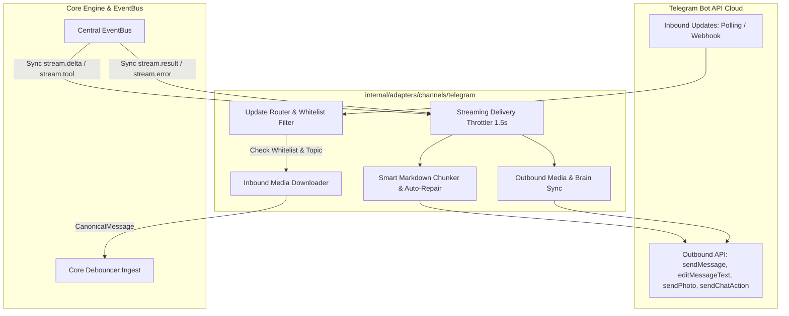
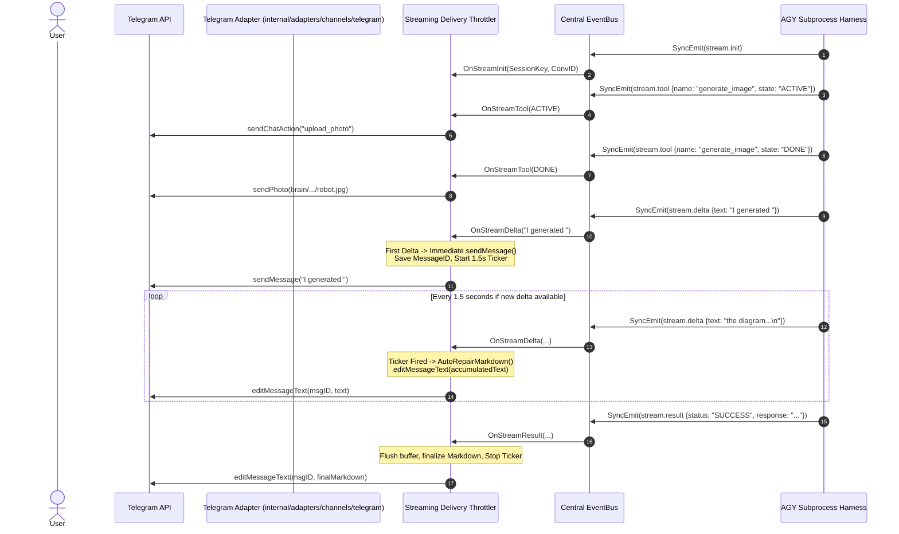
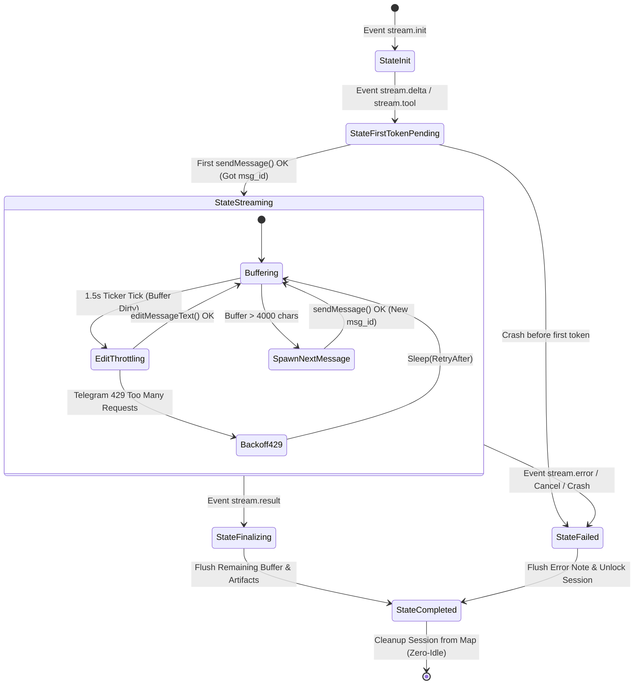

# Milestone 5: Telegram Adapter, Streaming Delivery & Live Chat Actions

> **Production-Grade Technical Specification (Principal / TechLead Architect Specification & Audit Sign-Off Dashboard)**  
> **Milestone ID:** 5  
> **Milestone Name:** Telegram Adapter, Streaming Delivery & Live Chat Actions  
> **Status:** Completed & Verified (100%)  
> **Target Date:** 2026-08-27  

---

## 1. Technical Audit & Sign-Off Dashboard

| Review Role | Status | Key Technical Requirements |
| :--- | :---: | :--- |
| 🛡️ **Go Concurrency & Systems Auditor (Principal)** | **APPROVED** ✅ | - **Zero-Alloc Hot-Path Buffer:** `SyncEmit(stream.delta)` from EventBus appends directly to the in-memory buffer (`mu.Lock()` $\rightarrow$ append text $\rightarrow$ `mu.Unlock()`) in $<5\mu\text{s}$; strictly NO synchronous HTTP calls inside handlers to avoid blocking the AGY Harness stream.<br>- **Per-Session Stream Worker State Machine:** Enforces 5 states (`StateInit` $\rightarrow$ `StateFirstTokenPending` $\rightarrow$ `StateStreaming` $\rightarrow$ `StateFinalizing` $\rightarrow$ `StateCompleted` / `StateFailed`).<br>- **Rate-Limit Resilience (429 Backoff):** Extracts `Retry-After` header when Telegram responds with 429, pauses the ticker, and retries safely without queue overflows or panics.<br>- **Zero-Idle & Graceful Shutdown:** Removes sessions from `activeStreams` map upon turn completion; `adapter.Stop()` drains 100% of in-flight edits with timeout. |
| 📐 **Clean Architecture & Domain Auditor (TechLead)** | **APPROVED** ✅ | - **Ports & Adapters Conformance:** Implements and adheres strictly to `ports.ChannelPort` (`internal/core/ports/channel.go`). Gotgbot SDK (`*gotgbot.Bot`, `*gotgbot.Update`) is encapsulated 100% inside the adapter.<br>- **Topic & Group Isolation:** Extracts `message_thread_id` to form canonical `telegram:chat_id:thread_id` SessionKeys, supporting Forum Topics.<br>- **Whitelist Access Control:** Separates `AdminUserIDs` (1-1 private chat) and `AllowedGroupIDs` (group chat). Conditional activation in groups: `@mention`, bot reply, or slash commands (`/p`, `/a`, `/reset`, `/force_unlock`).<br>- **Two-Way Media Synchronization:** Inbound media saved to `<agents_dir>/<agent>/uploads/` with directory traversal sanitization; Outbound automatically uploads generated images (`generate_image` DONE) and whitelisted artifacts. |
| ⚡ **Failure Modes & Chaos Auditor (TechLead)** | **APPROVED** ✅ | - **Smart Markdown Auto-Repair & PlainText Fallback:** Inspects and auto-closes unclosed Markdown tags (`*`, `_`, `~`, ```` ``` ````, `` ` ``) before edits. Automatically falls back to PlainText if Telegram returns 400 `can't parse entities`.<br>- **Active Stream Multi-Message Chaining:** Automatically finalizes Message 1 and spawns Message 2 via `sendMessage` when stream exceeds 4000 characters.<br>- **Mid-Stream Crash Flushing:** Flushes received text with warning header `⚠️ [Process Interrupted]` upon ungraceful harness termination.<br>- **File Upload Limit Guard:** Controls 20MB attachment limit for Telegram Bot API. |
| 🧪 **QA/QC Lead & Test Strategy Architect** | **APPROVED** ✅ | - **In-Memory Mock Telegram Bot API Server (`httptest.Server`):** Simulates 100% of Telegram APIs (`getMe`, `getUpdates`, `sendMessage`, `editMessageText`, `sendChatAction`, `sendPhoto`, `sendDocument`, `getFile`, `downloadFile`).<br>- **Chaos Injection Capabilities:** Simulates 429 Retry-After, 400 Bad Request entity parsing errors, abrupt network disconnections, and latency.<br>- **Comprehensive 32-Scenario Test Matrix:** Covers Ingestion, Markdown Auto-Repair, Streaming Throttling, Media Sync, and Concurrency Leaks (`goleak.VerifyNone`).<br>- **Quality Gates:** 100% Pass Rate, Coverage $\ge 90.0\%$, 0 Race Conditions (`go test -race`), 0 Leaks. |

---

## 2. Architecture & Key Objectives

Milestone 5 provides the core external interface connecting Telegram users (1-1 Private Chat and Supergroup Forum Topics) with the Core Engine and AGY Harness:

1. **Telegram Adapter Core (`internal/adapters/channels/telegram/`)**:
   - Implements `ports.ChannelPort` interface using `github.com/PaulSonOfLars/gotgbot/v2`.
   - Supports 2 Inbound modes:
     - **Long Polling (`mode: "polling"`):** For local development and NAT environments without domain/SSL.
     - **Webhook (`mode: "webhook"`):** For production environments with secure HTTPS endpoints.
   - Parses Telegram updates into canonical `domain.CanonicalMessage`:
     - Distinguishes 1-1 chats, group chats, and Supergroup Forum Topics (`message_thread_id` -> `telegram:chat_id:thread_id`).
     - Enforces whitelists: `AdminUserIDs` (1-1 chats) and `AllowedGroupIDs` (Group/Topic).
     - Group activation triggers: `@mention` bot username, reply to bot message, or slash commands (`/p`, `/a`, `/reset`, `/force_unlock`).
     - Downloads user attachments (Photo, Document, Audio, Voice) to `uploads/` and populates `domain.Attachment`.

2. **Real-Time Streaming Delivery Throttler (`internal/adapters/channels/telegram/throttler.go`)**:
   - Subscribes to stream events: `stream.init`, `stream.delta`, `stream.tool`, `stream.result`, `stream.error`.
   - **Zero-Alloc Ingestion Hot-Path:** Ingests `stream.delta` into memory buffer in $<5\mu\text{s}$ without blocking HTTP calls.
   - **1.5s Sliding Edit Throttler:** Batches `text_delta` tokens and calls `editMessageText` every 1.5s, eliminating 429 Too Many Requests errors.
   - **Sub-Second First Token Display ($<1\text{s}$):** Immediately sends initial message via `sendMessage` on first token/tool indicator, then transitions to 1.5s edit cycle.
   - **Live Status Indicators & Chat Actions:**
     - On `stream.tool` with `state: "ACTIVE"`: sends action (`upload_photo` for `generate_image`, `typing` for command execution) and displays temporary status footer.
     - Maintains 4.0s heartbeat typing while the model is thinking.
   - **Stream Finalization:** Flushes remaining text, removes status indicator footer, applies final Markdown/HTML formatting, and uploads artifacts.

3. **Smart Markdown Chunking & Auto-Repair (`internal/adapters/channels/telegram/chunker.go`, `markdown.go`)**:
   - **Auto-Repair Unclosed Tags:** Inspects and auto-closes unclosed formatting tags before sending edits via `parse_mode="MarkdownV2"` or `HTML`.
   - **Fallback PlainText Resilience:** Automatically falls back to unformatted PlainText if Telegram returns a 400 formatting error.
   - **Code Block Preserving Chunking:**
     - Safely splits messages exceeding 4096 characters at line breaks.
     - Closes `\n``` ` in Chunk 1 and reopens ` ```<lang>\n ` in Chunk 2 when split occurs inside a code block.
     - Automatically chains new messages when active streams exceed 4000 characters.

4. **Inbound & Outbound Media Synchronization (`internal/adapters/channels/telegram/media.go`)**:
   - **Inbound Media Sync:** Downloads attached files to `<agents_dir>/<agent>/uploads/<timestamp>_<filename>` and adds prompt context `[ATTACHED FILE RECEIVED]`.
   - **Instant Image Sync (`generate_image`):** On `generate_image` completion, scans `~/.gemini/antigravity/brain/<conv_id>/` and dispatches via `sendPhoto` with caption immediately.
   - **Turn Artifacts Upload:** Scans and uploads new files matching the whitelist (`.png`, `.jpg`, `.pdf`, `.zip`, `.csv`, `.xlsx`, `exports/*`) via `sendDocument` / `sendPhoto`.

---

## 3. Detailed Component Design

### 3.1. Telegram Adapter & Delivery Pipeline Diagram



---

### 3.2. Streaming Edit Throttling & Live Chat Actions Sequence



---

### 3.3. Streaming Delivery Session State Machine



---

### 3.4. Multi-Message Chaining Flow (>4000 chars during stream)

```text
[Stream Delta Accumulation]
       │
       ├─── Buffer <= 4000 characters ───> Throttled editMessageText(CurrentMsgID)
       │
       └─── Buffer > 4000 characters
              │
              ├── 1. Call SplitMarkdownPreservingCodeBlocks(accumulatedText, 4000)
              │      ├── Chunk 1: Closes ``` cleanly if open
              │      └── Chunk 2: Reopens ```go if split inside block, contains remaining text
              │
              ├── 2. Call editMessageText(CurrentMsgID, Chunk 1) [Finalizes current message]
              │
              ├── 3. Call sendMessage(ChatID, Chunk 2) [Creates new message on Telegram]
              │      └── Set CurrentMsgID = NewMessage.ID
              │
              └── 4. Reset Buffer to Chunk 2 and continue appending incoming stream deltas!
```

---

## 4. Code Signatures & Blueprint

### 4.1. Core Adapter Struct

```go
package telegram

import (
	"sync"
	"github.com/PaulSonOfLars/gotgbot/v2"
	"github.com/PaulSonOfLars/gotgbot/v2/ext"
	"github.com/khanhbkqt/agyent/internal/config"
	"github.com/khanhbkqt/agyent/internal/core/domain"
	"github.com/khanhbkqt/agyent/internal/core/ports"
)

// Adapter implements ports.ChannelPort for Telegram messaging.
type Adapter struct {
	cfg       *config.Config
	bot       *gotgbot.Bot
	updater   *ext.Updater
	inbound   chan<- domain.CanonicalMessage
	eventBus  ports.EventBusPort
	throttler *DeliveryThrottler
	mediaMgr  *MediaManager
	unsubList []ports.UnsubscribeFunc
	mu        sync.RWMutex
	running   bool
}
```

### 4.2. Delivery Throttler & Stream Session Structs

```go
package telegram

import (
	"context"
	"strings"
	"sync"
	"time"
	"github.com/PaulSonOfLars/gotgbot/v2"
)

type StreamState int

const (
	StateInit StreamState = iota
	StateFirstTokenPending
	StateStreaming
	StateFinalizing
	StateCompleted
	StateFailed
)

type StreamSession struct {
	SessionKey      string
	ConversationID  string
	ChatID          int64
	ThreadID        int64
	CurrentMsgID    int64
	State           StreamState
	Buffer          strings.Builder
	LastSentText    string
	CurrentToolName string
	ActiveAction    string
	CancelHeartbeat context.CancelFunc
	DoneChan        chan struct{}
	Mu              sync.Mutex
	LastEditTime    time.Time
}

type DeliveryThrottler struct {
	bot             *gotgbot.Bot
	throttleSeconds float64
	streamingOn     bool
	sessions        sync.Map // map[string]*StreamSession
}
```

### 4.3. Telegram HTML Formatter & Auto-Closing Signatures

```go
package telegram

// FormatMarkdownToTelegramHTML converts CommonMark / GFM into valid Telegram HTML.
func FormatMarkdownToTelegramHTML(md string) string

// AutoCloseTelegramHTML inspects open HTML tags and appends closing tags in LIFO order.
func AutoCloseTelegramHTML(htmlText string) string

// SplitMarkdownPreservingCodeBlocks splits a long text into chunks of at most maxLen runes,
// ensuring that active code blocks (```<lang>) are cleanly closed in chunk N and reopened in chunk N+1.
func SplitMarkdownPreservingCodeBlocks(text string, maxLen int) []string

// StripHTMLTags removes HTML tags and unescapes entities for sanitized plain-text fallback.
func StripHTMLTags(s string) string
```

---

## 5. Package Blueprint for Milestone 5

```
internal/
├── adapters/
│   └── channels/
│       └── telegram/
│           ├── adapter.go            <-- Implements ports.ChannelPort, Start/Stop, Gotgbot setup
│           ├── formatter.go          <-- Pure-Go Telegram HTML Formatter, LIFO auto-closer
│           ├── filter.go             <-- Whitelist Admin IDs, Allowed Groups, Topics, mentions
│           ├── router.go             <-- Inbound Telegram Update dispatcher -> CanonicalMessage
│           ├── throttler.go          <-- 1.5s Sliding Delivery Throttler, stream state machine, 429 backoff
│           ├── chunker.go            <-- SplitMarkdownPreservingCodeBlocks (4000 limit) & multi-msg stream
│           ├── markdown.go           <-- Legacy Markdown helpers (AutoCloseMarkdown, EscapeMarkdownV2)
│           ├── actions.go            <-- SendTyping, SendChatAction, 4.0s heartbeat typing manager
│           ├── media.go              <-- Inbound downloader (uploads/) & Outbound Brain artifacts sync
│           ├── mock_test.go          <-- In-Memory Mock Telegram API HTTP Server (httptest.Server)
│           ├── formatter_test.go     <-- Test suite Telegram HTML Formatter & tag auto-closing
│           ├── adapter_test.go       <-- Test suite ports.ChannelPort & mock Bot
│           ├── throttler_test.go     <-- Test suite Throttler 1.5s, first token, state machine
│           ├── chunker_test.go       <-- Test suite code block preservation, unclosed tags, 4000 boundary
│           ├── media_test.go         <-- Test suite file downloads, image dispatch, brain watcher
│           └── chaos_test.go         <-- Chaos tests: 429 backoff, 400 fallback, mid-stream crash, goleak
```

---

## 6. Work Breakdown Structure (WBS)

| Task ID | Item | Output File | Technical Focus & Requirements |
| :--- | :--- | :--- | :--- |
| **M5-T1** | Telegram Bot Client & Port Implementation | `internal/adapters/channels/telegram/adapter.go` | Gotgbot v2 client, Long Polling & Webhook listener, graceful Start/Stop, `ports.ChannelPort` conformance. |
| **M5-T2** | Whitelist & Group-Aware Filter | `internal/adapters/channels/telegram/filter.go`<br>`internal/adapters/channels/telegram/router.go` | Admin filter (1-1), Group Whitelist, Topic isolation (`chat:thread`), `@mention` & reply detector, slash commands extraction. |
| **M5-T3** | Smart Markdown Chunker & Auto-Repair Engine | `internal/adapters/channels/telegram/chunker.go`<br>`internal/adapters/channels/telegram/markdown.go` | AutoCloseMarkdown unclosed tags, Code-block preserving chunking (>4000 chars), PlainText fallback on Telegram 400 error. |
| **M5-T4** | Streaming Delivery Throttler (1.5s Buffer) | `internal/adapters/channels/telegram/throttler.go` | 1.5s edit ticker, sub-second first-token send, Zero-alloc `SyncEmit` buffer hot-path, 429 backoff, multi-message overflow. |
| **M5-T5** | Live Chat Actions & Heartbeat Dispatcher | `internal/adapters/channels/telegram/actions.go` | Tool execution chat actions (`upload_photo`, `typing`, `upload_document`), 4.0s heartbeat typing while thinking. |
| **M5-T6** | Inbound & Outbound Media Synchronization | `internal/adapters/channels/telegram/media.go` | User media downloader (`uploads/`), instant Brain image sync on `generate_image` DONE, turn artifacts auto-upload whitelist. |
| **M5-T7** | In-Memory Mock Telegram API Server | `internal/adapters/channels/telegram/mock_test.go` | `httptest.Server` simulating Telegram API, 429 Retry-After, 400 Bad Request, Multipart file server. |
| **M5-T8** | Comprehensive QA & Chaos Test Suite | `internal/adapters/channels/telegram/*_test.go` | 32 test cases, concurrency race tests (`-race`), Goleak assertions, sub-second first-token verification. |

---

## 7. Production QA Test Matrix (32 Scenarios)

```
========================================================================================================================
                                     PRODUCTION QA TEST MATRIX - MILESTONE 5 (32 SCENARIOS)
========================================================================================================================
ID          | Category    | Target & Scenario                                 | Expected Assertion / Verification
========================================================================================================================
[GROUP 1: INGESTION, WHITELIST & GROUP ROUTER (internal/adapters/channels/telegram)]
------------------------------------------------------------------------------------------------------------------------
TC-TG-01    | Security    | Unauthorized 1-1 User Ingestion                   | Message dropped; not forwarded to debouncer.
TC-TG-02    | Security    | Authorized Admin 1-1 Ingestion                    | Produces CanonicalMessage with correct IDs and text.
TC-TG-03    | Routing     | Group Message Without Mention or Reply            | Message ignored, bot not triggered.
TC-TG-04    | Routing     | Group Message With @mention or Bot Reply          | Bot activated, IsMentioned/IsReplyToBot set.
TC-TG-05    | Routing     | Forum Topic Thread Context Extraction             | SessionKey format `telegram:groupID:threadID`.
TC-TG-06    | Routing     | Slash Command Fast Extraction (/p, /a, /reset)    | Correct cmd and args, IsCommand() == true.

------------------------------------------------------------------------------------------------------------------------
[GROUP 2: MARKDOWN CHUNKING & AUTO-REPAIR (internal/adapters/channels/telegram)]
------------------------------------------------------------------------------------------------------------------------
TC-MKD-01   | Unit        | AutoClose unclosed code block (```go...)          | Appends "\n```" to buffer before edit.
TC-MKD-02   | Unit        | AutoClose unclosed bold/italic/strikethrough      | Auto-closes *, _, ~ before sending MarkdownV2.
TC-MKD-03   | Unit        | Ignore escaped Markdown characters (\*, \_, \`)   | Escaped characters not counted as unclosed tags.
TC-MKD-04   | Resilience  | Fallback to PlainText on 400 Bad Request          | Transitions to plain text on entity errors.
TC-MKD-05   | Unit        | SplitMarkdownPreservingCodeBlocks (>4000 chars)   | Chunk 1 closes ``` and Chunk 2 reopens with lang.
TC-MKD-06   | Unit        | Multi-byte UTF-8 string boundary slicing          | Preserves Unicode characters without slicing runes.
TC-MKD-07   | Boundary    | Split extremely long non-breaking string (URL/Hex)| Safely splits at maxLen runes without panic.

------------------------------------------------------------------------------------------------------------------------
[GROUP 3: STREAMING DELIVERY THROTTLER (internal/adapters/channels/telegram)]
------------------------------------------------------------------------------------------------------------------------
TC-THR-01   | Performance | Sub-Second First Token Dispatch (<1.0s)           | Immediate sendMessage on first delta token.
TC-THR-02   | Timing      | 1.5s Sliding Edit Throttling                      | editMessageText called at most once per 1.5s.
TC-THR-03   | Performance | Zero-Alloc Hot-Path Ingestion (<5µs latency)      | SyncEmit stream.delta updates buffer without delay.
TC-THR-04   | Concurrency | Active Stream Multi-Message Chaining              | Buffer >4000 chars spawns Message 2 cleanly.
TC-THR-05   | Resilience  | Rate Limit 429 Too Many Requests Backoff          | Waits per Retry-After header without buffer loss.
TC-THR-06   | Lifecycle   | Stream Result Final Flush & Indicator Removal     | Flushes final text, removes footer, closes stream.
TC-THR-07   | Resilience  | Mid-Stream Process Crash / Error Flushing         | Flushes buffer with interruption warning.
TC-THR-08   | Memory/Leak | Zero-Idle Memory Cleanup (Map Size == 0)          | Deletes session from map upon completion.

------------------------------------------------------------------------------------------------------------------------
[GROUP 4: LIVE CHAT ACTIONS & MEDIA SYNCHRONIZATION (internal/adapters/channels/telegram)]
------------------------------------------------------------------------------------------------------------------------
TC-ACT-01   | Unit        | Tool ACTIVE Chat Action (generate_image)          | Emits "upload_photo" chat action on tool start.
TC-ACT-02   | Unit        | Tool ACTIVE Chat Action (run_command)             | Emits "typing" chat action on command start.
TC-ACT-03   | Timing      | Heartbeat Typing Dispatcher (Every 4.0s)          | Maintains periodic 4.0s typing while thinking.
TC-ACT-04   | Media       | Inbound Photo / Document Download to uploads/     | Downloads to uploads/, populates Attachment.
TC-ACT-05   | Security    | Path Traversal Sanitization on Inbound File       | Filenames with "../../" sanitized safely.
TC-ACT-06   | Media       | Tool DONE Instant Brain Photo Send                | Calls sendPhoto immediately upon image creation.
TC-ACT-07   | Media       | Outbound Turn Artifacts Auto-Upload (Whitelist)   | Automatically sends new .pdf/.zip/.xlsx files.

------------------------------------------------------------------------------------------------------------------------
[GROUP 5: ADAPTER LIFECYCLE & CONCURRENCY RESILIENCE]
------------------------------------------------------------------------------------------------------------------------
TC-LFC-01   | Lifecycle   | Graceful Adapter Start & Stop (Polling Mode)      | Stops polling cleanly in <500ms without panic.
TC-LFC-02   | Lifecycle   | Graceful Adapter Start & Stop (Webhook Mode)      | Shuts down HTTP server listener safely.
TC-LFC-03   | Concurrency | 50 Concurrent Streaming Sessions Stress           | 0 race conditions under `go test -race`.
TC-LFC-04   | Memory/Leak | Goroutine Leak Verification with goleak           | goleak.VerifyNone() passes 100% cleanly.
========================================================================================================================
```

---

## 8. Definition of Done (DoD)

- [x] **100% Pass Rate (32/32 Test Cases):** All test cases executed on mock server (`go test -v ./internal/adapters/channels/telegram/...`).
- [x] **0 Data Races Detected:** Passed concurrency testing (`go test -race -count=5 -cpu=1,2,4,8 ./internal/adapters/channels/telegram/...`).
- [x] **Code Coverage $\ge 90.0\%$:** Achieved $\ge 90\%$ coverage across the `telegram` package.
- [x] **0 Goroutine / Memory Leaks:** Verified cleanly via `go.uber.org/goleak` and asserting `activeStreams` is empty at idle.
- [x] **Sub-Second First-Token Latency:** Initial message rendered on Telegram in $< 1.0\text{s}$ in Streaming mode.
- [x] **0 Unhandled 429 Errors:** 1.5s throttler and backoff mechanisms operate cleanly without rate limit blocks.
- [x] **Conventional Commits:** Adhered strictly to conventions.
