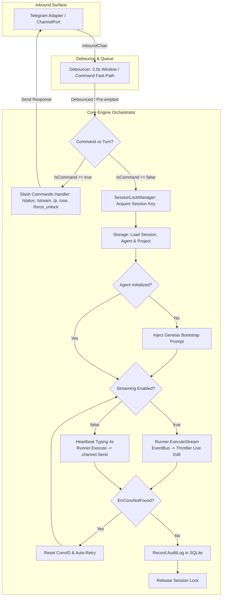

# Milestone 6: Orchestration Engine, Stream Toggle, Daemon Runner & Release Packaging

> **Document status:** Historical
> **Code authority:** engine, composition root, Makefile and current documentation
> **Last verified:** 2026-09-05

> **Status:** Done (100%)  
> **Target Version:** `v1.0.0`  
> **Review Status:** Approved by Principal Architect & Audited by QC Lead  

Phase 6 wires together all system components (Core Engine, Streaming Harness, Storage, EventBus, Debouncer, Telegram Adapter), manages daemon lifecycles, guarantees per-session concurrency safety, executes self-healing protocols, validates **Real AGY CLI Integration**, and packages static CGO-free releases.

---

## 1. Key Objectives

1. **Core Engine Orchestration & Turn Pipeline (`internal/core/engine/`)**:
   - Initialize and wire Ports and Adapters:
     $$\text{Storage} \longleftrightarrow \text{LockManager} \longleftrightarrow \text{EventBus} \longleftrightarrow \text{Debouncer} \longleftrightarrow \text{Runner} \longleftrightarrow \text{Channel}$$
   - Manage **Dual-Mode Execution**:
     - **Real-Time Streaming (`stream-json`)**: Emits NDJSON events directly into `EventBus`; Telegram's `DeliveryThrottler` handles live typing, streaming updates, and media synchronization. The engine avoids sending duplicate final messages.
     - **Classic Batch (`json`)**: Engine maintains heartbeat typing (every 4s), executes `runner.Execute`, and delivers a complete `OutboundMessage` upon process termination.
   - **Self-Healing on `ErrConversationNotFound`:** Automatically resets `conversation_id` when the session expires or is not found, retrying the prompt without user re-entry.
   - **`/force_unlock` & Process Tree Termination:** Cancels active subprocess contexts via `activeTurns map[string]context.CancelFunc` and immediately releases session mutexes.

2. **Agent Bootstrap Protocol (`internal/core/engine/bootstrap.go`)**:
   - Manages agent initialization lifecycle (`uninitialized` $\rightarrow$ `initialized`).
   - Injects the Genesis Bootstrap Prompt so `agy` generates the 4 foundation files (`IDENTITY.md`, `SOUL.md`, `USER.md`, `MEMORY.md`).

3. **Complete Slash Commands Suite (`internal/core/engine/commands.go`)**:
   - `/status`: Uptime, Active Agent, Active Project, CWD, Streaming Status, Active Locks, Dropped Events.
   - `/stream [on|off]`: Inspect or toggle Real-Time Streaming dynamically at runtime.
   - `/agents`, `/a list`, `/use <name>`, `/a <name>`, `/agent new <name> [desc]`: Agent management.
   - `/projects`, `/p list`, `/p <name>`, `/p new <name> [path]`, `/p exit`, `/p ~`, `/p info`, `/p reset`: Multi-Project management.
   - `/reset`: Reset conversation ID for the current scope.
   - `/force_unlock`: Abort running subprocess and release session lock.
   - `/help`: Interactive command guide.

4. **`agyent run` CLI Daemon & Process Lifecycle (`cmd/agyent/run.go`)**:
   - Runs `agyent` as a 24/7 background daemon service.
   - Prints startup banner.
   - Traps OS signals (`SIGINT`, `SIGTERM`).
   - Executes sequential **Graceful Shutdown** in $< 3.0\text{s}$:
     1. `Channel.Stop()` (halts polling/webhook, flushes throttler)
     2. `Debouncer.Close(ctx)` (flushes buffer)
     3. `Engine.Stop(ctx)` (terminates in-flight process trees)
     4. `EventBus.CloseWithTimeout(ctx)` (drains async queue)
     5. `Storage.Close()` (closes SQLite connections)

5. **SafeGo Panic Recovery Wrapper (`internal/core/concurrency/safego.go`)**:
   - Utility wrapping newly spawned goroutines (`SafeGo(fn)`, `SafeGoWithContext(ctx, fn)`), recovering panics and logging structured stack traces to protect the gateway daemon.

6. **Stratified Test Strategy (Mocked & Real AGY Integration)**:
   - **Tier 1 (Fast Mock Tests):** Runs in CI/CD (< 3.0s), using mock processes, mock HTTP servers, and synthetic virtual clocks.
   - **Tier 2 (Real AGY CLI Integration Tests):** Tests against the real `agy` binary (`v1.1.20`), verifying NDJSON streaming (`stream-json`), Brain storage (`~/.gemini/antigravity/brain/<id>/`), multi-turn memory, and workspace isolation. Gated via `skipIfNoRealAGY(t)`.

7. **Cross-Compilation & VPS Systemd Scripts**:
   - Makefile for Pure-Go (Zero CGO) static compilation across 5 targets:
     - Linux x86_64 (`GOOS=linux GOARCH=amd64`)
     - Linux ARM64 / Raspberry Pi (`GOOS=linux GOARCH=arm64`)
     - macOS Intel (`GOOS=darwin GOARCH=amd64`)
     - macOS Apple Silicon (`GOOS=darwin GOARCH=arm64`)
     - Windows x64 (`GOOS=windows GOARCH=amd64`)
     - Systemd service template `scripts/deploy/agyent.service` for Linux VPS deployment.

---

## 2. Detailed Task Breakdown

| Task ID | Item | Target File | Technical Detail |
| :--- | :--- | :--- | :--- |
| **M6-T0** | Patch `ParseSessionKey` in Telegram Throttler | `internal/adapters/channels/telegram/throttler.go` | Supports 2-part keys (1-1 DM) and 3-part keys (Topics) |
| **M6-T1** | Upgrade `LockManager` with `ForceUnlock` & Add `SafeGo` | `internal/core/ports/lock.go` `internal/core/concurrency/lock_manager.go` `internal/core/concurrency/safego.go` `internal/core/concurrency/safego_test.go` | `ForceUnlock(sessionKey string) bool` and panic isolation utility |
| **M6-T2** | Implement Agent Lifecycle Bootstrap Protocol | `internal/core/engine/bootstrap.go` | Injects Genesis Prompt when uninitialized and updates state |
| **M6-T3** | Implement Slash Commands Handler | `internal/core/engine/commands.go` | `/status`, `/stream`, `/agents`, `/use`, `/projects`, `/p`, `/reset`, `/force_unlock`, `/help` |
| **M6-T4** | Implement Core Engine Orchestrator & Dual-Mode Pipeline | `internal/core/engine/engine.go` | Turn pipeline, streaming vs batch branching, self-healing, `activeTurns` cancel map |
| **M6-T5** | Complete `agyent run` CLI Daemon & Graceful Shutdown | `cmd/agyent/run.go` | Startup banner, signal trapping, ordered graceful shutdown (< 3.0s) |
| **M6-T6** | Build E2E System & Mocked Concurrency Test Suite | `internal/core/engine/engine_test.go` | Lifecycle, dual-mode, media sync, locks, self-healing, slash commands |
| **M6-T7** | Build Real AGY CLI Integration Test Suite | `internal/core/engine/real_agy_test.go` | Real `agy` CLI tests: stream-json, batch json, brain artifacts, bootstrap |
| **M6-T8** | Build Makefile Cross-Compilation & Systemd Unit | `Makefile` `scripts/deploy/agyent.service` | Pure-Go zero-CGO multi-platform static build & VPS service |
| **M6-T9** | Documentation & Release Packaging `v1.0.0` | `README.md` `CHANGELOG.md` `docs/plans/master_roadmap.md` | Release notes and operations guide |

---

## 3. Engine Orchestration Diagram

---

## 4. Real AGY CLI Integration Test Matrix

| Test ID | Scenario | CLI Mode & Flags | Acceptance Criteria |
| :--- | :--- | :--- | :--- |
| **`TC-REAL-STREAM-01`** | Real-time Streaming Execution | `agy --output-format stream-json` | • Captures `init` packet with tools list • Receives `agent_response` text deltas in real time • Receives `result` completing turn with token metrics |
| **`TC-REAL-STREAM-02`** | Multi-turn Continuation | `agy --conversation <conv_id>` | • Reuses conversation ID from turn 1 • Validates context retention across turns |
| **`TC-REAL-BATCH-01`** | Classic Batch Execution | `agy --output-format json` | • Receives 1 final JSON envelope • Emits Typing action every 4.0s • Delivers complete message to channel |
| **`TC-REAL-ARTIFACT-01`**| Capturing New Workspace Files | Snapshot Diff on project dir | • SnapshotWatcher detects new files by `mtime` • Ignores source files, auto-attaches images/exports |
| **`TC-REAL-BRAIN-01`**   | Syncing Brain Generated Images | Scans `~/.gemini/antigravity/brain/<id>/` | • Captures image produced by `generate_image` • Sends photo directly to Telegram |
| **`TC-REAL-BOOTSTRAP-01`**| Agent Genesis Protocol | Agent status `uninitialized` | • Injects Genesis prompt into workspace • Automatically creates 4 files: `IDENTITY.md`, `SOUL.md`, `USER.md`, `MEMORY.md` • Updates status to `initialized` in SQLite |
| **`TC-REAL-CANCEL-01`**  | Emergency Unlock & Kill Tree | Invokes `/force_unlock` | • Calls `killProcessTree` terminating background `agy` • Immediately releases session lock |
| **`TC-REAL-SELFHEAL-01`**| Self-Healing on Expired Session | Session with expired UUID | • Traps `ErrConversationNotFound` • Resets conversation ID and automatically retries turn |

---

## 5. Acceptance Criteria

- [x] `ParseSessionKey` in Telegram Throttler supports both 1-1 chats and forum topic threads.
- [x] `agyent run` boots cleanly, displaying startup banner and structured status logs.
- [x] Terminating daemon via `Ctrl+C` initiates Graceful Shutdown, freeing resources in $< 3.0\text{s}$.
- [x] Toggling `streaming_enabled` (or `/stream on/off`) dynamically changes delivery behavior (Stream vs Batch).
- [x] `/force_unlock` releases session locks and safely terminates child subprocess trees.
- [x] The engine self-heals automatically when encountering `ports.ErrConversationNotFound`.
- [x] 100% test suite pass rate across both Mocked and Real AGY CLI Integration suites: `go test -v -race ./...`.
- [x] Successfully builds single static binaries across all 5 targets (`linux-amd64`, `linux-arm64`, `darwin-amd64`, `darwin-arm64`, `windows-amd64`).
