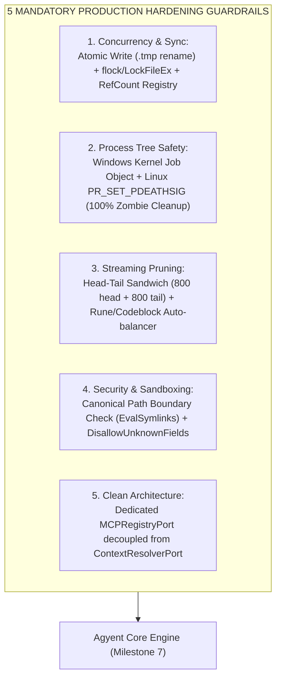
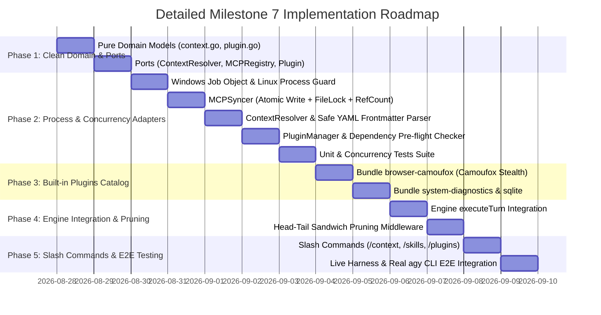

# Milestone 7: Context Management, Skills Subsystem & Extensible Plugins

Comprehensive technical specification and implementation design for **Milestone 7: Context Management, Progressive Skills, Dynamic MCP Syncing & Extensible Plugins** of the **`agyent`** system.

---

## 1. Objectives & Architectural Guardrails



---

## 2. Implementation Phases & Work Breakdown Structure



---

### Phase 1: Pure Core Domain & Ports

#### 1.1. `internal/core/domain/context.go` & `plugin.go`
- **Goal:** Define pure domain models independent of OS infrastructure.
- **Components:**
  - `ContextScope`: `ScopeGlobal` | `ScopeWorkspace`.
  - `SkillHeader`: `Name`, `Description`, `FilePath`, `Scope`.
  - `MCPServerConfig`: `ServerName`, `Command`, `Args`, `ServerURL`, `Env`, `Scope`, `Disabled`.
  - `PluginManifest`: `Name`, `Version`, `Description`, `Author`, `Enabled`, `Tags`.
  - `Plugin`: `Manifest`, `Path`, `Scope`, `MCPServers`, `Skills`, `Rules`, `InstalledAt`.
  - `ResolvedContext`: `WorkingDir`, `CombinedDirectives`, `SkillHeaders`, `ActiveMCPServers`, `ActivePlugins`, `ResolvedAt`.

#### 1.2. `internal/core/ports/` (Clean SRP Responsibility Separation)
- **`ports/context.go`**:
  ```go
  type ContextResolverPort interface {
      Resolve(ctx context.Context, globalHome string, workspaceDir string) (*domain.ResolvedContext, error)
      DiscoverSkills(ctx context.Context, globalHome string, workspaceDir string) ([]domain.SkillHeader, error)
  }
  ```
- **`ports/mcp.go`**:
  ```go
  type MCPRegistryPort interface {
      MountServers(ctx context.Context, sessionKey string, servers []domain.MCPServerConfig) error
      UnmountServers(ctx context.Context, sessionKey string, servers []domain.MCPServerConfig) error
  }
  ```
- **`ports/plugin.go`**:
  ```go
  type PluginManagerPort interface {
      ListPlugins(ctx context.Context, globalHome, workspaceDir string) ([]domain.Plugin, error)
      TogglePlugin(ctx context.Context, pluginName string, enabled bool, scope domain.ContextScope, workspaceDir string) error
      InstallBuiltinPlugin(ctx context.Context, pluginName string, targetScope domain.ContextScope, workspaceDir string) error
      ValidatePlugin(ctx context.Context, plugin *domain.Plugin) error
      AssemblePluginCapabilities(ctx context.Context, globalHome, workspaceDir string) (*domain.ResolvedContext, error)
  }
  ```

---

### Phase 2: Infrastructure, Safe Synchronization & Process Lifecycles

#### 2.1. `internal/adapters/harness/agy/job_windows.go` & `job_linux.go`
- **Windows:** Attach spawned `exec.Cmd` processes to Windows Kernel Job Objects (`JOB_OBJECT_LIMIT_KILL_ON_JOB_CLOSE`). When the parent process terminates, all child processes (Camoufox / Firefox / Python) are immediately reaped by the OS kernel, eliminating zombie processes.
- **Linux:** Enable `SysProcAttr: { Pdeathsig: syscall.SIGKILL }`.

#### 2.2. `internal/adapters/mcp/syncer.go` (`MCPRegistryPort` Implementation)
- **Atomic Write:** Writes to `.tmp` file $\rightarrow$ `f.Sync()` $\rightarrow$ `os.Rename`.
- **Cross-Process File Lock:** Uses `LockFileEx` (Windows) / `flock` (Linux) to protect against concurrent file writes.
- **Reference Counting:** Tracks active session usage per server (`activeMounts[key]++`) to prevent premature unmounting during concurrent turns.
- **Crash Recovery:** Automatically purges servers with prefix `__agyent_ephemeral_` upon startup.

#### 2.3. `internal/adapters/context/resolver.go`
- **Security Check:** Integrates `ValidateSecurePath` with `filepath.EvalSymlinks` to prevent path traversal attacks.
- **Safe YAML Parser:** Parses `SKILL.md` frontmatter safely, isolating syntax errors without crashing the daemon.

#### 2.4. `internal/adapters/plugin/manager.go` & `validator.go`
- **Dependency Pre-flight:** Verifies required binaries exist (`exec.LookPath`) before enabling plugins.
- **Strict JSON Decoder:** Uses `DisallowUnknownFields()` to validate `plugin.json` manifests.

---

### Phase 3: Built-in Capability Plugins Catalog

1. **`builtin/plugins/browser-camoufox/`:**
   - `plugin.json`, `server.py` (JSON-RPC 2.0 Stdio MCP), `SKILL.md`, `rules/AGENTS.md`.
2. **`builtin/plugins/system-diagnostics/`:**
   - Host CPU, RAM, Disk, and Process monitoring.
3. **`builtin/plugins/database-sqlite/`:**
   - Schema inspection and local SQLite querying.

---

### Phase 4: Engine Integration & Head-Tail Sandwich Pruning

#### 4.1. `internal/core/engine/pruner.go`
- Prunes outputs exceeding 2000 characters using a **Head-Tail Sandwich** strategy (first 800 characters + summary notice + last 800 characters).
- Auto-balances Markdown code fences (```` ``` ````) and respects UTF-8 rune boundaries.

#### 4.2. `internal/core/engine/engine.go` & `bootstrap.go`
- Integrates `ContextResolverPort`, `MCPRegistryPort`, `PluginManagerPort` into `executeTurn()`.
- Implements **Progressive Disclosure** (injecting only skill headers into system prompts).

---

### Phase 5: Slash Commands & Live E2E Testing

#### 5.1. `internal/core/engine/commands.go`
- `/context`: Detailed breakdown of token budget, CWD, active MCP servers, and directives.
- `/skills`: Lists loaded skills with scope.
- `/plugins`: Lists plugins with `[ENABLED] / [DISABLED]` status.
- `/plugin enable <name>` / `/plugin disable <name>`: Toggle plugins directly via Telegram.

#### 5.2. Comprehensive Testing
- **Automated Unit & Concurrency Tests:** `go test -v -race ./...` (Coverage > 85%).
- **Live Harness E2E:** Live validation with `agy` CLI binary and `bin/agyent`.

---

## 3. Definition of Done (DoD)

- [x] Zero Race Conditions: Passed all concurrency tests under `-race`.
- [x] Zero Zombie Subprocesses: Process management enforced via Windows Job Objects and Linux PDEATHSIG.
- [x] Zero Corrupted Config: 100% atomic writes for `mcp_config.json`.
- [x] Telegram HTML formatting preserved during streaming and in-memory pruning.
- [x] Built-in Plugin `browser-camoufox` executed live with real `agy` CLI.
