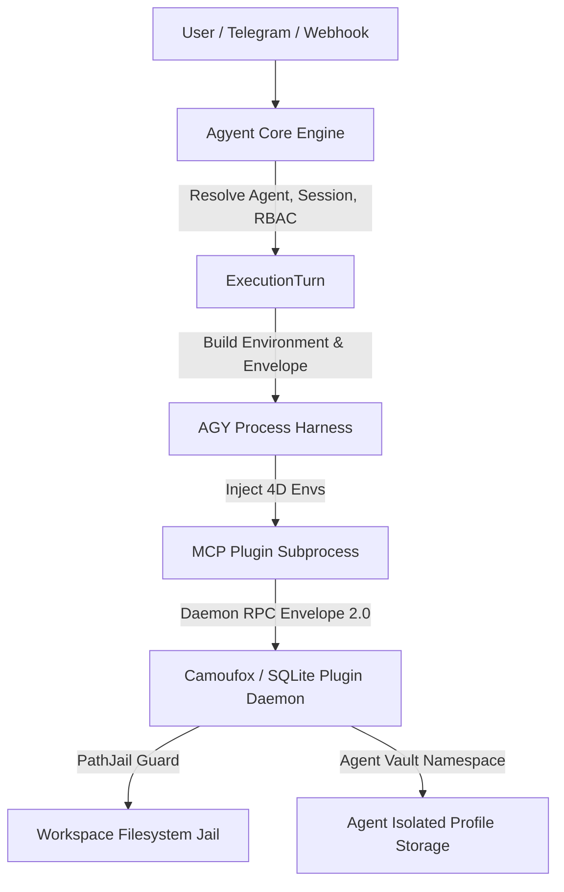

# APIS-4D: Universal Plugin Multi-Tenant Isolation Standard

## 1. Overview & Architecture

The **Agyent Plugin Isolation Standard (APIS-4D)** defines the multi-tenant security, namespace partitioning, and execution context specification for all internal and third-party Model Context Protocol (MCP) plugins operating within the Agyent ecosystem.

When multiple autonomous agents (e.g. `coder_bot`, `auditor_agent`, `security_lead`, `subagent_worker`) execute tasks across different user sessions, projects, or threads, plugins must enforce strict multi-tenant boundaries to prevent cross-agent data leakage, profile contamination, and unauthorized filesystem traversal.



---

## 2. The 4 Dimensions of APIS-4D

Every MCP tool execution in Agyent is governed by four core isolation dimensions:

| Dimension | Environment Variable | Payload Key | Description |
| :--- | :--- | :--- | :--- |
| **D1: Workspace Jail** | `AGYENT_AGENT_WORKSPACE` | `context.workspace_dir` | The canonical root directory where file reads, writes, and database operations are strictly jailed. |
| **D2: Agent Namespace** | `AGYENT_AGENT_NAME` | `context.agent_name` | The unique name of the calling agent (e.g. `admin_agent`, `dev_bot`, `subagent_123`). Partitions browser profiles and states. |
| **D3: Session Key** | `AGYENT_SESSION_KEY` | `context.session_key` | The interactive chat/thread session key (e.g. `telegram:999001:888001`) guaranteeing turn context alignment. |
| **D4: Caller Identity** | `AGYENT_USER_ID` | `context.user_id` | The authenticated user identifier initiating the execution, enabling RBAC verification within plugins. |

---

## 3. Go Core & Harness Process Environment Injection

### 3.1 Domain Model Definition

The core domain `ExecutionRequest` structure carries the full isolation envelope:

```go
type ExecutionRequest struct {
    Prompt                     string
    WorkspaceDir               string
    AgentName                  string
    SessionKey                 string
    UserID                     string
    Env                        map[string]string
    // ...
}
```

### 3.2 Harness Child Process Injection

The harness automatically injects the four dimensions into `cmd.Env` prior to launching the CLI runner or MCP child processes:

```go
func buildCommandEnv(req domain.ExecutionRequest, sessionKeyOpt ...string) []string {
    baseEnv := os.Environ()
    envMap := make(map[string]string, len(baseEnv))
    for _, e := range baseEnv {
        parts := strings.SplitN(e, "=", 2)
        if len(parts) == 2 {
            envMap[parts[0]] = parts[1]
        }
    }

    if req.AgentName != "" {
        envMap["AGYENT_AGENT_NAME"] = req.AgentName
    }
    if req.WorkspaceDir != "" {
        envMap["AGYENT_AGENT_WORKSPACE"] = req.WorkspaceDir
    }
    if req.SessionKey != "" {
        envMap["AGYENT_SESSION_KEY"] = req.SessionKey
    }
    if req.UserID != "" {
        envMap["AGYENT_USER_ID"] = req.UserID
    }

    // Merge custom overrides
    for k, v := range req.Env {
        envMap[k] = v
    }

    result := make([]string, 0, len(envMap))
    for k, v := range envMap {
        result = append(result, fmt.Sprintf("%s=%s", k, v))
    }
    return result
}
```

---

## 4. JSON-RPC Payload Envelope 2.0 Specification

For long-lived background daemons or decoupled tool invocation, plugins utilize the **APIS-4D Payload Envelope 2.0**:

```json
{
  "context": {
    "agent_name": "auditor_agent",
    "workspace_dir": "C:\\Users\\user\\.agyent\\agents\\auditor_agent\\workspace",
    "session_key": "telegram:123456:7890",
    "user_id": "usr_998877"
  },
  "name": "camoufox_session_start",
  "args": {
    "profile_name": "github_recon",
    "headless": true
  }
}
```

Daemons extract `context` and enforce tenant ownership before fulfilling tool actions.

---

## 5. Plugin Implementation Reference

### 5.1 Browser-Camoufox ProfileVault Namespace Partitioning

Browser profiles, cookies, and local storage states are strictly partitioned per agent:

- **Workspace-scoped profiles**: `<workspace_dir>/.plugins/camoufox/profiles/<profile_name>/`
- **Global agent profiles**: `~/.agyent/camoufox/agents/<agent_name>/profiles/<profile_name>/`

**Directory Traversal Defense:**
```python
def clean_agent_name(agent_name: Optional[str] = None) -> str:
    if not agent_name:
        return "default"
    base = os.path.basename(str(agent_name).strip())
    clean = "".join(c for c in base if c.isalnum() or c in ("-", "_")).strip()
    return clean if clean else "default"
```

**BrowserManager Multi-Tenant Ownership Guard:**
Active sessions are keyed by `f"{agent_name}:{profile_name}"`. Unauthorized agents attempting to access or close sessions owned by another agent are rejected with `Access Denied`.

### 5.2 Database-Sqlite PathJail Guard

Plugins accessing the local filesystem must validate paths using canonical path comparison with Windows case-folding:

```python
def is_safe_path(target_path: str, workspace_root: Optional[str] = None) -> bool:
    if not target_path:
        return False
    if not workspace_root:
        workspace_root = os.environ.get("AGYENT_AGENT_WORKSPACE") or os.getcwd()
    try:
        ws_real = os.path.realpath(os.path.abspath(workspace_root))
        target_real = os.path.realpath(os.path.abspath(target_path))
        if sys.platform == "win32":
            ws_real = ws_real.lower()
            target_real = target_real.lower()
        common = os.path.commonpath([ws_real, target_real])
        return common == ws_real
    except Exception:
        return False
```

Attempts to execute queries outside `workspace_root` return:
```json
{
  "error": "Security Violation: Database path '...' is outside the authorized workspace jail. Access denied under APIS-4D standard."
}
```

---

## 6. Plugin Developer Compliance Checklist

When developing or integrating plugins for Agyent:
1. **Never hardcode default storage paths**; always check `os.environ.get("AGYENT_AGENT_WORKSPACE")` and `os.environ.get("AGYENT_AGENT_NAME")`.
2. **Sanitize all identifiers** (`agent_name`, `profile_name`, `session_id`) using `os.path.basename` and regex whitelist to prevent directory traversal.
3. **Verify PathJail containment** for all filesystem reads, writes, and database connections.
4. **Implement ownership checks** on in-memory caches, background processes, and active sessions.
5. **Support Payload Envelope 2.0** for all daemon RPC interfaces.
