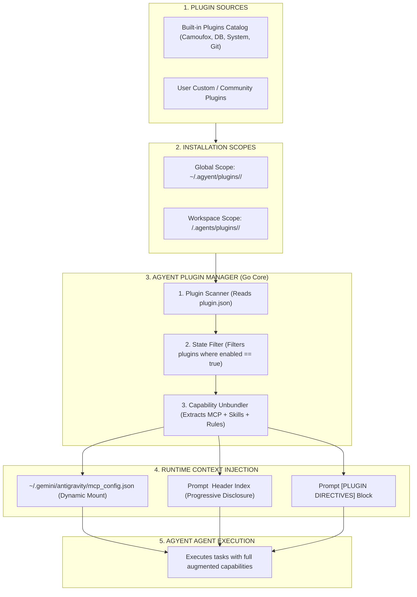

# Plugin System Architecture

This document provides a comprehensive technical specification of the **Plugin Subsystem** for the `agyent` ecosystem. This subsystem enables users to extend assistant capabilities via a **Plug-and-Play** model, packaging infrastructure toolsets (**MCP Servers**), operational workflows (**Skills**), and safety directives (**Rules**) into self-contained bundles.

---

## 1. Design Philosophy & Plugin Structure

A **Plugin** in `agyent` is a **Self-Contained Capability Bundle**. Rather than requiring fragmented manual configuration, a plugin encapsulates tools, workflows, and rules within a cohesive directory structure:

```text
plugins/<plugin-name>/
├── plugin.json               # [Required] Manifest defining identity, metadata, and enabled status
├── mcp_config.json           # [Optional] MCP Server configuration (Stdio or HTTP/SSE)
├── rules/                    # [Optional] Operational and safety rules active with this plugin
│   └── AGENTS.md
├── skills/                   # [Optional] Specialized domain skills and runbooks
│   └── <skill-name>/
│       └── SKILL.md
└── server/ (or scripts/)     # [Optional] Executable MCP server code / helper scripts
```

---

## 2. Plugin Lifecycle & Architecture Diagram



---

## 3. Built-in Plugins Catalog

The `agyent` system provides an out-of-the-box **Built-in Plugins Catalog** ready for immediate installation:

| Plugin Name | Description & Capabilities | Packaged Components |
| :--- | :--- | :--- |
| **`browser-camoufox`** | Anti-detect web browsing and scraping powered by Camoufox Firefox & Playwright. | - MCP: Stdio Camoufox server.<br>- Skills: `web-browse-camoufox`, `web-scrape-data`.<br>- Rules: Stealth browsing & token optimization rules. |
| **`system-diagnostics`** | Host resource telemetry (CPU, RAM, Disk, Process, Network) and OS-level diagnostics. | - MCP: System telemetry Stdio server.<br>- Skills: `system-health-check`, `kill-zombie-process`.<br>- Rules: System safety rules (no root file deletion). |
| **`database-sqlite`** | Schema inspection, SQL query execution, and SQLite integrity validation. | - MCP: SQLite inspector server.<br>- Skills: `inspect-schema`, `run-sql-query`.<br>- Rules: Default READONLY; confirmation required for writes. |
| **`github-ops`** | Pull request management, issue triage, commit exploration, and git workflow automation. | - MCP: GitHub MCP tools.<br>- Skills: `review-pr`, `summarize-issue`.<br>- Rules: Adherence to Conventional Commits. |

---

## 4. Go Core Domain Entities & Port Interfaces

### 4.1. Domain Entities (`internal/core/domain/plugin.go`)

```go
package domain

import "time"

type PluginManifest struct {
    Name        string   `json:"name"`
    Version     string   `json:"version"`
    Description string   `json:"description"`
    Author      string   `json:"author,omitempty"`
    Enabled     bool     `json:"enabled"`
    Tags        []string `json:"tags,omitempty"`
}

type Plugin struct {
    Manifest    PluginManifest    `json:"manifest"`
    Path        string            `json:"path"`
    Scope       ContextScope      `json:"scope"`
    MCPServers  []MCPServerConfig `json:"mcp_servers,omitempty"`
    Skills      []SkillHeader     `json:"skills,omitempty"`
    Rules       string            `json:"rules,omitempty"`
    InstalledAt time.Time         `json:"installed_at"`
}
```

### 4.2. Port Interface (`internal/core/ports/plugin.go`)

```go
package ports

import (
    "context"
    "github.com/khanhbkqt/agyent/internal/core/domain"
)

type PluginManagerPort interface {
    // ListPlugins scans and returns all installed plugins across Global and Workspace scopes
    ListPlugins(ctx context.Context, globalHome, workspaceDir string) ([]domain.Plugin, error)
    
    // TogglePlugin enables or disables a plugin by name
    TogglePlugin(ctx context.Context, pluginName string, enabled bool, scope domain.ContextScope, workspaceDir string) error
    
    // InstallBuiltinPlugin installs a plugin from the built-in library
    InstallBuiltinPlugin(ctx context.Context, pluginName string, targetScope domain.ContextScope, workspaceDir string) error
    
    // AssemblePluginCapabilities combines MCP, Skills, and Rules from all active plugins
    AssemblePluginCapabilities(ctx context.Context, globalHome, workspaceDir string) (*domain.ResolvedContext, error)
}
```

---

## 5. User Slash Commands Reference

Users can manage plugins directly via Telegram or CLI:
- `/plugins`: List installed plugins with their `[ENABLED]` / `[DISABLED]` status.
- `/plugins catalog`: Browse available built-in plugins in the library.
- `/plugin install <name>`: Download and install a plugin from the built-in repository.
- `/plugin enable <name>`: Enable a plugin (injects tools into subsequent turns).
- `/plugin disable <name>`: Disable a plugin (unmounts tools from active context).
