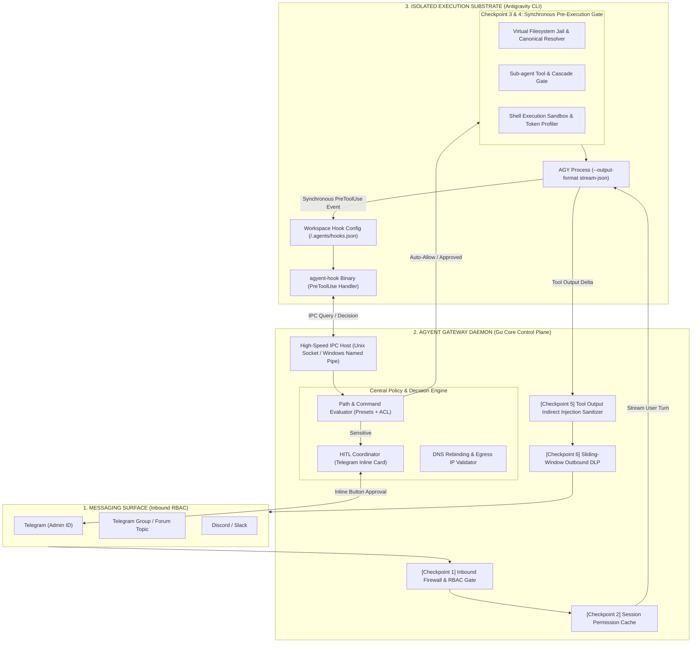
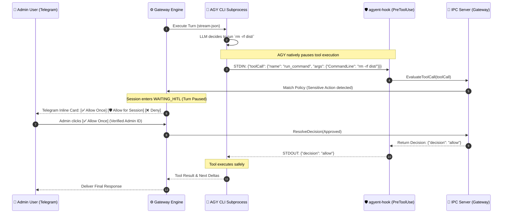

# Universal AI Security Gateway & Guardrails Architecture

This document provides the comprehensive technical specification for the **Universal AI Security Gateway & Guardrails Subsystem** in **agyent**. It details the multi-layer defense-in-depth model, Antigravity Native Hook Bridge (`PreToolUse`), non-blocking Human-In-The-Loop (HITL) state machine, filesystem jailing, sub-agent governance, sliding-window DLP, indirect prompt injection filtering, frictionless UX, and configuration schema.

---

## 1. Executive Summary & Threat Modeling

### 1.1. The Vulnerability of Unrestricted Autonomous Agents
By default, autonomous agent harnesses run subprocesses with `--dangerously-skip-permissions`, granting the Large Language Model (LLM) unrestricted access to the host operating system. This presents critical threat vectors:

1. **Remote Code Execution (RCE) & Destructive Operations:** Hallucinated or injected prompts executing `rm -rf /`, `mkfs`, `powershell -enc`, `dd`, or `diskpart`.
2. **Path Traversal & Sensitive Data Exfiltration:** Unauthorized reads or overrides of SSH keys (`~/.ssh/id_rsa`), cloud credentials (`~/.aws/credentials`), host secrets (`/etc/shadow`), or the gateway database (`~/.agyent/agyent.db`).
3. **Indirect Prompt Injection:** Malicious payloads hidden inside fetched websites, scraped pull requests, or untrusted source repositories hijacking agent intent via tool outputs (`read_url_content`, `search_web`, `git clone`).
4. **Sub-Agent Privilege Escalation & Fork Bombs:** Background sub-agents spawning unconstrained nested tasks via `define_subagent` or inheriting parent write capabilities via `invoke_subagent(TypeName: "self")`.
5. **Network Egress & SSRF Exploits:** Tools querying local loopbacks or cloud metadata services (`http://169.254.169.254/latest/meta-data`) via HTTP tools or raw shell (`curl`, `python`, `powershell`).
6. **HITL Callback Spoofing:** Non-admin group chat members approving sensitive actions by clicking Telegram inline buttons.
7. **DLP Streaming Token Leaks:** High-entropy secret tokens split across throttled 1.5s streaming deltas escaping naive regex filters.

---

## 2. Universal Gateway Security Architecture

Rather than relying on naive stdout stream listening (which cannot stop tool execution before it happens), **agyent** implements a **Dual-Plane Security Architecture**:
1. **Control Plane (Go Gateway Daemon):** Manages RBAC, Session Permission Cache, HITL Telegram coordination, Sliding DLP, and Outbound delivery.
2. **Execution Gate Plane (Antigravity Native Hook Bridge):** Intercepts tool calls *synchronously before execution* via Antigravity's native `PreToolUse` Lifecycle Hook, communicating with the Gateway Daemon via high-speed IPC (Unix Domain Sockets / Windows Named Pipes).



---

## 3. The 6 Security Checkpoints

### Checkpoint 1: Inbound Firewall & Strict RBAC
- **Admin Verification (`admin_user_ids`):** Only verified Admin IDs can trigger sensitive actions, approve HITL cards, or run configuration slash commands (`/security`, `/whitelist`, `/config`).
- **Group & Forum Topic Isolation:** Non-admin group users are restricted to contextual assistance. All shell execution and dangerous file mutations triggered in group contexts are rejected or routed exclusively to the Admin's private DM for HITL approval.
- **Inbound Prompt Injection Filter:** Validates incoming text against prompt injection patterns (`ignore previous instructions`, `you are now in DAN mode`, `</SYSTEM_RUNTIME_FOUNDATION>`).

### Checkpoint 2: Virtual Filesystem Jail & Canonical Path Resolution
- **Canonical Normalization:** Normalizes all targets using `filepath.EvalSymlinks` and `filepath.Clean`.
- **Windows-Specific Hardening:**
  - Evaluates NTFS Directory Junctions (`mklink /J`) and Hardlinks (`mklink /H`).
  - Resolves 8.3 Short Names (`C:\PROGRA~1` $\to$ `C:\Program Files`) via Win32 `GetLongPathNameW`.
  - Case-Insensitive Path Normalization (enforces lowercase comparison on Windows).
  - Blocks Alternate Data Streams (ADS) (`file.txt:hidden.exe`) and Device/UNC paths (`\\?\`, `\\.\`, `\\127.0.0.1\c$`).
- **Absolute Forbidden Blacklist:** Strictly forbids access to `~/.ssh`, `~/.aws`, `~/.gnupg`, `~/.kube`, `~/.agyent/config.yaml`, `~/.agyent/agyent.db*`, `<workspaceDir>/.agents/hooks.json` (prevents self-tampering), `C:\Windows`, and `/etc`.

### Checkpoint 3: Synchronous Pre-Execution Tool Interceptor (Native Hook)
- **Lifecycle Hook Integration:** Connects directly into Antigravity's `PreToolUse` hook via `agyent-hook` binary.
- **Evaluates Tool Calls Synchronously:**
  - **`run_command`:** Evaluates CommandLine against the Shell Execution Profile.
  - **`write_to_file` / `replace_file_content` / `view_file`:** Evaluates TargetFile against Filesystem Jail.
  - **`read_url_content` / `search_web`:** Evaluates URL against SSRF and DNS Rebinding rules.
  - **`invoke_subagent` / `define_subagent`:** Evaluates Sub-agent roles and depth limits.
- **Three Policy Decisions:**
  - **`allow`:** Tool executes immediately.
  - **`deny`:** Execution is halted; AGY receives `{ "decision": "deny", "reason": "..." }` and returns the denial to the model context.
  - **`ask` (HITL):** Tool execution pauses; Gateway triggers Telegram interactive approval card.

### Checkpoint 4: Sub-Agent Governance & Anti-Fork Bomb Quotas
- **Sub-Agent Creation Interception (`define_subagent` & `invoke_subagent`):**
  - **Role Downgrading:** Subagents can never inherit permissions greater than their parent session.
  - **Tool Capability Filtering:**
    - `researcher`: Read-only tools (`view_file`, `grep_search`, `find_by_name`, `search_web`). Forbids `run_command`, `write_to_file`, `replace_file_content`, and nested subagent dispatch.
    - `coder`: Scoped file writes in workspace; whitelisted build/test commands only.
    - `reviewer`: Read-only code inspection and `git diff`.
- **Anti-Fork Bomb Quotas:** Maximum cascade depth of 1 (subagents cannot spawn nested subagents); maximum 3 concurrent workers tracked via `conversationId` session tree.

### Checkpoint 5: Network Egress, SSRF & PostToolUse Ingestion Sanitizer
- **Multi-Level Egress Validation:**
  - **Cloud Metadata Endpoints:** Blocks `169.254.169.254` (AWS, GCP, Azure token protection).
  - **Private Loopback & RFC 1918 Subnets:** Blocks `127.0.0.0/8`, `10.0.0.0/8`, `172.16.0.0/12`, `192.168.0.0/16`, `::1`.
  - **IP Encoding Normalization:** Detects and expands Decimal (`http://2130706433`), Hex (`http://0x7f000001`), Octal (`http://0177.0.0.1`), and IPv6-mapped IPv4 representations.
  - **DNS Rebinding Prevention:** Performs active DNS lookup at evaluation time (`net.LookupIP`) and blocks connections if the resolved IP points to private or metadata subnets.
- **PostToolUse Secret Redaction & Indirect Injection Sanitizer:**
  - Connects to Antigravity's `PostToolUse` Lifecycle Hook and Gateway Stream Middleware.
  - Inspects all raw tool outputs (from `view_file`, `run_command`, `read_url_content`, MCP tools) immediately after execution.
  - **Instant Secret Redaction:** Automatically masks any accidentally exposed API keys (`sk-...`, `ghp_...`, `AKIA...`, private keys, passwords) to `[REDACTED_SECRET]` before outputs contaminate the transcript, long-term memory (`MEMORY.md`), or downstream turns.
  - **Prompt Injection Defense:** Neutralizes system override payloads hidden in web scraping or third-party git repos.

### Checkpoint 6: Sliding-Window Outbound DLP & Tool-Argument Auditing
- **Sliding-Window Lookback Buffer:**
  - Because streaming deltas are dispatched in 1.5s bursts, the Delivery Throttler maintains a **64-character trailing lookback buffer** across flush boundaries.
  - Ensures high-entropy secrets (`sk-ant-...`, `ghp_...`, `AKIA...`, `Bearer ...`) that straddle consecutive chunk boundaries are matched and redacted to `[REDACTED]`.
- **Out-of-Band Tool Exfiltration Inspection:**
  - Audits outgoing arguments of web-facing tools (`search_web(query)`, `read_url_content(url)`) to prevent data exfiltration via query parameters.

---

## 4. Key Engineering Invariants & Bottleneck Mitigations

| Architectural Challenge | Risk / Bottleneck | Gateway Engineering Solution |
| :--- | :--- | :--- |
| **Tool Interception Latency** | Hook execution overhead slows down agent responsiveness. | **Sub-5ms IPC Protocol:** `agyent-hook` connects to Gateway Daemon via local IPC (Unix Domain Socket / Windows Named Pipe) with zero cold-start process overhead. |
| **Session State Deadlocks** | Holding session FIFO mutex while waiting for Telegram HITL blocks administrative queries. | **Non-Blocking Turn Suspend:** Session enters `WAITING_HITL` state; user can issue `/status` or `/cancel`; new conversational turns are safely queued until current turn is resolved or aborted. |
| **Prefix KV-Cache Preservation** | Dynamic security context injected at Levels 0–3 busts Gemini KV-cache hit rate (85–95%). | **Level 4 Injection Invariant:** Dynamic security notices (e.g., granted permissions) are appended strictly at Level 4. |
| **Blast Radius & Host Isolation** | Global hook pollution breaking host IDE or external developer CLI sessions. | **Workspace-Scoped Hook Mounting:** Hook configuration is isolated strictly to `<workspaceDir>/.agents/hooks.json` and protected from write access via PathJail, leaving `~/.gemini/config/` pristine. |
| **Subprocess Zombie Leaks** | Subagent processes surviving unexpected Gateway crashes or timeouts. | **Kernel Job Object Watchdog:** Enforce OS Job Objects on Windows (`JOB_OBJECT_LIMIT_KILL_ON_JOB_CLOSE`) and POSIX process groups (`syscall.SIGKILL` to negative PID). |

---

## 5. Non-Blocking Native Hook HITL State Machine



---

## 6. UX & Operations Design

### 6.1. Interactive Telegram HITL Card with RBAC Verification
When a sensitive tool execution is intercepted, the Gateway sends a formatted card:

```
┌────────────────────────────────────────────────────────┐
│ 🛡️ [Agyent Security Gate] Action Approval Required    │
├────────────────────────────────────────────────────────┤
│ 💻 Tool     : `run_command`                            │
│ 📜 Command  : `rm -rf ./dist && npm run build`         │
│ 📂 Directory: `C:\projects\ecommerce-api`              │
│ 🤖 Agent    : `coder` • Task `task-8f12`               │
│ ⚠️ Risk Eval : Medium (Directory removal & build)      │
├────────────────────────────────────────────────────────┤
│ [ ✅ Allow Once ]        [ 🛡️ Allow for Session ]      │
│ [ ❌ Deny Action ]       [ 🛑 Force Kill Agent ]       │
└────────────────────────────────────────────────────────┘
```

- **Strict User Verification:** When an inline button is clicked, the Gateway verifies `callback.From.ID == admin_user_ids`. Unauthorized clicks receive an immediate alert: `"⛔ You are not authorized to approve this action."`
- **[ ✅ Allow Once ]**: Hook returns `{ "decision": "allow" }`; tool executes once.
- **[ 🛡️ Allow for Session ]**: Pattern added to **Session Permission Cache**; subsequent identical calls run without prompts.
- **[ ❌ Deny Action ]**: Hook returns `{ "decision": "deny", "reason": "Action denied by administrator" }`. AGY feeds denial back to LLM context to adapt.
- **[ 🛑 Force Kill Agent ]**: Gateway immediately terminates the subprocess tree and unlocks the session.
- **Auto-Deny Timeout (60s):** If no button is clicked within 60s, the action is automatically rejected.

---

```
+----------------------------------------------------------------------------------------------------+
|                                      SECURITY PRESETS MATRIX                                       |
+-------------------+---------------------------------------------------------+----------------------+
| Preset            | Operational Behavior                                    | Target Environment   |
+-------------------+---------------------------------------------------------+----------------------+
| 🔓 unrestricted   | Full Autonomy. Unrestricted shell execution, broad path  | Trusted Local VPS,   |
|                   | access, zero HITL prompts, audit-only DLP.              | Autonomous Agents    |
+-------------------+---------------------------------------------------------+----------------------+
| 🛠️ developer       | Relaxed. Auto-allows standard dev tools; blocks OS     | Local Workstation    |
|                   | destruction; broad path access.                         |                      |
+-------------------+---------------------------------------------------------+----------------------+
| 🛡️ balanced       | [DEFAULT] Auto-allows safe build/test/git; prompts via  | VPS, Small Team      |
|                   | Telegram for unfamiliar commands; strict workspace jail.| Shared Server        |
+-------------------+---------------------------------------------------------+----------------------+
| 🔒 strict         | Hardened. Whitelist-only execution; all other actions   | Production Servers,  |
|                   | denied; zero network egress to private IPs.             | Multi-tenant Hosts   |
+-------------------+---------------------------------------------------------+----------------------+
| 📖 read_only      | Immutable. 100% blocks all file writes and shell       | Code Auditing,       |
|                   | commands. Read-only codebase exploration only.          | Research Sub-agents  |
+-------------------+---------------------------------------------------------+----------------------+
```

### Monotonic Security Profile Upgrade Rule (Per-Agent Guardrail)
Each agent is provisioned with a baseline `security_preset` stored in SQLite (`agents.security_preset`), defaulting to `balanced`. To prevent privilege escalation:
- **Monotonic Progression:** An agent can only be transitioned to equal or higher security levels ($\text{Level}(Target) \ge \text{Level}(Baseline)$):
  $$\text{unrestricted (0)} \rightarrow \text{developer (1)} \rightarrow \text{balanced (2)} \rightarrow \text{strict (3)} \rightarrow \text{read\_only (4)}$$
- **Downgrade Rejection:** Any attempt to switch an agent to a less secure level than its baseline via `/security preset <mode>` is rejected with a descriptive error.
- **Dynamic Keyboard Filtering:** The interactive `/security` dashboard dynamically filters its Inline Keyboard to only render buttons for valid presets ($\ge \text{baseline}$), preventing accidental misconfiguration.

---

## 6.3. Security Slash Commands Reference

| Slash Command | Description | Permission | Example Usage |
| :--- | :--- | :--- | :--- |
| `/security` (or `/sec`) | View current security dashboard, active agent, preset, jail, and metrics with dynamic preset buttons. | Admin Only | `/security` |
| `/security preset <mode>` | Switch active agent's security preset (enforces monotonic upgrade $\ge$ baseline). | Admin Only | `/security preset strict` |
| `/security grant <scope> [ttl]` | Temporarily grant Agent permission to edit configs or run setup tools (e.g. 15m). | Admin Only | `/security grant config 15m` |
| `/security redact <mode>` | Switch redaction mode (`strict`, `permissive`, `audit_only`). | Admin Only | `/security redact permissive` |
| `/whitelist add <cmd\|path>` | Add a temporary or persistent whitelist entry directly from chat. | Admin Only | `/whitelist add "npm run build"` |
| `/audit [limit]` | Inspect the most recent intercepted and blocked security events. | Admin Only | `/audit 10` |

---

## 7. Configuration Schema Reference (`config.yaml`)

```yaml
# ~/.agyent/config.yaml
security:
  enabled: true
  preset: "balanced"                 # "developer" | "balanced" | "strict" | "read_only"
  mode: "interactive"                # "interactive" (Prompt Telegram) | "strict" (Auto-block unknown)
  approval_timeout_seconds: 60
  admin_user_ids: [123456789]

  # 1. Agent-Assisted Configuration Management (Delegated Infra/Setup)
  agent_config_management:
    enabled: true                    # Allow agent to propose config edits with mandatory HITL approval
    require_approval: true           # Always show Telegram diff card before applying config modifications
    manageable_files:
      - ".env"
      - ".env.*"
      - "~/.agyent/config.yaml"      # Allows agent to assist with gateway configuration
      - "docker-compose.yml"
      - "Makefile"

  # 2. Shell Command Execution Guardrails
  commands:
    enabled: true
    custom_blacklist:
      - '(?i)git push .*--force.*(main|master)'
      - '(?i)drop\s+database'
    custom_whitelist:
      - "npm run test:e2e"
      - "go test ./..."

  # 3. Filesystem Boundaries & Anti-Traversal
  filesystem:
    enforce_workspace_jail: true
    allowed_paths:
      - "~/Desktop/projects"
    forbidden_paths:
      - "~/.ssh"
      - "~/.aws"
      - "~/.gnupg"
      - "~/.kube"
      - "~/.gemini/config/hooks.json" # Immutable: prevents agent tampering with hooks

  # 4. Sub-Agent Governance
  subagents:
    max_concurrent_workers: 3
    max_cascade_depth: 1             # Disallow subagents from spawning subagents
    roles:
      researcher:
        allowed_tools: ["view_file", "grep_search", "find_by_name", "search_web"]
        disallowed_tools: ["run_command", "write_to_file", "replace_file_content", "invoke_subagent", "define_subagent"]
      coder:
        allowed_tools: ["*"]
        disallowed_tools: ["define_subagent"]
      reviewer:
        allowed_tools: ["view_file", "grep_search", "find_by_name"]
        disallowed_tools: ["write_to_file", "replace_file_content", "invoke_subagent", "define_subagent"]

  # 5. Network & SSRF Guardrails
  network:
    block_cloud_metadata: true       # Block 169.254.169.254
    block_private_networks: true     # Block 127.0.0.1, 10.0.0.0/8, 192.168.0.0/16
    prevent_dns_rebinding: true

  # 6. Outbound DLP & PostToolUse Redaction
  dlp:
    enabled: true
    redaction_mode: "strict"         # "strict" (Mask all secrets) | "permissive" (Allow local .env vars) | "audit_only"
    sliding_window_bytes: 64
    sanitize_tool_outputs: true
    whitelisted_env_keys:
      - "PORT"
      - "HOST"
      - "NODE_ENV"
      - "APP_NAME"
      - "DATABASE_URL"
      - "API_BASE_URL"
```

---

## 8. Go Hexagonal Domain Entities & Port Interfaces

```go
package ports

import (
    "context"
    "agyent/internal/core/domain"
)

// SecurityManagerPort coordinates multi-layer tool interception, path jailing, and policy decisions.
type SecurityManagerPort interface {
    // EvaluateToolCall evaluates any tool call synchronously intercepted by PreToolUse hook.
    EvaluateToolCall(ctx context.Context, req domain.ToolEvaluationRequest) (domain.SecurityDecision, error)
    
    // EvaluateCommand checks a shell command against active blacklist/whitelist/HITL rules.
    EvaluateCommand(ctx context.Context, sessionKey string, role string, cmd string) (domain.SecurityDecision, error)
    
    // EvaluatePath verifies if target file access is permitted within the active workspace jail.
    EvaluatePath(ctx context.Context, sessionKey string, targetPath string, isWrite bool) (domain.SecurityDecision, error)
    
    // EvaluateURL verifies that destination URL does not target private IPs or cloud metadata (with DNS Rebinding protection).
    EvaluateURL(ctx context.Context, urlStr string) (domain.SecurityDecision, error)
    
    // SanitizeToolOutput inspects external tool outputs (web, mcp) for indirect prompt injections.
    SanitizeToolOutput(ctx context.Context, output string) (string, error)

    // GrantSessionPermission adds a temporary permission grant to the session cache.
    GrantSessionPermission(sessionKey string, pattern string)
    
    // GetDashboardSummary returns statistics for /security slash command.
    GetDashboardSummary(sessionKey string) domain.SecurityDashboard
}

// HookIPCPort defines the IPC server interface communicating with agyent-hook binary.
type HookIPCPort interface {
    Start(ctx context.Context) error
    Stop() error
    HandleHookRequest(req domain.HookRequest) (domain.HookResponse, error)
}

// HITLApprovalPort coordinates interactive approval requests over communication channels.
type HITLApprovalPort interface {
    // RequestApproval sends an interactive card and suspends execution until user action or timeout.
    RequestApproval(ctx context.Context, req domain.ApprovalRequest) (bool, error)
    
    // HandleCallback processes inline keyboard clicks from Telegram/Discord with strict RBAC verification.
    HandleCallback(ctx context.Context, callbackID string, userID int64, action string) error
}

// TurnOrchestratorPort manages non-blocking turn state machines to prevent session deadlocks.
type TurnOrchestratorPort interface {
    Dispatch(ctx context.Context, msg domain.CanonicalMessage) error
    ResumeWithHITL(ctx context.Context, sessionKey string, approved bool) error
    CancelTurn(ctx context.Context, sessionKey string) error
}
```
