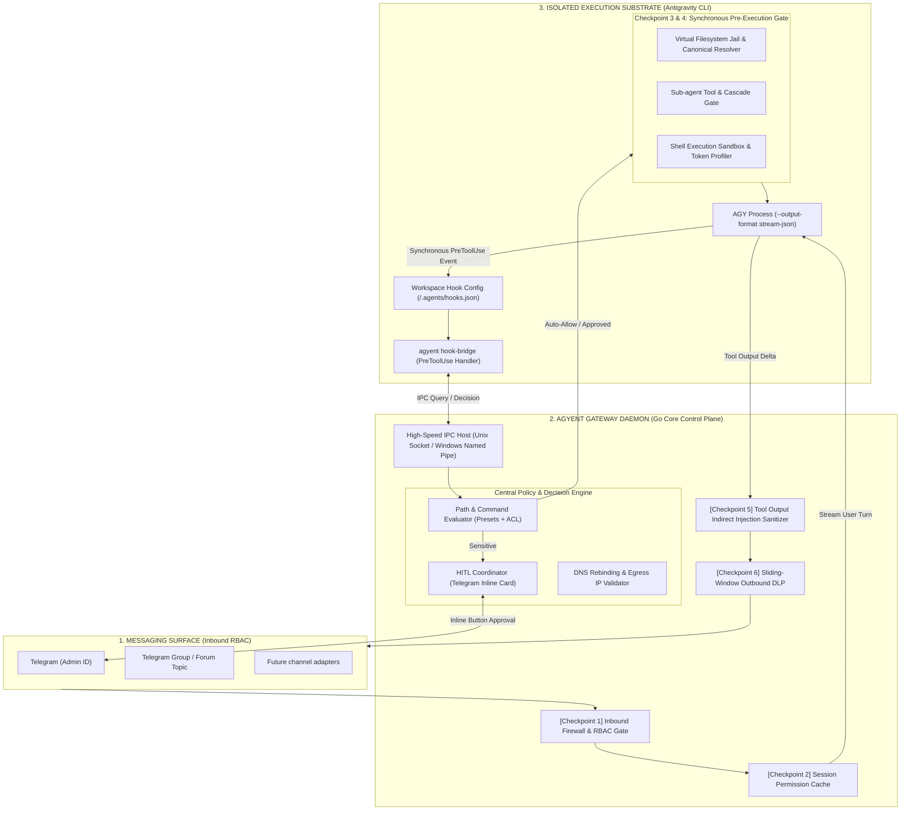
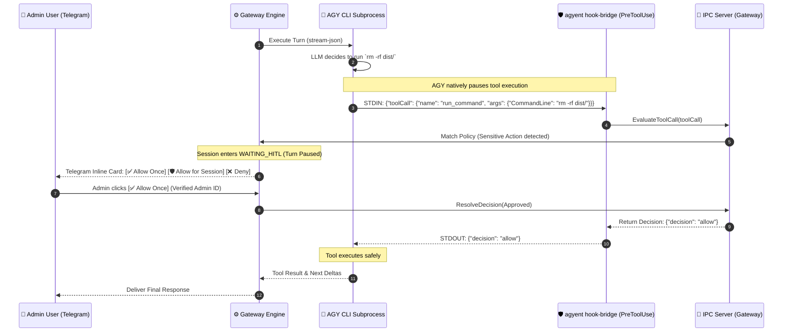

# Universal AI Security Gateway & Guardrails Architecture

> **Document status:** Reference
> **Code authority:** `internal/core/auth`, `internal/core/execution`, `internal/adapters/security`, hook bridge CLI
> **Last verified:** 2026-09-06

This document provides the comprehensive technical specification for the **Universal AI Security Gateway & Guardrails Subsystem** in **agyent**. It details the multi-layer defense-in-depth model, Antigravity Native Hook Bridge (`PreToolUse`), non-blocking Human-In-The-Loop (HITL) state machine, filesystem jailing, sub-agent governance, sliding-window DLP, indirect prompt injection filtering, frictionless UX, and configuration schema.

---

## 1. Executive Summary & Threat Modeling

### 1.1. The Vulnerability of Unrestricted Autonomous Agents
An unattended AGY process needs native permission grants before a tool call can
reach agyent's policy hook. A global grant or the dangerous skip flag would make
that authority ambient across unrelated sessions. Managed runs therefore use a
dedicated AGY project grant, `--sandbox`, one admitted workspace, and the
authenticated PreToolUse hook. This design addresses the following threats:

1. **Remote Code Execution (RCE) & Destructive Operations:** Hallucinated or injected prompts executing `rm -rf /`, `mkfs`, `powershell -enc`, `dd`, or `diskpart`.
2. **Path Traversal & Sensitive Data Exfiltration:** Unauthorized reads or overrides of SSH keys (`~/.ssh/id_rsa`), cloud credentials (`~/.aws/credentials`), host secrets (`/etc/shadow`), or the gateway database (`~/.agyent/agyent.db`).
3. **Indirect Prompt Injection:** Malicious payloads hidden inside fetched websites, scraped pull requests, or untrusted source repositories hijacking agent intent via tool outputs (`read_url_content`, `search_web`, `git clone`).
4. **Sub-Agent Privilege Escalation & Fork Bombs:** Background sub-agents spawning unconstrained nested tasks via `define_subagent` or inheriting parent write capabilities via `invoke_subagent(TypeName: "self")`.
5. **Network Egress & SSRF Exploits:** Tools querying local loopbacks or cloud metadata services (`http://169.254.169.254/latest/meta-data`) via HTTP tools or raw shell (`curl`, `python`, `powershell`).
6. **HITL Callback Spoofing:** Non-admin group chat members approving sensitive actions by clicking Telegram inline buttons.
7. **DLP Streaming Token Leaks:** High-entropy secret tokens split across throttled 1.5s streaming deltas escaping naive regex filters.

---

## 2. Universal Gateway Security Architecture

Rather than relying on naive stdout stream listening (which cannot stop tool execution before it happens), **agyent** implements a **Dual-Plane Security Architecture**:
1. **Control Plane (Go Gateway Daemon):** Manages RBAC, Session Permission Cache, HITL Telegram coordination, Sliding DLP, and Outbound delivery.
2. **Execution Gate Plane (Antigravity Native Hook Bridge):** Intercepts tool calls *synchronously before execution* via Antigravity's native `PreToolUse` Lifecycle Hook, communicating with the Gateway Daemon via high-speed IPC (Unix Domain Sockets / Windows Named Pipes).



---

## 3. The 6 Security Checkpoints

### Checkpoint 1: Inbound Firewall & Strict RBAC
- **Admin Verification (`admin_user_ids`):** Only verified Admin IDs can trigger sensitive actions, approve HITL cards, or run configuration slash commands (`/security`, `/whitelist`, `/config`).
- **Group & Forum Topic Isolation:** Non-admin group users are restricted to contextual assistance. All shell execution and dangerous file mutations triggered in group contexts are rejected or routed exclusively to the Admin's private DM for HITL approval.
- **Inbound Prompt Injection Filter:** Validates incoming text against prompt injection patterns (`ignore previous instructions`, `you are now in DAN mode`, `</SYSTEM_RUNTIME_FOUNDATION>`).

### Checkpoint 2: Virtual Filesystem Jail & Canonical Path Resolution
- **Canonical Normalization:** Normalizes all targets using `filepath.EvalSymlinks` and `filepath.Clean`.
- **Windows-Specific Hardening:**
  - Evaluates NTFS Directory Junctions (`mklink /J`) and Hardlinks (`mklink /H`).
  - Resolves 8.3 Short Names (`C:\PROGRA~1` $\to$ `C:\Program Files`) via Win32 `GetLongPathNameW`.
  - Case-Insensitive Path Normalization (enforces lowercase comparison on Windows).
  - Sanitizes and neutralizes Windows Reserved Device Names (`CON`, `PRN`, `AUX`, `NUL`, `COM1-9`, `LPT1-9`).
  - Blocks Alternate Data Streams (ADS) (`file.txt:hidden.exe`) and Device/UNC paths (`\\?\`, `\\.\`, `\\127.0.0.1\c$`).
- **Inbound Media Jail Alignment:** Inbound attachments are safely relocated to `<workspaceDir>/uploads/` with auto-provisioned `.gitignore` (`*`), ensuring legitimate user uploads reside directly inside the active workspace boundary (`DecisionAllow`) without granting access outside the jail.
- **Three-Tier Security Boundary & Control Plane Protection:**
  - **Tier 0 (Host Infrastructure):** Strictly forbids access to `~/.ssh`, `~/.aws`, `~/.gnupg`, `~/.kube`, `C:\Windows`, and `/etc`.
  - **Tier 1 (Gateway Daemon Control Plane):** Strictly protects `~/.agyent/config.yaml`, `~/.agyent/agyent.db*`, and `<workspaceDir>/.agents/hooks.json` from unauthorized mutation, regardless of preset.
  - **Tier 2 (Agent Cognitive & Workspace Data Plane):** Agent workspaces located under `~/.agyent/workspace/` or `~/.agyent/workspace-<agent>/` and persona files (`MEMORY.md`, `USER.md`, `SOUL.md`, `IDENTITY.md`, `HEARTBEAT.md`, `memory/*.md`) are recognized as mutable Data Plane resources and are fully writable by the agent within its admitted workspace.


### Checkpoint 3: Synchronous Pre-Execution Tool Interceptor (Native Hook)
- **Lifecycle Hook Integration:** Connects Antigravity `PreToolUse` and `PostToolUse` hooks through the `agyent hook-bridge` CLI command.
- **Evaluates Tool Calls Synchronously:**
  - **`run_command`:** Evaluates CommandLine against the Shell Execution Profile.
  - **`write_to_file` / `replace_file_content` / `view_file`:** Evaluates TargetFile against Filesystem Jail.
  - **`read_url_content` / `search_web`:** Evaluates URL against SSRF and DNS Rebinding rules.
  - **`invoke_subagent` / `define_subagent`:** Evaluates Sub-agent roles and depth limits.
- **Three internal policy decisions:**
  - **`allow`:** Tool executes immediately.
  - **`deny`:** Execution is halted; AGY receives `{ "decision": "deny", "reason": "..." }` and returns the denial to the model context.
  - **`ask` (HITL):** The Gateway triggers the channel approval flow and waits
    for its bounded result. The hook returns only final `allow` or `deny` to
    headless AGY. Missing HITL delivery, timeout, cancellation, or unavailable
    approval port becomes `deny`; raw `ask` never crosses the hook boundary.

### Checkpoint 4: Sub-Agent Governance & Anti-Fork Bomb Quotas
- **Sub-Agent Creation Interception (`define_subagent` & `invoke_subagent`):**
  - **Role Downgrading:** Subagents can never inherit permissions greater than their parent session.
  - **Tool Capability Filtering:**
    - `researcher`: Read-only tools (`view_file`, `grep_search`, `find_by_name`, `search_web`). Forbids `run_command`, `write_to_file`, `replace_file_content`, and nested subagent dispatch.
    - `coder`: Scoped file writes in workspace; whitelisted build/test commands only.
    - `reviewer`: Read-only code inspection and `git diff`.
- **Anti-Fork Bomb Quotas:** Maximum cascade depth of 1 (subagents cannot spawn nested subagents); maximum 3 concurrent workers tracked via `conversationId` session tree.

### Checkpoint 5: Network Egress, SSRF & PostToolUse Ingestion Sanitizer
- **Multi-Level Egress Validation:**
  - **Cloud Metadata Endpoints:** Blocks `169.254.169.254` (AWS, GCP, Azure token protection).
  - **Private Loopback & RFC 1918 Subnets:** Blocks `127.0.0.0/8`, `10.0.0.0/8`, `172.16.0.0/12`, `192.168.0.0/16`, `::1`.
  - **IP Encoding Normalization:** Detects and expands Decimal (`http://2130706433`), Hex (`http://0x7f000001`), Octal (`http://0177.0.0.1`), and IPv6-mapped IPv4 representations.
  - **DNS Rebinding Prevention:** Performs active DNS lookup at evaluation time (`net.LookupIP`) and blocks connections if the resolved IP points to private or metadata subnets.
- **PostToolUse Secret Redaction & Indirect Injection Sanitizer:**
  - Connects to Antigravity's `PostToolUse` Lifecycle Hook and Gateway Stream Middleware.
  - Inspects all raw tool outputs (from `view_file`, `run_command`, `read_url_content`, MCP tools) immediately after execution.
  - **Instant Secret Redaction:** Automatically masks any accidentally exposed API keys (`sk-...`, `ghp_...`, `AKIA...`, private keys, passwords) to `[REDACTED_SECRET]` before outputs contaminate the transcript, long-term memory (`MEMORY.md`), or downstream turns.
  - **Prompt Injection Defense:** Neutralizes system override payloads hidden in web scraping or third-party git repos.

### Checkpoint 6: Sliding-Window Outbound DLP & Tool-Argument Auditing
- **Sliding-Window Lookback Buffer:**
  - Because streaming deltas are dispatched in 1.5s bursts, the Delivery Throttler maintains a **64-character trailing lookback buffer** across flush boundaries.
  - Ensures high-entropy secrets (`sk-ant-...`, `ghp_...`, `AKIA...`, `Bearer ...`) that straddle consecutive chunk boundaries are matched and redacted to `[REDACTED]`.
- **Out-of-Band Tool Exfiltration Inspection:**
  - Audits outgoing arguments of web-facing tools (`search_web(query)`, `read_url_content(url)`) to prevent data exfiltration via query parameters.

---

## 4. Key Engineering Invariants & Bottleneck Mitigations

| Architectural Challenge | Risk / Bottleneck | Gateway Engineering Solution |
| :--- | :--- | :--- |
| **Tool Interception Latency** | Hook execution overhead slows down agent responsiveness. | **Local IPC path:** `agyent hook-bridge` connects to the gateway over a Unix domain socket or Windows transport; measure latency in the target environment rather than treating a fixed number as guaranteed. |
| **Session State Deadlocks** | Holding session FIFO mutex while waiting for Telegram HITL blocks administrative queries. | **Non-Blocking Turn Suspend:** Session enters `WAITING_HITL` state; user can issue `/status` or `/cancel`; new conversational turns are safely queued until current turn is resolved or aborted. |
| **Prefix KV-Cache Preservation** | Dynamic security context injected at Levels 0–3 invalidates the otherwise stable prefix. | **Level 4 Injection Invariant:** Dynamic security notices (e.g., granted permissions) are appended strictly at Level 4. Measure cache behavior for the configured provider. |
| **Blast Radius & Host Isolation** | Global hook or permission pollution breaking unrelated AGY sessions. | **Workspace and project scope:** Hooks live under `<workspaceDir>/.agents/hooks.json`; native grants live in the dedicated project record. Global hook and permission settings are not rewritten. |
| **Subprocess Zombie Leaks** | Subagent processes surviving unexpected Gateway crashes or timeouts. | **Kernel Job Object Watchdog:** Enforce OS Job Objects on Windows (`JOB_OBJECT_LIMIT_KILL_ON_JOB_CLOSE`) and POSIX process groups (`syscall.SIGKILL` to negative PID). |

---

## 5. Non-Blocking Native Hook HITL State Machine



---

## 6. UX & Operations Design

### 6.1. Interactive Telegram HITL Card with Multi-Tier Approval
When a sensitive tool execution is intercepted, the Gateway sends a formatted interactive card with a 3-tier approval hierarchy:

```
┌────────────────────────────────────────────────────────┐
│ 🛡️ [Agyent Security Gate] Action Approval Required    │
├────────────────────────────────────────────────────────┤
│ 💻 Tool     : `run_command`                            │
│ 📜 Command  : `python3 scraper.py --target de`         │
│ 📂 Directory: `/data/agents/wife_assistant/workspace`  │
│ 🤖 Agent    : `wife_assistant`                         │
│ ⚠️ Risk Eval : Medium (Network fetch & local execution) │
├────────────────────────────────────────────────────────┤
│ [ ✅ Allow Once ]        [ 🛡️ Allow Command (python3) ]│
│ [ 🔓 Allow All (Session) ]        [ ❌ Deny ]         │
│ [ 🛑 Force Kill Agent ]                                │
└────────────────────────────────────────────────────────┘
```

- **Strict User Verification:** When an inline button is clicked, the Gateway verifies `callback.From.ID == admin_user_ids`. Unauthorized clicks receive an immediate alert: `"⛔ You are not authorized to approve this action."`
- **[ ✅ Allow Once ]**: Hook returns `{ "decision": "allow" }`; tool executes once.
- **[ 🛡️ Allow Command (<base>) ]**: Dynamically extracts the base binary via `domain.ExtractBaseCommand` (e.g. `python3`, `node`, `git`, `curl`) and grants permission for that binary family across the active session.
- **[ 🔓 Allow All (Session) ]**: Grants wildcard (`*`) permission across all tools and commands for the active session lifecycle.
- **[ ❌ Deny ]**: Hook returns `{ "decision": "deny", "reason": "Action denied by administrator" }`. AGY feeds denial back to LLM context to adapt without aborting the session.
- **[ 🛑 Force Kill Agent ]**: Gateway immediately terminates the subprocess tree and unlocks the session.
- **Auto-Deny Timeout (60s):** If no button is clicked within 60s, the action is automatically rejected.

### 6.2. Session-Lifecycle Grant Management & Hard Guardrail Invariance
Session grants are bound strictly to the lifetime of the active session rather than relying on arbitrary TTL timers:
1. **Lifecycle Invalidation Triggers:**
   - Explicit session resets or conversation changes (`/reset`, `/new`, `/clear`, `/c switch`).
   - Agent switches (`/a use <agent>`) and project switches (`/p use <project>`).
   - Ephemeral background tasks and scheduled turns conclude (`defer SecurityManager.ClearSessionGrants(sessionKey)`).
2. **Hard Guardrail Invariance:**
   - Inviolable system protections (e.g. anti-self-escalation, gateway database `agyent.db` protection, `pkill agyent`, forbidden root paths) are evaluated *prior* to checking session grants.
   - Even when wildcard `*` (`Allow All (Session)`) is active, hard guardrail violations remain strictly blocked (`DecisionDeny`).

### 6.3. Delegated Principals & Quality Assertions for Scheduled/Background Tasks
1. **Delegated Principal:**
   - Scheduled tasks run with `domain.PrincipalUser` inheriting the creator's identity (`Provider: task.Channel`, `SubjectID: task.CreatedBy`, `AccountID: task.AgentName`).
   - Session keys are channel-routable (e.g. `telegram:8220274185`), allowing HITL approval cards triggered during scheduled runs to be delivered directly to the creator's chat.
2. **Quality Assertions against False-Positive Completion:**
   - `TaskExecutor` asserts that background runs produce non-empty outputs and do not contain soft-deny refusal patterns (e.g. `"I cannot fulfill this request"`, `"Permission denied"`).
   - For image or multimedia generation tasks, the executor enforces artifact existence checks before marking the scheduled run as `COMPLETED`.

---

```
+----------------------------------------------------------------------------------------------------+
|                                      SECURITY PRESETS MATRIX                                       |
+-------------------+---------------------------------------------------------+----------------------+
| Preset            | Operational Behavior                                    | Target Environment   |
+-------------------+---------------------------------------------------------+----------------------+
| 🔓 unrestricted   | Full Autonomy. Unrestricted shell execution, broad path | Trusted Local VPS,   |
|                   | access, zero HITL prompts, audit-only DLP.              | Autonomous Agents    |
+-------------------+---------------------------------------------------------+----------------------+
| 🛠️ developer       | Relaxed. Auto-allows standard dev tools; blocks OS      | Local Workstation    |
|                   | destruction; broad path access across ~.                |                      |
+-------------------+---------------------------------------------------------+----------------------+
| 📁 workspace_only | Standard Agent. Autonomous file & command execution     | General AI Agents,   |
|                   | strictly confined inside workspace; outer paths denied. | Project Automation   |
+-------------------+---------------------------------------------------------+----------------------+
| 🛡️ balanced       | [DEFAULT] Auto-allows safe build/test/git; prompts via  | VPS, Small Team      |
|                   | Telegram for unfamiliar commands; strict workspace jail.| Shared Server        |
+-------------------+---------------------------------------------------------+----------------------+
| 🔒 strict         | Hardened. Whitelist-only execution; all other actions   | Production Servers,  |
|                   | denied; zero network egress to private IPs.             | Multi-tenant Hosts   |
+-------------------+---------------------------------------------------------+----------------------+
| 📖 read_only      | Blocks file modifications and terminal executions.      | Code Auditing,       |
|                   | Read-only codebase exploration and search only.         | Research Sub-agents  |
+-------------------+---------------------------------------------------------+----------------------+
```

### Security Profile Control & Hierarchy
Each agent is provisioned with a `security_preset` stored in SQLite (`agents.security_preset`), defaulting to `balanced`.
- **Preset Hierarchy:**
  $$\text{unrestricted (0)} \rightarrow \text{developer (1)} \rightarrow \text{workspace\_only (2)} \rightarrow \text{balanced (3)} \rightarrow \text{strict (4)} \rightarrow \text{read\_only (5)}$$
- **SuperAdmin Dynamic Control:** Authenticated SuperAdmins on Telegram have full administrative control to switch any agent's preset freely to any level (`/security preset <mode>` or via the interactive dashboard buttons).
- **Anti-Self-Escalation:** AI agents and sub-agents remain strictly barred from modifying security configurations or self-escalating privileges through tool execution or subshells.

---

### 6.4. Security Slash Commands Reference

| Slash Command | Description | Permission | Example Usage |
| :--- | :--- | :--- | :--- |
| `/security` (or `/sec`) | View current security dashboard, active agent, preset, jail, and metrics with preset buttons. | Admin Only | `/security` |
| `/security preset <mode>` | Switch active agent's security preset (`unrestricted`, `developer`, `workspace_only`, `balanced`, `strict`, `read_only`). | Admin Only | `/security preset workspace_only` |
| `/security grant <command>` | Temporarily grant permission for a specific shell command in active session. | Admin Only | `/security grant python3` |
| `/security redact <mode>` | Switch redaction mode (`strict`, `permissive`, `audit_only`). | Admin Only | `/security redact permissive` |
| `/whitelist add <cmd\|path>` | Add a temporary or persistent whitelist entry directly from chat. | Admin Only | `/whitelist add "npm run build"` |
| `/audit [limit]` | Inspect the most recent intercepted and blocked security events. | Admin Only | `/audit 10` |

---

## 7. Configuration Schema Reference (`config.yaml`)

```yaml
# ~/.agyent/config.yaml
security:
  enabled: true
  preset: "balanced"                 # "developer" | "balanced" | "strict" | "read_only"
  mode: "interactive"                # "interactive" (Prompt Telegram) | "strict" (Auto-block unknown)
  approval_timeout_seconds: 60
  admin_user_ids: [123456789]

  # 1. Agent-Assisted Configuration Management (Delegated Infra/Setup)
  agent_config_management:
    enabled: true                    # Allow agent to propose config edits with mandatory HITL approval
    require_approval: true           # Always show Telegram diff card before applying config modifications
    manageable_files:
      - ".env"
      - ".env.*"
      - "~/.agyent/config.yaml"      # Allows agent to assist with gateway configuration
      - "docker-compose.yml"
      - "Makefile"

  # 2. Shell Command Execution Guardrails
  commands:
    enabled: true
    custom_blacklist:
      - '(?i)git push .*--force.*(main|master)'
      - '(?i)drop\s+database'
    custom_whitelist:
      - "npm run test:e2e"
      - "go test ./..."

  # 3. Filesystem Boundaries & Anti-Traversal
  filesystem:
    enforce_workspace_jail: true
    allowed_paths:
      - "~/Desktop/projects"
    forbidden_paths:
      - "~/.ssh"
      - "~/.aws"
      - "~/.gnupg"
      - "~/.kube"
      - "<workspaceDir>/.agents/hooks.json" # Immutable: prevents agent tampering with hooks

  # 4. Sub-Agent Governance
  subagents:
    max_concurrent_workers: 3
    max_cascade_depth: 1             # Disallow subagents from spawning subagents
    roles:
      researcher:
        allowed_tools: ["view_file", "grep_search", "find_by_name", "search_web"]
        disallowed_tools: ["run_command", "write_to_file", "replace_file_content", "invoke_subagent", "define_subagent"]
      coder:
        allowed_tools: ["*"]
        disallowed_tools: ["define_subagent"]
      reviewer:
        allowed_tools: ["view_file", "grep_search", "find_by_name"]
        disallowed_tools: ["write_to_file", "replace_file_content", "invoke_subagent", "define_subagent"]

  # 5. Network & SSRF Guardrails
  network:
    block_cloud_metadata: true       # Block 169.254.169.254
    block_private_networks: true     # Block 127.0.0.1, 10.0.0.0/8, 192.168.0.0/16
    prevent_dns_rebinding: true

  # 6. Outbound DLP & PostToolUse Redaction
  dlp:
    enabled: true
    redaction_mode: "strict"         # "strict" (Mask all secrets) | "permissive" (Allow local .env vars) | "audit_only"
    sliding_window_bytes: 64
    sanitize_tool_outputs: true
    whitelisted_env_keys:
      - "PORT"
      - "HOST"
      - "NODE_ENV"
      - "APP_NAME"
      - "DATABASE_URL"
      - "API_BASE_URL"

# Declarative Per-Agent Security Presets & Profiles
agents:
  dev_admin:
    security_preset: "unrestricted" # Full autonomy for admin agent
    default_model: "gemini-2.5-pro"
  auditor:
    security_preset: "strict"       # Whitelist-only for security auditor
    default_model: "gemini-2.5-flash"
  researcher:
    security_preset: "read_only"    # Read-only code exploration
```

---

## 8. Go Hexagonal Domain Entities & Port Interfaces

```go
package ports

import (
    "context"
    "agyent/internal/core/domain"
)

// SecurityManagerPort coordinates multi-layer tool interception, path jailing, and policy decisions.
type SecurityManagerPort interface {
    // EvaluateToolCall evaluates any tool call synchronously intercepted by PreToolUse hook.
    EvaluateToolCall(ctx context.Context, req domain.ToolEvaluationRequest) (domain.SecurityDecision, error)
    
    // EvaluateCommand checks a shell command against active blacklist/whitelist/HITL rules.
    EvaluateCommand(ctx context.Context, sessionKey string, role string, cmd string) (domain.SecurityDecision, error)
    
    // EvaluatePath verifies if target file access is permitted within the active workspace jail.
    EvaluatePath(ctx context.Context, sessionKey string, workspaceDir string, targetPath string, isWrite bool) (domain.SecurityDecision, error)
    
    // EvaluateURL verifies that destination URL does not target private IPs or cloud metadata (with DNS Rebinding protection).
    EvaluateURL(ctx context.Context, urlStr string) (domain.SecurityDecision, error)
    
    // SanitizeToolOutput inspects external tool outputs (web, file, shell) for sensitive secrets and indirect injections.
    SanitizeToolOutput(ctx context.Context, toolName string, output string) (string, error)

    // GrantSessionPermission adds a permission grant to the session cache.
    GrantSessionPermission(sessionKey string, pattern string)
    
    // ClearSessionGrants removes all active session grants for the given sessionKey upon session invalidation/reset.
    ClearSessionGrants(sessionKey string)
    
    // ClearAllSessionGrants flushes all cached session grants.
    ClearAllSessionGrants()
    
    // SetPreset switches the active security preset.
    SetPreset(preset domain.SecurityPreset)
    
    // SetRedactionMode switches the active secret redaction mode.
    SetRedactionMode(mode domain.RedactionMode)
    
    // AddWhitelistEntry dynamically appends a custom command or path to the active whitelist.
    AddWhitelistEntry(entry string)
    
    // GetDashboardSummary returns statistics for /security slash command.
    GetDashboardSummary(sessionKey string) domain.SecurityDashboard

    // EnsureWorkspaceHooks guarantees that .agents/hooks.json is provisioned in the given workspace.
    EnsureWorkspaceHooks(workspaceDir string) error

    // RegisterActiveTurn registers the active sessionKey, preset, and workspace associated with a running turn.
    RegisterActiveTurn(turn domain.TurnSecurityContext)

    // UnregisterActiveTurn removes the active turn association when execution concludes.
    UnregisterActiveTurn(convID string, workspaceDir string)

    // UnregisterTurnByID removes the active turn association by its unique TurnID.
    UnregisterTurnByID(turnID string)

    // ResolveSessionKey retrieves the active sessionKey for a given conversationID or workspace.
    ResolveSessionKey(convID string, workspaceDir string) string

    // ResolveTurnContext retrieves the full active TurnSecurityContext for a given conversationID or workspace.
    ResolveTurnContext(convID string, workspaceDir string) (domain.TurnSecurityContext, bool)

    // ResolveTurnByID retrieves the active TurnSecurityContext directly by TurnID.
    ResolveTurnByID(turnID string) (domain.TurnSecurityContext, bool)

    // CancelSessionApprovals terminates all pending approval requests for a given session.
    CancelSessionApprovals(sessionKey string)
}

// HITLApprovalPort coordinates interactive approval requests over communication channels.
type HITLApprovalPort interface {
    // RequestApproval sends an interactive card and suspends execution until user action or timeout.
    RequestApproval(ctx context.Context, req domain.ApprovalRequest) (domain.ApprovalDecision, error)
    
    // HandleCallback processes inline keyboard clicks from Telegram/Discord with strict RBAC verification.
    HandleCallback(ctx context.Context, callbackID string, userID int64, action string) error

    // CancelPendingRequest terminates a pending approval request when the turn is aborted.
    CancelPendingRequest(requestID string)

    // CancelPendingRequestsForSession terminates all pending approval requests for a given session.
    CancelPendingRequestsForSession(sessionKey string)
}
```
