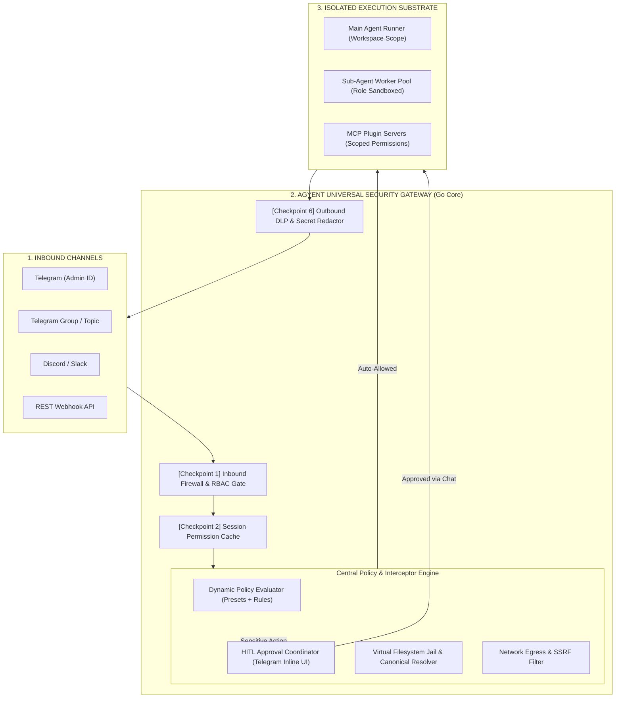
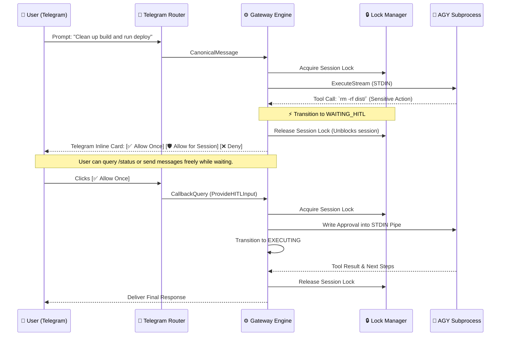

# Universal AI Security Gateway & Guardrails Architecture

This document provides the comprehensive technical specification for the **Universal AI Security Gateway & Guardrails Subsystem** in **agyent**. It details the multi-layer defense-in-depth model, non-blocking Human-In-The-Loop (HITL) state machine, streaming tool interception, filesystem jailing, sub-agent privilege separation, frictionless UX, and configuration schema.

---

## 1. Executive Summary & Threat Modeling

### 1.1. The Vulnerability of Unrestricted Permissions
By default, autonomous agent harnesses run subprocesses with `--dangerously-skip-permissions`, granting the Large Language Model (LLM) unrestricted access to the host operating system. This presents critical vulnerabilities:

1. **Remote Code Execution (RCE) & Destructive Operations:** Hallucinated or injected prompts executing `rm -rf /`, `mkfs`, `powershell -enc`, `dd`, or `diskpart`.
2. **Path Traversal & Sensitive Data Exfiltration:** Unauthorized reads or overrides of SSH keys (`~/.ssh/id_rsa`), cloud credentials (`~/.aws/credentials`), host secrets (`/etc/shadow`), or the gateway database (`~/.agyent/agyent.db`).
3. **Indirect Prompt Injection:** Malicious payloads hidden inside fetched websites, scraped pull requests, or untrusted source repositories hijacking agent intent.
4. **Sub-Agent Privilege Escalation & Fork Bombs:** Background sub-agents spawning unconstrained nested tasks or modifying files outside their assigned project workspace.
5. **Network Egress & SSRF Exploits:** Tools querying local loopbacks or cloud metadata services (`http://169.254.169.254/latest/meta-data`) to steal IAM roles.

---

## 2. Universal Gateway Security Architecture

Rather than relying on mutable in-workspace hook files (which an agent could tamper with), **agyent** acts as a **Central AI Security Proxy & Gateway Orchestrator** between inbound channels and isolated execution substrates.



---

## 3. The 6 Security Checkpoints

### Checkpoint 1: Inbound Firewall & Role-Based Access Control (RBAC)
- **Admin Users (`admin_user_ids`):** Full control over slash commands, configuration presets, and interactive approvals.
- **Group / Topic Users:** Scoped to read-only assistance; shell execution and dangerous file mutations are automatically denied.
- **Prompt Injection Filter:** Heuristic and semantic detection of jailbreak sequences (e.g., `ignore all previous instructions`, `<SYSTEM_RUNTIME_FOUNDATION>` overrides).

### Checkpoint 2: Virtual Filesystem Jail & Canonical Path Resolution
- **Workspace Scoping:** All filesystem operations (`view_file`, `write_to_file`, `replace_file_content`, `list_dir`) are strictly bounded to the active project workspace or global agent directory.
- **Anti-Traversal Engine:** Resolves all symlinks and relative path sequences (`..`) via `filepath.EvalSymlinks` and `filepath.Clean`.
- **Absolute Blacklist Paths:** Strictly forbids access to `~/.ssh`, `~/.aws`, `~/.gnupg`, `~/.kube`, `~/.agyent/config.yaml`, `~/.agyent/agyent.db*`, `C:\Windows`, and `/etc`.

### Checkpoint 3: Streaming Tool Execution Interceptor
- Intercepts tool calls directly during real-time `stream-json` execution.
- Evaluates actions against **3 Policy Classes**:
  - **Auto-Allow (Whitelist):** Safe build/test/query commands (e.g., `go test`, `npm test`, `git status`, `ls`, `grep`).
  - **Hard Deny (Blacklist):** Destructive commands (e.g., `rm -rf /`, `mkfs`, `format`, `powershell -enc`).
  - **Sensitive (Ask / HITL):** High-impact actions requiring human confirmation (e.g., `git push --force`, `rm -rf dist/`, `npm publish`).

### Checkpoint 4: Sub-Agent Hierarchical Supervisor & Sandboxing
- **Privilege Deprecation:** Sub-agents never inherit higher permissions than their parent session.
- **Role Capability Matrix:**
  - `researcher`: 100% Read-only tools (`view_file`, `grep_search`, `find_by_name`, `search_web`). No shell commands or file writes.
  - `coder`: Scoped file writes within project workspace; whitelisted build/test commands only.
  - `reviewer`: Read-only code inspection and `git diff`.
- **Anti-Fork Bomb Quotas:** Maximum cascade depth of 1 (sub-agents cannot spawn nested sub-agents); maximum 3 concurrent workers.
- **Process Sandbox:** Attached to Windows Kernel Job Objects (`JOB_OBJECT_LIMIT_KILL_ON_JOB_CLOSE`) and Unix process groups to guarantee zero zombie process leaks.

### Checkpoint 5: Network Egress & SSRF Protection
- Blocks HTTP/web extraction tools (`read_url_content`, `search_web`) from querying:
  - Cloud Metadata Endpoints: `169.254.169.254` (AWS, GCP, Azure token leakage prevention).
  - Private Loopback & RFC 1918 Subnets: `127.0.0.1`, `localhost`, `10.0.0.0/8`, `192.168.0.0/16`.

### Checkpoint 6: Outbound Data Loss Prevention (DLP) & Secret Redaction
- Inspects all LLM outbound text and tool outputs before transmission to chat channels.
- Redacts API keys (`sk-...`, `ghp_...`, `AKIA...`), bot tokens, and authorization headers to `[REDACTED]`.

---

## 4. Key Engineering Invariants & Bottleneck Mitigations

| Architectural Challenge | Risk / Bottleneck | Gateway Engineering Solution |
| :--- | :--- | :--- |
| **Concurrency & Lock Deadlocks** | Holding session FIFO mutex while waiting for Telegram approval blocks all user commands. | **Non-Blocking Asynchronous State Machine:** Release lock upon entering `WAITING_HITL`; re-acquire lock when callback arrives. |
| **Streaming Buffer Bloat** | `bufio.Scanner` with fixed 10MB limit crashes on massive git diffs / base64 lines (`bufio.ErrTooLong`). | **$O(1)$ `json.Decoder` Stream Iteration:** Stream NDJSON tokens directly from stdout pipe with zero line-length limits. |
| **Prefix KV-Cache Preservation** | Dynamic security context injected at Levels 0–3 busts Gemini KV-cache hit rate (85–95%). | **Level 4 Injection Invariant:** Dynamic security notices (e.g., granted permissions) are appended strictly at Level 4. |
| **Anti-Tampering Protection** | Agent editing or deleting local `hooks.json` files inside writable workspace. | **Read-Only Gateway Security Mount:** Security policies are stored outside workspace (`chmod 0400`) and enforced by the Gateway daemon. |
| **Subprocess Zombie Leaks** | Subagent processes surviving unexpected Gateway crashes or timeouts. | **Kernel Job Object Watchdog:** Enforce OS Job Objects on Windows and `killProcessTree` with `recover()` on all worker goroutines. |

---

## 5. Non-Blocking Human-In-The-Loop (HITL) State Machine



---

## 6. UX & Operations Design

### 6.1. Interactive Telegram HITL Card
When a sensitive tool execution is intercepted, the Gateway sends a formatted card:

```
┌────────────────────────────────────────────────────────┐
│ 🛡️ [Agyent Security Gate] Action Approval Required    │
├────────────────────────────────────────────────────────┤
│ 💻 Command  : `rm -rf ./dist && npm run build`         │
│ 📂 Directory: `C:\projects\ecommerce-api`              │
│ 🤖 Agent    : `coder` • Task `task-8f12`               │
│ ⚠️ Risk Eval : Medium (Directory removal & build)      │
├────────────────────────────────────────────────────────┤
│ [ ✅ Allow Once ]        [ 🛡️ Allow for Session ]      │
│ [ ❌ Deny Action ]       [ 🛑 Force Kill Agent ]       │
└────────────────────────────────────────────────────────┘
```

- **[ ✅ Allow Once ]**: Action executes immediately; subprocess resumes.
- **[ 🛡️ Allow for Session ]**: Pattern added to **Session Permission Cache**; subsequent identical calls run without prompts.
- **[ ❌ Deny Action ]**: Returns `PermissionDenied` error to LLM context, allowing it to adapt safely.
- **[ 🛑 Force Kill Agent ]**: Terminates the subprocess tree and unlocks the session.
- **Auto-Deny Timeout (60s):** If no button is clicked within 60s, the action is automatically rejected to avoid blocking system resources.

---

### 6.2. The 4 Zero-Config Security Presets

```
+----------------------------------------------------------------------------------------------------+
|                                      SECURITY PRESETS MATRIX                                       |
+-------------------+---------------------------------------------------------+----------------------+
| Preset            | Operational Behavior                                    | Target Environment   |
+-------------------+---------------------------------------------------------+----------------------+
| 🛠️ developer       | Relaxed. Auto-allows standard dev tools; blocks OS     | Local Workstation    |
|                   | destruction; broad path access.                         |                      |
+-------------------+---------------------------------------------------------+----------------------+
| 🛡️ balanced       | [DEFAULT] Auto-allows safe build/test/git; prompts via  | VPS, Small Team      |
|                   | Telegram for unfamiliar commands; strict workspace jail.| Shared Server        |
+-------------------+---------------------------------------------------------+----------------------+
| 🔒 strict         | Hardened. Whitelist-only execution; all other actions   | Production Servers,  |
|                   | denied; zero network egress to private IPs.             | Multi-tenant Hosts   |
+-------------------+---------------------------------------------------------+----------------------+
| 📖 read_only      | Immutable. 100% blocks all file writes and shell       | Code Auditing,       |
|                   | commands. Read-only codebase exploration only.          | Research Sub-agents  |
+-------------------+---------------------------------------------------------+----------------------+
```

---

### 6.3. Security Slash Commands Reference

| Slash Command | Description | Example Usage |
| :--- | :--- | :--- |
| `/security` (or `/sec`) | View current security dashboard, preset, active jail, and audit counts. | `/security` |
| `/security preset <mode>` | Switch active security preset dynamically. | `/security preset balanced` |
| `/whitelist add <cmd\|path>` | Add a temporary or persistent whitelist entry directly from chat. | `/whitelist add "npm run build"` |
| `/audit [limit]` | Inspect the most recent intercepted and blocked security events. | `/audit 10` |

---

## 7. Configuration Schema Reference (`config.yaml`)

### 7.1. Minimal Zero-Config (Recommended for 90% of Users)
```yaml
# ~/.agyent/config.yaml
security:
  preset: "balanced"                 # "developer" | "balanced" | "strict" | "read_only"
  approval_timeout_seconds: 60       # Timeout for Telegram inline button responses

  # Additional allowed directories outside the default agent workspace
  allowed_paths:
    - "~/Desktop/projects"
    - "D:/SharedRepositories"

  # Custom allowed command prefixes
  allowed_commands:
    - "docker compose up"
    - "mvn test"
```

---

### 7.2. Full Advanced Specification
```yaml
# ~/.agyent/config.yaml (Advanced)
security:
  enabled: true
  preset: "balanced"
  mode: "interactive"                # "interactive" (Prompt Telegram) | "strict" (Block unknown)
  approval_timeout_seconds: 60

  # 1. Command Execution Guardrails
  commands:
    enabled: true
    custom_blacklist:
      - '(?i)git push .*--force.*(main|master)'
      - '(?i)drop\s+database'
    custom_whitelist:
      - "npm run test:e2e"

  # 2. Filesystem Boundaries
  filesystem:
    enforce_workspace_jail: true
    allowed_paths:
      - "~/Desktop/projects"
    forbidden_paths:
      - "~/.ssh"
      - "~/.aws"
      - "~/.gnupg"
      - "~/.kube"
      - "~/.agyent/config.yaml"      # Protect gateway bot tokens and database
      - "~/.agyent/agyent.db*"

  # 3. Sub-Agent Worker Isolation
  subagents:
    default_sandbox: true            # Pass --sandbox flag to subagents
    max_concurrent_workers: 3
    max_cascade_depth: 1             # Disallow subagents from spawning subagents
    roles:
      researcher:
        allowed_tools: ["view_file", "grep_search", "find_by_name", "search_web"]
        disallowed_tools: ["run_command", "write_to_file", "replace_file_content", "dispatch_subagent"]
      coder:
        allowed_tools: ["*"]
        disallowed_tools: ["dispatch_subagent"]
      reviewer:
        allowed_tools: ["view_file", "grep_search", "find_by_name"]
        disallowed_tools: ["write_to_file", "replace_file_content", "dispatch_subagent"]

  # 4. Network & SSRF Guardrails
  network:
    block_cloud_metadata: true       # Block 169.254.169.254
    block_private_networks: true     # Block 127.0.0.1, 192.168.0.0/16
```

---

## 8. Go Hexagonal Domain Entities & Port Interfaces

```go
package ports

import (
    "context"
    "agyent/internal/core/domain"
)

// SecurityManagerPort coordinates multi-layer tool interception, path jailing, and policy decisions.
type SecurityManagerPort interface {
    // EvaluateCommand checks a shell command against active blacklist/whitelist/HITL rules.
    EvaluateCommand(ctx context.Context, sessionKey string, role string, cmd string) (domain.SecurityDecision, error)
    
    // EvaluatePath verifies if target file access is permitted within the active workspace jail.
    EvaluatePath(ctx context.Context, sessionKey string, targetPath string, isWrite bool) (domain.SecurityDecision, error)
    
    // EvaluateURL verifies that destination URL does not target private IPs or cloud metadata.
    EvaluateURL(ctx context.Context, urlStr string) (domain.SecurityDecision, error)
    
    // GrantSessionPermission adds a temporary permission grant to the session cache.
    GrantSessionPermission(sessionKey string, pattern string)
    
    // GetDashboardSummary returns statistics for /security slash command.
    GetDashboardSummary(sessionKey string) domain.SecurityDashboard
}

// HITLApprovalPort coordinates interactive approval requests over communication channels.
type HITLApprovalPort interface {
    // RequestApproval sends an interactive card and suspends execution until user action or timeout.
    RequestApproval(ctx context.Context, req domain.ApprovalRequest) (bool, error)
    
    // HandleCallback processes inline keyboard clicks from Telegram/Discord.
    HandleCallback(ctx context.Context, callbackID string, action string) error
}

// TurnOrchestratorPort manages non-blocking turn state machines to prevent session deadlocks.
type TurnOrchestratorPort interface {
    Dispatch(ctx context.Context, msg domain.CanonicalMessage) error
    ResumeWithHITL(ctx context.Context, sessionKey string, approved bool) error
    CancelTurn(ctx context.Context, sessionKey string) error
}
```
