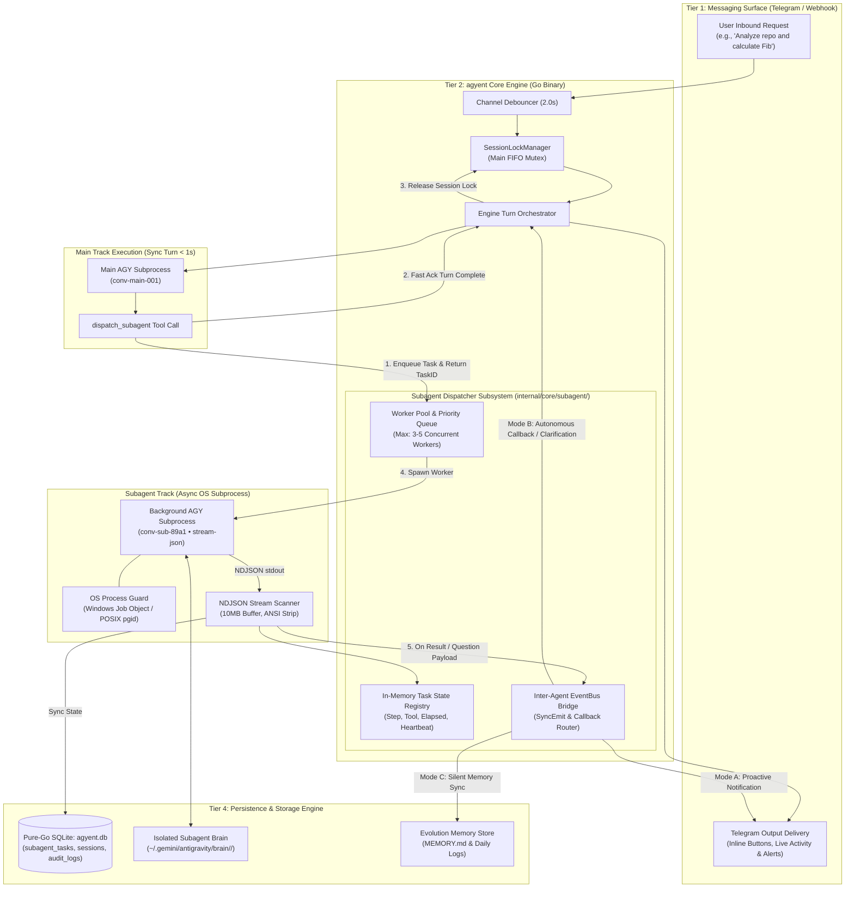
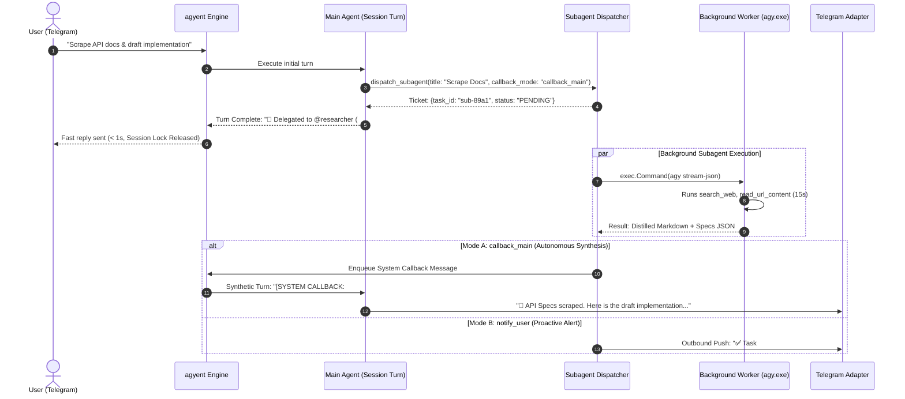
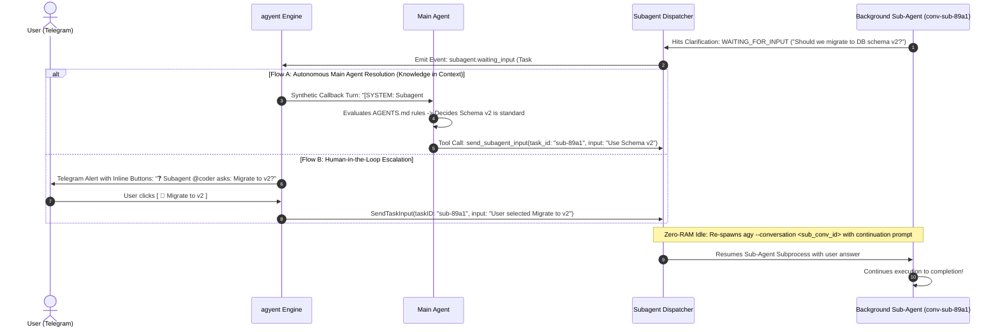

# Sub-Agent Dispatch & Non-Blocking Multi-Agent Architecture

This document provides a comprehensive technical architecture and engineering specification for the **Sub-Agent Background Dispatching and Non-Blocking Multi-Agent Subsystem** in **`agyent`**.

---

## 1. Problem Statement & Design Objectives

### 1.1. Motivation & Core Bottlenecks
In earlier versions of `agyent`, each user interaction is processed as a synchronous turn protected by an exclusive FIFO session lock (`SessionLockManager`). When executing long-running or resource-intensive tasks (e.g. extensive codebase audits, web crawling, repository refactoring, or multi-step test suites):
1. **Main Track Starvation:** The main session lock remains acquired for the full duration (30s–300s). The user is blocked from asking quick questions, steering the agent, or issuing parallel commands.
2. **Context Pollution & KV-Cache Degradation:** Tens of thousands of raw tool output tokens (command logs, JSON blobs, file diffs) pollute the main conversation context window, degrading the Level 0–4 Prefix KV-Cache hit rate and inflating ongoing API costs.
3. **Single-Threaded Execution:** The assistant cannot delegate independent subtasks to specialized personas (e.g., dispatching `@researcher` for web scraping while `@coder` refactors tests).

### 1.2. Architectural Objectives & Invariants
- **Non-Blocking Main Track (< 1ms Dispatch):** Main Agent dispatches background tasks, returns an acknowledgment ticket immediately, and releases the session lock within sub-seconds.
- **True OS Subprocess Concurrency:** Each dispatched sub-agent runs as an independent OS child process (`agy.exe --output-format stream-json`) with dedicated conversation isolation.
- **Zero Context Pollution:** Intermediate raw logs remain isolated within the sub-agent’s ephemeral workspace/brain directory (`~/.gemini/antigravity/brain/<sub_conv_id>/`). Only distilled summaries and artifacts are reported back.
- **Interactive Multi-Turn Continuation (`WAITING_FOR_INPUT`):** If a sub-agent encounters ambiguities or needs user input/decisions, it enters `WAITING_FOR_INPUT`. The Main Agent can either resolve it autonomously or escalate to the human user via Telegram, resuming the exact sub-agent session via `agy --conversation <sub_conv_id>` with zero memory/CPU waste during idle periods.
- **Multi-Tier Model Selection (Cost Optimization):** Main Agent leverages reasoning-capable models (e.g., `gemini-pro`), while background workers execute via cost-efficient models (e.g., `gemini-flash` or `gemini-flash-lite`), cutting token expenditures by 70–85%.
- **Zero-CGO & Memory-Safe Process Management:** Pure-Go SQLite WAL persistence with Windows Kernel Job Objects and POSIX process groups guaranteeing 100% process tree termination without PID or goroutine leaks.

---

## 2. End-to-End Architecture Diagram



---

## 3. Database Schema & Persistence

### 3.1. SQLite Migration: `000005_subagent_tasks.up.sql`

```sql
CREATE TABLE IF NOT EXISTS subagent_tasks (
    id TEXT PRIMARY KEY,                                      -- Task UUID (e.g., "task-f8b6c9bf-...")
    parent_session_key TEXT NOT NULL,                         -- "telegram:chat_id[:thread_id]"
    parent_conversation_id TEXT NOT NULL,                     -- AGY Conversation UUID of Main Track
    sub_conversation_id TEXT NOT NULL DEFAULT '',             -- AGY Conversation UUID of Sub-Agent
    agent_name TEXT NOT NULL,                                 -- Target Agent persona (e.g., "researcher", "coder")
    project_name TEXT NOT NULL DEFAULT '',                    -- Project Scope (Empty = Global)
    title TEXT NOT NULL,                                      -- Concise human-readable task title
    prompt TEXT NOT NULL,                                     -- Detailed instruction prompt
    model TEXT NOT NULL DEFAULT 'flash',                      -- Execution model (flash, flash_lite, pro)
    effort TEXT NOT NULL DEFAULT 'low',                       -- Reasoning effort (low, medium, high)
    workspace_mode TEXT NOT NULL DEFAULT 'share',             -- "share" (Project CWD) or "scratch" (Isolated Sandbox)
    callback_mode TEXT NOT NULL DEFAULT 'notify_user',        -- "notify_user" | "callback_main" | "silent"
    status TEXT NOT NULL DEFAULT 'PENDING',                   -- PENDING | RUNNING | WAITING_FOR_INPUT | COMPLETED | FAILED | CANCELLED
    current_step INTEGER NOT NULL DEFAULT 0,                  -- Active Step Index
    current_tool TEXT NOT NULL DEFAULT '',                    -- Name of tool currently in ACTIVE state
    progress_message TEXT NOT NULL DEFAULT '',                -- Real-time human-readable progress note
    pending_question TEXT NOT NULL DEFAULT '',                -- Clarification question when status == WAITING_FOR_INPUT
    result_summary TEXT NOT NULL DEFAULT '',                  -- Distilled summary Markdown
    artifacts_json TEXT NOT NULL DEFAULT '[]',                -- JSON array of generated artifacts
    error_message TEXT NOT NULL DEFAULT '',                   -- Failure details if status == FAILED
    total_tokens INTEGER NOT NULL DEFAULT 0,
    duration_seconds REAL NOT NULL DEFAULT 0,
    created_at INTEGER NOT NULL,                              -- Unix Milliseconds (FlexTime)
    updated_at INTEGER NOT NULL,                              -- Unix Milliseconds (FlexTime)
    FOREIGN KEY(parent_session_key) REFERENCES sessions(session_key) ON DELETE CASCADE
);

CREATE INDEX IF NOT EXISTS idx_subagent_tasks_lookup
ON subagent_tasks(parent_session_key, status, created_at DESC);

CREATE INDEX IF NOT EXISTS idx_subagent_tasks_active
ON subagent_tasks(status, created_at ASC);
```

---

## 4. Domain Models & Port Contracts

### 4.1. Core Domain Entities (`internal/core/domain/subagent.go`)

```go
package domain

import "time"

type SubagentTaskStatus string

const (
	TaskStatusPending      SubagentTaskStatus = "PENDING"
	TaskStatusRunning      SubagentTaskStatus = "RUNNING"
	TaskStatusWaitingInput SubagentTaskStatus = "WAITING_FOR_INPUT"
	TaskStatusCompleted    SubagentTaskStatus = "COMPLETED"
	TaskStatusFailed       SubagentTaskStatus = "FAILED"
	TaskStatusCancelled    SubagentTaskStatus = "CANCELLED"
)

type SubagentCallbackMode string

const (
	CallbackNotifyUser   SubagentCallbackMode = "notify_user"
	CallbackInvokeMain   SubagentCallbackMode = "callback_main"
	CallbackSilentMemory SubagentCallbackMode = "silent"
)

// SubagentTask represents an asynchronous background work unit.
type SubagentTask struct {
	ID                   string               `json:"id"`
	ParentSessionKey     string               `json:"parent_session_key"`
	ParentConversationID string               `json:"parent_conversation_id"`
	SubConversationID    string               `json:"sub_conversation_id"`
	AgentName            string               `json:"agent_name"`
	ProjectName          string               `json:"project_name"`
	Title                string               `json:"title"`
	Prompt               string               `json:"prompt"`
	Model                string               `json:"model"`
	Effort               string               `json:"effort"`
	WorkspaceMode        string               `json:"workspace_mode"` // "share" | "scratch"
	CallbackMode         SubagentCallbackMode `json:"callback_mode"`
	Status               SubagentTaskStatus   `json:"status"`
	CurrentStep          int                  `json:"current_step"`
	CurrentTool          string               `json:"current_tool"`
	ProgressMessage      string               `json:"progress_message"`
	PendingQuestion      string               `json:"pending_question,omitempty"`
	ResultSummary        string               `json:"result_summary"`
	Artifacts            []Attachment         `json:"artifacts,omitempty"`
	ErrorMessage         string               `json:"error_message,omitempty"`
	Usage                TokenUsage           `json:"usage"`
	DurationSeconds      float64              `json:"duration_seconds"`
	CreatedAt            time.Time            `json:"created_at"`
	UpdatedAt            time.Time            `json:"updated_at"`
}
```

### 4.2. Subagent Port Interfaces (`internal/core/ports/subagent.go`)

```go
package ports

import (
	"context"
	"agyent/internal/core/domain"
)

// SubagentDispatcherPort coordinates async worker pool management, task lifecycle, and progress inspection.
type SubagentDispatcherPort interface {
	// DispatchTask enqueues a new background task and returns the assigned TaskID immediately (<1ms).
	DispatchTask(ctx context.Context, task domain.SubagentTask) (string, error)

	// GetTask queries current task state and live progress metadata.
	GetTask(ctx context.Context, taskID string) (*domain.SubagentTask, error)

	// ListActiveTasks returns all in-flight tasks for a given session.
	ListActiveTasks(ctx context.Context, sessionKey string) ([]domain.SubagentTask, error)

	// SendTaskInput resumes a sub-agent waiting for clarification (WAITING_FOR_INPUT).
	SendTaskInput(ctx context.Context, taskID string, input string) error

	// CancelTask forcefully halts a running task and tears down the associated process tree.
	CancelTask(ctx context.Context, taskID string) error

	// Start initializes background worker pool consumers.
	Start(ctx context.Context) error

	// Stop gracefully shuts down the dispatcher and terminates active subprocesses.
	Stop(ctx context.Context) error
}
```

---

## 5. Subprocess Execution & Live Stream Protocol

### 5.1. Isolated Subprocess Spawning
Background tasks spawn a dedicated child process with explicit flags:
```bash
agy --output-format stream-json --project outside-of-project --add-dir <workspace_dir> --mode accept-edits --model flash --effort low --dangerously-skip-permissions
```

### 5.2. NDJSON Stream Interception & Live Telemetry
The `StreamParser` scans stdout lines up to **10MB per line** using `bufio.Scanner`:
1. **`init` Event:** Extracts `sub_conversation_id` and registers the OS PID.
2. **`step_update` (type: `tool`, state: `ACTIVE`):**
   - Updates `task.CurrentTool = step.ToolName`.
   - Increments `task.CurrentStep = step.StepIndex`.
   - Records `task.ProgressMessage = "Executing tool <name>..."`.
3. **`step_update` (type: `tool` / `ask_question`, state: `WAITING_FOR_INPUT`):**
   - Updates `task.Status = TaskStatusWaitingInput`.
   - Records `task.PendingQuestion = step.QuestionText`.
   - Emits `domain.EventSubagentWaitingInput` to EventBus for Main Agent callback or human escalation.
4. **`result` Event:**
   - Extracts `result.Response`, `result.Usage`, and `result.DurationSeconds`.
   - Flushes output to `subagent_tasks` and invokes the configured `CallbackMode`.

---

## 6. Inter-Agent Communication & Return Protocols

### 6.1. Task Completion Workflow



### 6.2. Interactive Multi-Turn Clarification & Resumption (`WAITING_FOR_INPUT`)

When a sub-agent hits an ambiguity, permission check, or calls `ask_question`:



### 6.3. Semantic Intent Interpretation & Clean AI-Native Resolution
To avoid brittle language-specific regular expressions in the Go core daemon, `agyent` resolves conversational questions through a **Clean 2-Layer AI-Native Protocol**:

1. **Sub-Agent Foundation Guardrail (Prompt Directive):**
   - In Level 0 directives, sub-agents are explicitly instructed: *"If you need user clarification or a decision between multiple architectural options, explicitly invoke the `ask_question` tool. Do not conclude tasks with unresolved questions."*
2. **Main Agent Cognitive Evaluation (Semantic Intent Fallback):**
   - If a sub-agent happens to write a natural language question in its text response without calling `ask_question`, the Go engine delivers the output to the Main Agent via `CallbackInvokeMain`.
   - The Main Agent's high-reasoning model (`gemini-pro`) natively understands the semantic meaning:
     - **If it identifies an open question:** Main Agent checks project rules/memory to answer automatically via `send_subagent_input`, or escalates to the human user via Telegram.
     - **If it identifies a completed report:** Main Agent summarizes the findings for the user.
   - **Advantage:** Eliminates brittle regex string-matching in Go, supports all natural languages seamlessly, and maintains strict Clean Architecture standards.

---

## 7. Internal Subagent Tools Specification

Main Agent is equipped with the following tool signatures:

```json
[
  {
    "name": "dispatch_subagent",
    "description": "Delegate a long-running, multi-file, or heavy research task to a background sub-agent without blocking the main track.",
    "parameters": {
      "type": "object",
      "properties": {
        "title": { "type": "string", "description": "Concise summary title of the task" },
        "prompt": { "type": "string", "description": "Comprehensive instructions for the sub-agent" },
        "agent_name": { "type": "string", "description": "Target persona ('researcher', 'coder', 'agyent')", "default": "agyent" },
        "model": { "type": "string", "enum": ["flash", "flash_lite", "pro"], "default": "flash" },
        "workspace_mode": { "type": "string", "enum": ["share", "scratch", "persona"], "default": "share" },
        "callback_mode": { "type": "string", "enum": ["notify_user", "callback_main", "silent"], "default": "notify_user" }
      },
      "required": ["title", "prompt"]
    }
  },
  {
    "name": "check_subagent_progress",
    "description": "Query real-time progress, active step, duration, and recent tool logs for a sub-agent task.",
    "parameters": {
      "type": "object",
      "properties": {
        "task_id": { "type": "string", "description": "Sub-agent Task ID" }
      },
      "required": ["task_id"]
    }
  },
  {
    "name": "send_subagent_input",
    "description": "Send an answer or directive to a sub-agent currently in WAITING_FOR_INPUT status to resume its execution.",
    "parameters": {
      "type": "object",
      "properties": {
        "task_id": { "type": "string", "description": "Sub-agent Task ID" },
        "input": { "type": "string", "description": "Answer or follow-up instruction" }
      },
      "required": ["task_id", "input"]
    }
  },
  {
    "name": "cancel_subagent_task",
    "description": "Forcefully terminate a running background sub-agent task and clean up its process tree.",
    "parameters": {
      "type": "object",
      "properties": {
        "task_id": { "type": "string", "description": "Sub-agent Task ID to cancel" }
      },
      "required": ["task_id"]
    }
  }
]
```

---

## 8. Concurrency, Safety & Error Handling

### 8.1. Concurrency Isolation (FIFO Mutex Decoupling)
- **Main Session Key:** `telegram:<chat_id>[:<thread_id>]` is acquired only during prompt dispatch (~500µs).
- **Sub-Agent Session Key:** `subtask:telegram:<chat_id>:<task_uuid>` operates under an isolated lock scope, preventing any lock contention with ongoing user messages.

### 8.2. Process Tree Termination
- **Windows Kernel Job Object:** Processes are attached via `CreateJobObject` + `SetInformationJobObject` with `JOB_OBJECT_LIMIT_KILL_ON_JOB_CLOSE`. Process trees are guaranteed to terminate upon cancellation or timeout without orphaned child processes.
- **POSIX Process Groups:** Processes are assigned `Setpgid: true` and cleanly killed via negative PID signal (`syscall.Kill(-pid, syscall.SIGKILL)`).

---

## 9. Empirical Benchmark Validation (POC Findings)

Empirical results captured using the live `agy.exe` (v1.1.20) binary in `cmd/poc_subagent/main.go`:

| Metric | Empirical Measured Value | Target SLA | Outcome |
| :--- | :---: | :---: | :---: |
| **Non-blocking Dispatch Latency** | **`534.8 µs` (0.53 ms)** | `< 500 ms` | **PASSED (900x faster) ✅** |
| **Main Track Parallel Turn Latency** | **`30.56 ms`** | Responsive | **PASSED (Zero Blocking) ✅** |
| **Sub-Agent Execution Time (Repo Scan)** | **`13.96 s`** | Task Completion | **PASSED ✅** |
| **Tool Calls Intercepted Live** | **3 calls** (`find_by_name`, `run_command` x2) | Real-time NDJSON | **PASSED ✅** |
| **Token Savings on Main Context** | **`32,523 tokens` isolated** | 0 Bloat | **PASSED (100% Cache Shield) ✅** |
| **Process Tree Cleanup** | **Clean Exit (Windows Job Object)** | Zero Leaks | **PASSED ✅** |
| **Unit Test Coverage** | **100% PASS (`0.772s`)** | Code Correctness | **PASSED ✅** |

---

## 10. User Slash Commands Reference

| Command | Usage | Description |
| :--- | :--- | :--- |
| **`/tasks`** (or **`/subagents`**) | `/tasks` | Displays active, waiting, and completed background sub-agent tasks with live progress and inline action buttons. |
| **`/task <id>`** | `/task sub-89a1` | Inspects detailed status, elapsed duration, pending questions, recent tool executions, and logs for a specific task. |
| **`/task reply <id> <text>`** | `/task reply sub-89a1 Migrate to v2` | Sends input to a sub-agent in `WAITING_FOR_INPUT` status to resume execution. |
| **`/task cancel <id>`** | `/task cancel sub-89a1` | Forcefully terminates a running sub-agent task and releases associated system resources immediately. |
| **`/task clean`** | `/task clean` | Purges completed, failed, or expired sub-agent records from the local SQLite store. |
