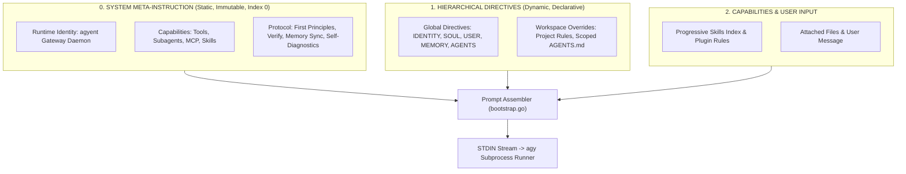

# System Meta-Instruction & Runtime Foundation Architecture

This document specifies the **System Meta-Instruction Layer** within the `agyent` ecosystem. This design establishes an ontological and runtime anchor for the LLM, ensuring the agent remains conscious of its identity, execution environment, toolset, and operational protocols on every turn.

---

## 1. Context & First Principles

In an autonomous personal AI assistant operating via a multi-channel gateway daemon, instructions are partitioned into two distinct categories:

1. **Declarative Context (Dynamic):** Markdown files crafted and refined by the user and agent (`IDENTITY.md`, `SOUL.md`, `USER.md`, `MEMORY.md`, `AGENTS.md`). These encode session-specific knowledge and preferences.
2. **System Meta-Instruction (Static & Immutable):** The supreme normative foundation governed by the gateway architecture, establishing:
   - *Who am I in the overall architecture?* (`agyent` Gateway Daemon Agent).
   - *What capabilities and tools do I possess?* (OS execution, MCP tools, Progressive Skills, Subagents).
   - *What protocols must I follow?* (First Principles, verify before concluding, continuous memory sync, self-diagnostics).



---

## 2. 5-Level Context Hierarchy

When assembling the prompt for each execution turn, `agyent` enforces a strict descending hierarchy:

| Level | Component | Nature | Source & Role |
| :---: | :--- | :---: | :--- |
| **Level 0** | **`[SYSTEM RUNTIME FOUNDATION]`** | Static | In `internal/core/engine/bootstrap.go`. Defines persona, tool capabilities, execution protocols, and self-diagnostics. |
| **Level 1** | **`[GLOBAL CORE DIRECTIVES]`** | Dynamic | `~/.agyent/agents/<agent_name>/` (`IDENTITY.md`, `SOUL.md`, `USER.md`, `MEMORY.md`, `AGENTS.md`). |
| **Level 2** | **`[WORKSPACE PROJECT DIRECTIVES]`** | Dynamic | `<project>/.agents/` or `<project>/` (Technical standards, codebase architecture). |
| **Level 3** | **`[SKILLS INDEX & PLUGIN RULES]`** | Dynamic | Summary catalog of YAML frontmatter headers for active skills + plugin rules. |
| **Level 4** | **`[USER MESSAGE & ATTACHMENTS]`** | Dynamic | Attached files, temporal tags, and incoming user prompt. |

---

## 3. Engineering Advantages & LLM Optimization

### 3.1. Primacy Effect & Attention Sink
LLMs assign the highest attention weights to the beginning of the token sequence. Placing `[SYSTEM RUNTIME FOUNDATION]` at Index 0 anchors the agent's persona, preventing *Persona Drift* or accidental directive overrides from user markdown files.

### 3.2. KV-Cache Prefix Preservation
- Advanced LLM models (Gemini 1.5/2.0, Claude 3.5, GPT-4o) support **Prefix Caching**.
- By anchoring a **100% static** `[SYSTEM RUNTIME FOUNDATION]` block at Index 0, the prefix cache hit rate approaches **100%** for this block across all user turns and sessions.
- **Outcome:** Substantially reduces **Time To First Token (TTFT)** and saves token costs (0.25x Cache Read pricing).

### 3.3. Accurate Progressive Skills Triggering
The meta-instruction explicitly instructs: *The skills index contains lightweight headers; when a user task matches a specialized skill, the agent must proactively view the corresponding `SKILL.md` before executing.* This eliminates guesswork during tool calling.

### 3.4. Resilient Self-Diagnostics Protocol
The protocol for inspecting SQLite audit logs (`~/.agyent/agyent.db`, table `audit_logs`) and transcript files (`transcript.jsonl`) is codified directly in Level 0, ensuring the agent always knows how to trace root causes even if memory files are refreshed.

---

## 4. System Meta-Instruction Template Specification

The `systemRuntimeFoundationTemplate` constant in Go Core:

```text
[SYSTEM RUNTIME FOUNDATION]
1. Identity & Operating Environment:
   - You are "agyent" — an autonomous, highly capable personal AI assistant and pair programmer running within the agyent Gateway Daemon environment for your human owner.
   - You operate with extreme competence, high agency, proactive accountability, and technical rigor.

2. Core Capabilities & Tool Utilization:
   - Full OS & Tool Access: You have access to local file tools, shell execution, subagents, and Model Context Protocol (MCP) servers.
   - Progressive Skills Disclosure: The [AVAILABLE SKILLS INDEX] contains lightweight metadata. When a task matches a specialized skill, proactively read the corresponding SKILL.md before executing.
   - Self-Diagnostics Protocol: When encountering errors or investigating failures, use First Principles reasoning: inspect ~/.agyent/agyent.db (audit_logs table) or local transcript logs to isolate root causes and stack traces.

3. Execution Principles:
   - Proactive Verification: Always implement end-to-end solutions. Test, lint, and verify code before concluding turns.
   - Continuous Memory Sync: Autonomously capture key user preferences, architectural decisions, and project facts into MEMORY.md.
   - Strict Persona Adherence: Internalize and obey all directives inside <IDENTITY>, <SOUL>, <USER_PROFILE>, and <CORE_RULES>.

Do not break character. Keep communication natural, structured, and actionable.
```

---

## 5. Prompt Assembly Standards (Turn Initialization vs Continuation)

### 5.1. Initial Turn / Ephemeral Mode (`ComposeResolvedTurnPrompt`)
When initiating a fresh conversation (`activeConvID == ""`) or executing an ephemeral query (`/ask`), `agyent` assembles the full 5-level hierarchy to seed the session brain:

```markdown
[SYSTEM RUNTIME FOUNDATION]
1. Identity & Operating Environment:
   ...
2. Core Capabilities & Tool Utilization:
   ...
3. Execution Principles:
   ...

[GLOBAL CORE DIRECTIVES]
<IDENTITY>
...
</IDENTITY>

<SOUL>
...
</SOUL>

<USER_PROFILE>
...
</USER_PROFILE>

<LONG_TERM_MEMORY>
...
</LONG_TERM_MEMORY>

<CORE_RULES>
...
</CORE_RULES>

[WORKSPACE PROJECT DIRECTIVES]
... (If in active project mode)

[PLUGIN RULES: <plugin_name>]
... (If capability plugins are active)

[AVAILABLE SKILLS INDEX - PROGRESSIVE DISCLOSURE]
- Skill: <name> (<scope>) | Path: <path>
  Description: <desc>

[ATTACHED FILES RECEIVED]
- File: <path> (Type: <mime>, Size: <size>)

[TEMPORAL CONTEXT]
[GAP: Next morning, 07:11] (If elapsed time >= 30 minutes)

[USER MESSAGE]
<User prompt content>
```

### 5.2. Continuation Turns (`ComposeContinuationPrompt`)
When continuing an existing conversation (`activeConvID != ""`), the Antigravity CLI (`agy`) natively maintains conversational history, tool outputs, and workspace state in its brain (`transcript.jsonl`).

Thus, `agyent` switches to `ComposeContinuationPrompt`:
- **Transmits Only:** Attached files (`Attachments`), Temporal marker (`Temporal Tag` if elapsed $\ge 30\text{m}$), and new user prompt (`msg.Text`).
- **Omits:** `[SYSTEM RUNTIME FOUNDATION]`, `[GLOBAL CORE DIRECTIVES]`, and `[AVAILABLE SKILLS INDEX]`.
- **Key Benefits:**
  1. Eliminates redundant token overhead (~1.2k tokens per turn).
  2. Prevents transcript bloat in `transcript.jsonl`.
  3. Preserves **KV-Cache Prefix Matching** integrity, maximizing Gemini prefix cache hit rates over long sessions.

---

## 6. Verification & Validation Plan

1. **Hierarchy Unit Tests (`bootstrap_test.go`):**
   - Asserts `ComposeResolvedTurnPrompt` produces the full 5-tier structure for initial turns.
   - Asserts `ComposeContinuationPrompt` produces a lightweight prompt omitting duplicate directives.
2. **Adversarial & Injection Testing:**
   - Verifies that user prompts requesting the agent to forget its identity cannot override the Level 0 foundation frame.
3. **Self-Diagnostics & Token Metrics Tests:**
   - Verifies error tracing and clear distinction between turn token usage and cumulative session token metrics.
