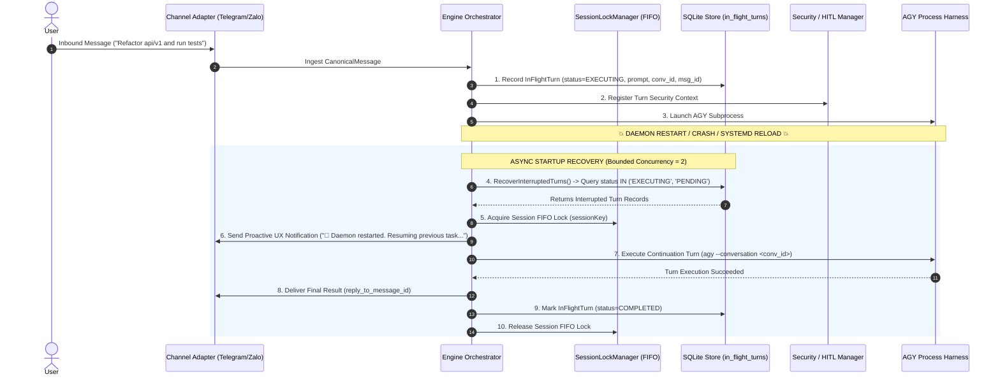

# Turn Auto-Recovery & Crash Resilience Architecture

> **Document status:** Reference  
> **Code authority:** `internal/core/engine`, `internal/adapters/storage/sqlite`, `internal/core/execution`, `internal/adapters/subagent`, `internal/core/scheduler`, `internal/adapters/security`  
> **Last verified:** 2026-09-06  

This document specifies the technical architecture, data structures, and lifecycle state machines for **Turn Auto-Recovery, Task Reconciliation, and Crash Resilience** in **`agyent`**.

---

## 1. Problem Statement & Design Objectives

### 1.1. Current State & Vulnerabilities
In the current architecture of `agyent`:
1. **Interactive Chat Turns are In-Memory Only:** When a user sends a message via Telegram or Zalo, the active turn state is tracked solely in volatile memory (`Engine.activeTurns` map and `SessionLockManager`). SQLite only records the session's `active_conversation_id` and audit logs *after* a turn completes successfully.
2. **Channel Ack Desynchronization:** Channel adapters acknowledge inbound messages (e.g., updating Telegram's `getUpdates` offset or returning HTTP 200 to webhooks) upon receiving updates. If the daemon restarts while processing, the channel provider will not re-deliver the message.
3. **Orphaned Subagent Tasks:** Dispatched background subagents are marked `RUNNING` in SQLite. When the daemon halts, their child processes terminate, but the database records remain `RUNNING` indefinitely, preventing the parent session from ever receiving callbacks or final summaries.
4. **Dropped Human-In-The-Loop (HITL) Decisions:** In-flight security approval tokens for dangerous tool commands or interactive clarification questions (`ask_question`) are held in memory. Restarting invalidates these tokens, rendering Telegram inline callback buttons dead.
5. **Silent Failures & Degraded User Experience:** When the daemon restarts (due to systemd service upgrades, host reboots, OS OOM kills, or panic recovery), users experience a silent freeze with no diagnostic notification or automatic resumption.

### 1.2. Non-Negotiable Invariants
- **CGO-Free SQLite WAL & Timestamp Standard:** All persistent state machines must use `modernc.org/sqlite` with WAL mode, dual-pool access (single writer, multi-reader), and persist timestamps strictly as **Unix Milliseconds** (`time.Now().UnixMilli()`) compatible with `FlexTime`.
- **Fail-Closed Security & APIS-4D Identity:** Recovery mechanisms must never bypass RBAC authorization policies or execute tools in an unmonitored security context. `AGYENT_TURN_ID`, `AGYENT_SESSION_KEY`, `AGYENT_AGENT_WORKSPACE`, `AGYENT_AGENT_NAME`, and `AGYENT_USER_ID` must be regenerated and bound to the recovery turn.
- **Strict FIFO Lock Manager Adherence:** Every recovery turn must acquire the per-session FIFO lock (`lockManager.Acquire`) prior to execution to prevent race conditions with new incoming user messages and eliminate transcript corruption.
- **Idempotency & Side-Effect Safety:** Automatic recovery must leverage Antigravity's conversation brain history (`--conversation <id>`) to resume execution context without blindly replaying side-effecting actions (file writes, bash scripts, git operations).
- **Crash-Loop Prevention (Circuit Breaker) & Bounded Concurrency:** Interrupted turns are permitted a maximum of one automatic recovery attempt (`max_retries = 1`). Startup recovery must be rate-limited via a bounded worker pool (`max_concurrent_recoveries = 2`) to prevent CPU/memory exhaustion crash storms.

---

## 2. Recovery Taxonomy & Use Cases Matrix

| Case | Execution Domain | State Storage | Failure Signature | Recovery Strategy |
|---|---|---|---|---|
| **Case 1: Interactive Chat Turn** | Main conversational turn (Telegram/Zalo) | In-memory `activeTurns` | Process terminated; user receives partial stream or no output | **Turn WAL & Continuation Prompt:** Record turn intent in SQLite `in_flight_turns`. On reboot, acquire FIFO lock, notify user, and resume via `--conversation <id>` continuation prompt. |
| **Case 2: Subagent Task** | Asynchronous background worker | `subagent_tasks` SQLite table | Task stuck in `RUNNING` forever; parent session blocked | **Dispatcher Reconcile & Re-enqueue:** Scan stale `RUNNING` tasks, transition to `PENDING` with retry increment (`retry_count < max_retries`), and resume worker pool. |
| **Case 3: Scheduled Task & Heartbeat** | Cron, one-off timer, periodic heartbeat | `agent_schedules`, `agent_heartbeats` | Task in `RUNNING` state at shutdown | **Misfire Policy Evaluation:** Sanitize `RUNNING` $\rightarrow$ `ACTIVE` and evaluate misfire policy (`fire_immediately`, `skip`, or `notify`). |
| **Case 4: HITL Security Approval** | Security chokepoint / `ask_question` | In-memory `pendingApprovals` | Callback button returns 404 / token expired | **Stale Token Expiration & Fallback:** Mark lingering tokens `EXPIRED_DAEMON_RESTART` on boot; provide user-friendly callback query answers and permit session grant persistence. |
| **Case 5: Staged Inbound Buffer** | Debouncer sliding window (2.0s) | In-memory message queues | Message lost during abrupt SIGKILL/crash | **Graceful Drain & Inbound Buffer Flush:** Ensure `debouncer.Close()` flushes pending queues during shutdown; fallback to WAL on hard crash. |

---

## 3. Architecture & End-to-End Recovery Flow



---

## 4. Schema & Data Storage Specifications

### 4.1. Migration `000012_in_flight_turns.up.sql`
A dedicated table tracks active turns throughout their lifecycle, and `subagent_tasks` is extended with retry counters:

```sql
CREATE TABLE IF NOT EXISTS in_flight_turns (
    turn_id TEXT PRIMARY KEY,
    session_key TEXT NOT NULL,
    conversation_id TEXT,
    agent_name TEXT NOT NULL,
    project_name TEXT,
    channel TEXT NOT NULL,
    chat_id TEXT NOT NULL,
    thread_id TEXT,
    inbound_message_id INTEGER NOT NULL DEFAULT 0,
    bot_id INTEGER NOT NULL DEFAULT 0,
    user_id TEXT NOT NULL,
    user_name TEXT,
    prompt TEXT NOT NULL,
    is_ephemeral BOOLEAN NOT NULL DEFAULT 0,
    status TEXT NOT NULL DEFAULT 'PENDING', -- PENDING, EXECUTING, WAITING_APPROVAL, INTERRUPTED_CRASH, RECOVERING, COMPLETED, FAILED
    retry_count INTEGER NOT NULL DEFAULT 0,
    max_retries INTEGER NOT NULL DEFAULT 1,
    recovery_mode TEXT NOT NULL DEFAULT 'auto', -- auto, notify_only, manual
    error_message TEXT,
    created_at INTEGER NOT NULL, -- Unix milliseconds
    updated_at INTEGER NOT NULL  -- Unix milliseconds
);

CREATE INDEX IF NOT EXISTS idx_in_flight_turns_status ON in_flight_turns(status);
CREATE INDEX IF NOT EXISTS idx_in_flight_turns_session ON in_flight_turns(session_key);

-- Extend subagent_tasks with retry protection against infinite crash loops
ALTER TABLE subagent_tasks ADD COLUMN retry_count INTEGER NOT NULL DEFAULT 0;
ALTER TABLE subagent_tasks ADD COLUMN max_retries INTEGER NOT NULL DEFAULT 1;
```

### 4.2. Migration `000012_in_flight_turns.down.sql`
```sql
DROP TABLE IF EXISTS in_flight_turns;
```

---

## 5. Subsystem Recovery Protocols

### 5.1. Interactive Chat Turn Recovery Protocol

#### 1. Turn Intent Registration
Prior to subprocess invocation in `Engine.executeTurn`:
- Insert a record into `in_flight_turns` with `status = 'EXECUTING'`, `turn_id`, `session_key`, `conversation_id`, `inbound_message_id`, `is_ephemeral`, and `prompt`.
- Upon successful execution completion, update status to `COMPLETED`.
- Upon handled domain error, update status to `FAILED`.
- Interrupted turns with `is_ephemeral = 1` (e.g. `/ask` quick queries) are transitioned directly to `FAILED` / `DISCARDED` on boot without auto-recovery to prevent workspace contamination.

#### 2. Non-Blocking Startup Recovery Worker
During engine initialization in `Engine.Start`:
- `Engine.Start` spawns an asynchronous recovery goroutine via `concurrency.SafeGo` to avoid blocking daemon startup, health checks, or channel polling.
- The worker uses a semaphore (`max_concurrent_recoveries = 2`) to prevent CPU/memory exhaustion crash storms.

```go
func (e *Engine) startRecoveryWorker(ctx context.Context) {
    concurrency.SafeGo(func() {
        // Small delay to allow channel adapters and lock managers to become fully ready
        select {
        case <-ctx.Done():
            return
        case <-time.After(500 * time.Millisecond):
        }
        _ = e.RecoverInterruptedTurns(ctx)
    })
}
```

#### 3. Per-Turn Recovery Execution
For each interrupted turn:
1. **Circuit Breaker Check:** If `retry_count >= max_retries`, mark `status = 'FAILED'` with error `"Exceeded maximum recovery attempts"` and notify the user:
   ```text
   ⚠️ Yêu cầu trước đó bị gián đoạn do hệ thống khởi động lại và không thể tự động phục hồi.
   Prompt: <truncated prompt>
   ```
2. **FIFO Lock Acquisition:** Acquire `lockManager.Acquire(ctx, t.SessionKey, timeout)` to serialize recovery work and eliminate concurrency races with newly arriving messages.
3. **Channel Notification:** Send an immediate acknowledgment over the originating channel with `ReplyToMessageID: t.InboundMessageID`:
   ```text
   🔄 Hệ thống vừa khởi động lại. Đang tự động khôi phục và tiếp tục tác vụ trước đó của bạn...
   ```
4. **Continuation Prompt Assembly & Idempotency Safeguards:**
   - **Branch A (Conversation ID exists):** If `t.ConversationID != ""`, pass `--conversation <t.ConversationID>` with a guarded continuation prompt:
     ```text
     [SYSTEM AUTO-RECOVERY NOTIFICATION]
     The system daemon was restarted while processing the previous turn.
     1. Inspect the current workspace files and recent tool outputs to determine which actions were already completed.
     2. Avoid re-executing non-idempotent side effects (e.g. git commits, external API calls, duplicate file appends) that have already succeeded.
     3. Resume and complete the user's original request:
     "{original_prompt}"
     ```
   - **Branch B (Bootstrap / First Turn with empty Conversation ID):** If `t.ConversationID == ""`, check workspace state. If directives/files are partially present, assemble a bootstrap recovery prompt with Level 0–4 directives and instruct the model to verify workspace initialization before completing the greeting.
5. **Execution & Completion:** Execute via `ExecutionService.ExecuteTurn`. On completion, update `status = 'COMPLETED'` and deliver the final response to the user.

---

### 5.2. Subagent Task Recovery Protocol

In `SubagentDispatcher.Start`:

1. **Reconciliation Query with Retry Protection:**
   Implement `ReconcileStaleRunningTasks` in `internal/adapters/storage/sqlite/subagent_repo.go`:
   ```sql
   -- Mark tasks that exceeded retries as FAILED
   UPDATE subagent_tasks
   SET status = 'FAILED',
       error_message = 'Subagent task exceeded maximum retry attempts across daemon restarts',
       updated_at = ?
   WHERE status = 'RUNNING' AND retry_count >= max_retries;

   -- Re-queue retryable tasks to PENDING
   UPDATE subagent_tasks
   SET status = 'PENDING',
       retry_count = retry_count + 1,
       progress_message = 'Re-queued automatically after daemon restart',
       updated_at = ?
   WHERE status = 'RUNNING' AND retry_count < max_retries;
   ```
2. **Task Enqueueing:**
   The dispatcher's `pollerLoop` picks up the re-queued `PENDING` tasks.
3. **Continuation Context Preservation:**
   When the subagent worker executes:
   - If `sub_conversation_id` is present, pass `--conversation <sub_conversation_id>` to continue the subagent's conversation history in `~/.gemini/antigravity/brain/<sub_id>/` without losing progress.
   - If no conversation ID was generated, the subagent starts cleanly from prompt origin.

---

### 5.3. Scheduled Tasks & Heartbeat Recovery

In `Scheduler.Start`:
1. Execute `SanitizeInterruptedSchedules` (`RUNNING` $\rightarrow$ `ACTIVE`).
2. **Misfire Evaluation:**
   - If `schedule_type == 'once'` and `next_run_at < now`:
     - If `misfire_policy == 'fire_immediately'`: Execute task immediately.
     - If `misfire_policy == 'skip'`: Mark as `MISFIRED_SKIPPED` and advance state.
     - If `misfire_policy == 'notify'`: Send alert message to the target chat.
3. Execute `SanitizeInterruptedHeartbeats` to re-arm periodic agent heartbeats.

---

### 5.4. Human-In-The-Loop (HITL) Stale Token Lifecycle

1. **Daemon Reboot Invalidation:**
   Since the OS child process waiting on the IPC socket terminates upon reboot, pending approval tokens cannot wake the original process. On startup:
   - Mark lingering approvals in memory or database as `EXPIRED_DAEMON_RESTART`.
2. **User Callback Interaction:**
   When a user clicks `[Approve]` or `[Reject]` on an expired inline button after daemon reboot:
   - The adapter returns a callback alert: `"⚠️ Tác vụ này đã bị gián đoạn do daemon khởi động lại. Phiên đang được tự động khôi phục."`
   - If the user clicks `allow_session`, persist the grant into `SecurityManager` session grants so that subsequent tool executions by the resumed turn are permitted without prompt re-asking.

---

## 6. Table Retention & Autonomous Janitor Rules

In `Engine.StartBackgroundJanitor`:
- Add a periodic retention rule (runs daily) to purge `in_flight_turns` records with terminal status (`COMPLETED`, `FAILED`) older than `retention_days` (default: 7 days):
  ```sql
  DELETE FROM in_flight_turns
  WHERE status IN ('COMPLETED', 'FAILED')
    AND updated_at < ?;
  ```

---

## 7. Configuration & Runtime Controls

Add recovery configuration to `config.yaml`:

```yaml
recovery:
  # Global master switch for crash recovery
  enabled: true
  
  # Operating mode:
  # - auto: automatically resume interrupted turns and notify user
  # - notify_only: alert the user that turn was interrupted with a re-run button
  # - disabled: mark interrupted turns as failed without auto-resumption
  mode: "auto"
  
  # Maximum automatic retries per turn to prevent crash-loops
  max_retries: 1
  
  # Bounded concurrency for startup recovery turns
  max_concurrent_recoveries: 2
  
  # Retention duration for completed in-flight turn records
  retention_days: 7
  
  # Subagent auto-requeue on startup
  subagents_auto_resume: true
```

---

## 8. Phased Implementation Roadmap

### Phase 1: Storage Layer & Migrations
- Implement migration `000012_in_flight_turns.up.sql` and `000012_in_flight_turns.down.sql`.
- Add `InFlightTurnRepository` port to `internal/core/ports/storage.go`.
- Implement repository methods in `internal/adapters/storage/sqlite/`.

### Phase 2: Subagent & Scheduler Hardening
- Add `ReconcileStaleRunningTasks` with retry tracking to `SubagentRepository`.
- Wire startup reconciliation in `SubagentDispatcher.Start`.
- Verify schedule misfire policies for interrupted one-off jobs.

### Phase 3: Interactive Turn Recovery Engine
- Instrument `Engine.executeTurn` with `in_flight_turns` lifecycle hooks.
- Implement non-blocking `Engine.RecoverInterruptedTurns(ctx)` with FIFO lock acquisition and rate-limiting (`max_concurrent_recoveries = 2`).
- Implement proactive channel notification and guarded continuation prompt assembly.

### Phase 4: HITL Stale Token Lifecycle & Fault-Injection Testing
- Implement callback query fallback for rebooted approval cards.
- Create automated fault-injection tests (simulating `kill -9` during active tool execution and validating automated continuation).
- Run full verification suite (`make verify` and `go test -race ./...`).
